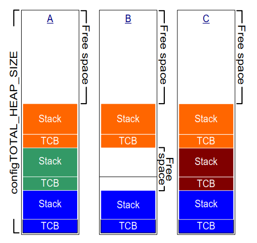
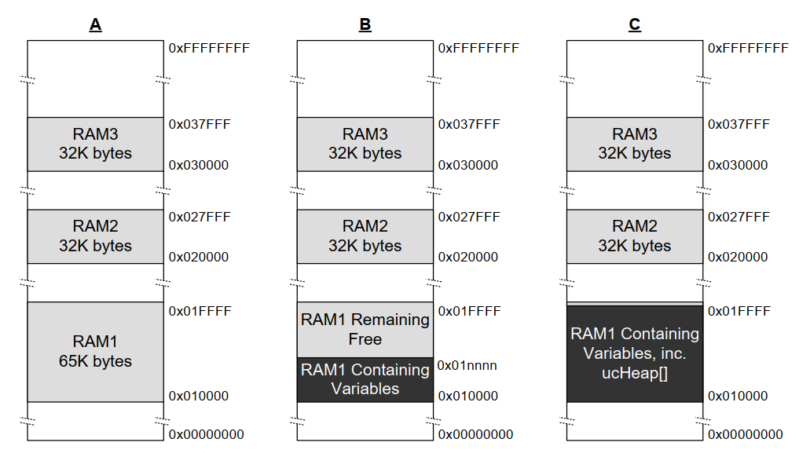

## 3.2 Example Memory Allocation Schemes

### 3.2.1 Heap\_1

It is common for small, dedicated embedded systems to only create tasks
and other kernel objects before starting the FreeRTOS scheduler. When
this is the case, memory only gets (dynamically) allocated by the kernel
before the application starts to perform any real-time functionality,
and the memory remains allocated for the application's lifetime. This
means the chosen allocation scheme does not have to consider the more
complex memory allocation issues, such as determinism and fragmentation,
and can instead prioritise attributes such as code size and simplicity.

Heap\_1.c implements a very basic version of `pvPortMalloc()`, and does not
implement `vPortFree()`. Applications that never delete a task or other
kernel objects have the potential to use heap\_1. Some commercially
critical and safety-critical systems that would otherwise prohibit the
use of dynamic memory allocation also have the potential to use heap\_1.
Critical systems often prohibit dynamic memory allocation because of the
uncertainties associated with non-determinism, memory fragmentation, and
failed allocations. Heap\_1 is always deterministic and cannot fragment
memory.

Heap\_1's implementation of `pvPortMalloc()` simply subdivides a simple
`uint8_t` array called the FreeRTOS heap into smaller blocks each time
it's called. The FreeRTOSConfig.h constant `configTOTAL_HEAP_SIZE` sets
the size of the array in bytes. Implementing the heap as a statically
allocated array makes FreeRTOS appear to consume a lot of RAM because
the heap becomes part of the FreeRTOS data.

Each dynamically allocated task results in two calls to `pvPortMalloc()`.
The first allocates a task control block (TCB), and the second the
task's stack. Figure 3.1 demonstrates how heap\_1 subdivides the simple
array as tasks get created.

Referring to Figure 3.1:

- **A** shows the array before creating any tasks—the entire array is free.

- **B** shows the array after creating one task.

- **C** shows the array after creating three tasks.


<a name="fig3.1" title="Figure 3.1 RAM being allocated from the heap\_1 array each time a task is created"></a>

<div align="center">


***Figure 3.1*** **RAM being allocated from the heap\_1 array each time a task is created**
</div>


### 3.2.2 Heap\_2

Heap\_2 is superseded by heap\_4, which includes enhanced functionality.
Heap\_2 is kept in the FreeRTOS distribution for backward compatibility
and is not recommended for new designs.

Heap\_2.c also works by subdividing an array dimensioned by the
`configTOTAL_HEAP_SIZE` constant. It uses a best-fit algorithm to allocate
memory, and, unlike heap\_1, it does implement `vPortFree()`. Again,
implementing the heap as a statically allocated array makes FreeRTOS
appear to consume a lot of RAM because the heap becomes part of the
FreeRTOS data.

The best-fit algorithm ensures that `pvPortMalloc()` uses the free block
of memory that is closest in size to the number of bytes requested. For
example, consider the scenario where:

- The heap contains three blocks of free memory that are 5 bytes, 25
  bytes, and 100 bytes, respectively.
- `pvPortMalloc()` requests 20 bytes of RAM.

The smallest free block of RAM into which the requested number of bytes
fits is the 25-byte block, so `pvPortMalloc()` splits the 25-byte block
into one block of 20 bytes and one block of 5 bytes before returning
a pointer to the 20-byte block[^2]. The new 5-byte block remains available
for future calls to `pvPortMalloc()`.

[^2]: This is an oversimplification, because heap\_2 stores information
on the block sizes within the heap area, so the sum of the two split
blocks will actually be less than 25.

Unlike heap\_4, heap\_2 does not combine adjacent free blocks into a
single larger block, so it is more susceptible to fragmentation than
heap\_4. However, fragmentation is not an issue if the allocated and
subsequently freed blocks are always the same size.

<a name="fig3.2" title="Figure 3.2 RAM being allocated and freed from the heap\_2 array as tasks are created and deleted"></a>

<div align="center">


***Figure 3.2*** **RAM being allocated and freed from the heap\_2 array as tasks are created and deleted**
</div>

Figure 3.2 demonstrates how the best-fit algorithm works when a task is
created, deleted, and created again. Referring to Figure 3.2:

- **A** shows the array after allocating three tasks. A large free
  block remains at the top of the array.

- **B** shows the array after deleting one of the tasks. The large
  free block at the top of the array remains. There are now also two
  smaller free blocks that previously held the TCB and stack of the
  deleted task.

- **C** shows the situation after creating another task. Creating
  the task resulted in two calls to `pvPortMalloc()` from within the
  `xTaskCreate()` API function, one to allocate a new TCB and the other
  to allocate the task stack. Section 3.4 of this book describes
  `xTaskCreate()`.

  Every TCB is the same size, so the best-fit algorithm reuses the block
  of RAM that held the TCB of the deleted task to hold the TCB of the
  created task.

  If the size of the stack allocated to the newly created task is the
  same size as that allocated to the previously deleted task, then the
  best-fit algorithm reuses the block of RAM that held the stack of the
  deleted task to hold the stack of the created task.

  The larger unallocated block at the top of the array remains
  untouched.

Heap\_2 is not deterministic but is faster than most standard library
implementations of `malloc()` and `free()`.


### 3.2.3 Heap\_3

Heap\_3.c uses the standard library `malloc()` and `free()` functions, so the
linker configuration defines the heap size, and the
`configTOTAL_HEAP_SIZE` constant is not used.

Heap\_3 makes `malloc()` and `free()` thread-safe by temporarily suspending
the FreeRTOS scheduler for the duration of their execution. Chapter 8,
Resource Management, covers thread safety and scheduler suspension.


### 3.2.4 Heap\_4

Like heap\_1 and heap\_2, heap\_4 works by subdividing an array into
smaller blocks. As before, the array is statically allocated and
dimensioned by `configTOTAL_HEAP_SIZE`, which makes FreeRTOS appear to use
a lot of RAM as the heap becomes part of the FreeRTOS data.

Heap\_4 uses a first-fit algorithm to allocate memory. Unlike heap\_2,
heap\_4 combines (coalesces) adjacent free blocks of memory into a
single larger block, which minimizes the risk of memory fragmentation.

The first fit algorithm ensures `pvPortMalloc()` uses the first free block
of memory that is large enough to hold the number of bytes requested.
For example, consider the scenario where:

- The heap contains three blocks of free memory that, in the order in
  which they appear in the array, are 5 bytes, 200 bytes, and 100
  bytes, respectively.
- `pvPortMalloc()` requests 20 bytes of RAM.

The first free block of RAM that the requested number of bytes fits is
the 200-byte block, so `pvPortMalloc()` splits the 200-byte block into one
block of 20 bytes and one of 180 bytes[^3], before returning a pointer
to the 20-byte block. The new 180-byte block remains available to future
calls to `pvPortMalloc()`.

[^3]: This is an oversimplification, because heap\_4 stores information
on the block sizes within the heap area, so the sum of the two split
blocks will actually be less than 200 bytes.

Heap\_4 combines (coalesces) adjacent free blocks into a single larger
block, minimizing the risk of fragmentation, and making it suitable for
applications that repeatedly allocate and free different-sized blocks of
RAM.


<a name="fig3.3" title="Figure 3.3 RAM being allocated and freed from the heap\_4 array"></a>

<div align="center">


***Figure 3.3*** **RAM being allocated and freed from the heap\_4 array**
</div>

Figure 3.3 demonstrates how the heap\_4 first-fit algorithm with memory
coalescence works. Referring to Figure 3.3:

- **A** shows the array after creating three tasks. A large free
  block remains at the top of the array.

- **B** shows the array after deleting one of the tasks. The large
  free block at the top of the array remains. There is now another
  free block where the TCB and stack of the deleted task used to be.
  Unlike in the heap\_2 example, heap\_4 merges the two memory blocks
  that previously held the TCB and stack of the deleted task,
  respectively, into a larger single free block.

- **C** shows the situation after creating a FreeRTOS queue.
  Section 5.3 of this book describes the `xQueueCreate()` API function
  used to allocate queues dynamically. `xQueueCreate()` calls
  `pvPortMalloc()` to allocate the RAM used by the queue. As heap\_4 uses
  a first-fit algorithm, `pvPortMalloc()` allocates RAM from the first
  free RAM block that is large enough to hold the queue, which in
  Figure 3.3, was the RAM freed by deleting the task. The queue does not
  consume all the RAM in the free block, so the block is split into
  two, and the unused portion remains available to future calls to
  `pvPortMalloc()`.

- **D** shows the situation after calling `pvPortMalloc()` directly
  from application code, rather than indirectly by calling a FreeRTOS
  API function. The user allocated block was small enough to fit in
  the first free block, which was the block between the memory
  allocated to the queue, and the memory allocated to the TCB
  following it.

  The memory freed by deleting the task has now split into three
  separate blocks; the first block holds the queue, the second block
  holds the user allocated memory, and the third block remains free.

- **E** shows the situation after deleting the queue, which
  automatically frees the memory allocated to the deleted queue. There
  is now free memory on either side of the user allocated block.

- **F** shows the situation after freeing the user allocated
  memory. The memory previously used by the user allocated block has
  been combined with the free memory on either side to create a larger
  single free block.

Heap\_4 is not deterministic but is faster than most standard library
implementations of `malloc()` and `free()`.


### 3.2.5 Heap\_5

Heap\_5 uses the same allocation algorithm as heap\_4. Unlike heap\_4,
which is limited to allocating memory from a single array, heap\_5 can
combine memory from multiple separated memory spaces into a single heap.
Heap\_5 is useful when the RAM provided by the system on which FreeRTOS
is running does not appear as a single contiguous (without space) block
in the system's memory map.


### 3.2.6 Initialising heap\_5: The vPortDefineHeapRegions() API Function

`vPortDefineHeapRegions()` initialises heap\_5 by specifying the start
address and size of each separate memory area that makes up the heap
managed by heap\_5. Heap\_5 is the only provided heap allocation scheme
that requires explicit initialisation and can't be used until after the
call to `vPortDefineHeapRegions()`. That means kernel objects, such as
tasks, queues, and semaphores, cannot be created dynamically until after
the call to `vPortDefineHeapRegions()`.


<a name="list3.1" title="Listing 3.1 The vPortDefineHeapRegions() API function prototype"></a>


```c
void vPortDefineHeapRegions( const HeapRegion_t * const pxHeapRegions );
```
***Listing 3.1*** *The vPortDefineHeapRegions() API function prototype*


`vPortDefineHeapRegions()` takes an array of `HeapRegion_t` structures as
its only parameter. Each structure defines the start address and size of
a memory block that will become part of the heap—the whole array of
structures defines the entire heap space.


<a name="list3.2" title="Listing 3.2 The HeapRegion\_t structure"></a>


```c
typedef struct HeapRegion
{
    /* The start address of a block of memory that will be part of the heap.*/
    uint8_t *pucStartAddress;

    /* The size of the block of memory in bytes. */
    size_t xSizeInBytes;

} HeapRegion_t;
```
***Listing 3.2*** *The HeapRegion\_t structure*


**Parameters:**

- `pxHeapRegions`

  A pointer to the start of an array of `HeapRegion_t` structures.
  Each structure defines the start address and size of a memory block that
  will become part of the heap.

  The `HeapRegion_t` structures in the array must be ordered by start
  address; the `HeapRegion_t` structure that describes the memory area with
  the lowest start address must be the first structure in the array, and
  the `HeapRegion_t` structure that describes the memory area with the
  highest start address must be the last structure in the array.

  Mark the end of the array with a `HeapRegion_t` structure that has its
  `pucStartAddress` member set to `NULL`.

By way of example, consider the hypothetical memory map shown in Figure
3.4 **A** which contains three separate blocks of RAM: RAM1, RAM2
and RAM3. It is assumed executable code is placed in read-only memory,
which is not shown.


<a name="fig3.4" title="Figure 3.4 Memory Map"></a>

<div align="center">


***Figure 3.4*** **Memory Map**
</div>

Listing 3.3 shows an array of `HeapRegion_t` structures that together
describe the three blocks of RAM in their entirety.


<a name="list3.3" title="Listing 3.3 An array of HeapRegion\_t structures that together describe the 3 regions of RAM in their entirety"></a>


```c
/* Define the start address and size of the three RAM regions. */
#define RAM1_START_ADDRESS ( ( uint8_t * ) 0x00010000 )
#define RAM1_SIZE ( 64 * 1024 )

#define RAM2_START_ADDRESS ( ( uint8_t * ) 0x00020000 )
#define RAM2_SIZE ( 32 * 1024 )

#define RAM3_START_ADDRESS ( ( uint8_t * ) 0x00030000 )
#define RAM3_SIZE ( 32 * 1024 )

/* Create an array of HeapRegion_t definitions, with an index for each
   of the three RAM regions, and terminate the array with a HeapRegion_t
   structure containing a NULL address. The HeapRegion_t structures must
   appear in start address order, with the structure that contains the
   lowest start address appearing first. */
const HeapRegion_t xHeapRegions[] =
{
    { RAM1_START_ADDRESS, RAM1_SIZE },
    { RAM2_START_ADDRESS, RAM2_SIZE },
    { RAM3_START_ADDRESS, RAM3_SIZE },
    { NULL,               0         } /* Marks the end of the array. */
};

int main( void )
{
    /* Initialize heap_5. */
    vPortDefineHeapRegions( xHeapRegions );

    /* Add application code here. */
}
```
***Listing 3.3*** *An array of HeapRegion\_t structures that together describe the 3 regions of RAM in their entirety*


Although Listing 3.3 correctly describes the RAM, it does not demonstrate a
usable example because it allocates all the RAM to the heap, leaving no
RAM free for use by other variables.

The linking phase of the build process allocates a RAM address to each
variable. The RAM available for use by the linker is normally described
by a linker configuration file, such as a linker script. In Figure 3.4
**B** it is assumed the linker script included information on
RAM1, but did not include information on RAM2 or RAM3. As a result, the
linker placed variables in RAM1, leaving only the portion of RAM1 above
address 0x0001nnnn available for use by heap\_5. The actual value of
0x0001nnnn depends on the combined size of all the variables included in
the application. The linker has left all of RAM2 and all of RAM3 unused,
leaving the whole of RAM2 and the whole of RAM3 available for use by
heap\_5.

The code shown in Listing 3.3 would cause the RAM allocated to heap\_5
below address 0x0001nnnn to overlap the RAM used to hold variables.
If you set the start address of the first `HeapRegion_t` structure within the
`xHeapRegions[]` array to 0x0001nnnn, rather than a start address of
0x00010000, the heap will not overlap with RAM used by the linker.
However, that is not a recommended solution because:

- The start address might not be easy to determine.
- The amount of RAM used by the linker might change in future builds,
  which would make an update to the start address used in the
  `HeapRegion_t` structure necessary.
- The build tools will not know, and therefore cannot warn the
  application writer, if the RAM used by the linker and the RAM used
  by heap\_5 overlap.

Listing 3.4 demonstrates a more convenient and maintainable example. It
declares an array called `ucHeap`. `ucHeap` is a normal variable, so it
becomes part of the data allocated to RAM1 by the linker. The first
`HeapRegion_t` structure in the `xHeapRegions` array describes the start
address and size of `ucHeap`, so `ucHeap` becomes part of the memory managed
by heap\_5. The size of `ucHeap` can be increased until the RAM used by the
linker consumes all of RAM1, as shown in Figure 3.4 **C**.


<a name="list3.4" title="Listing 3.4 An array of HeapRegion\_t structures that describe all of RAM2, all of RAM3, but only part of RAM1"></a>

```c
/* Define the start address and size of the two RAM regions not used by
   the linker. */
#define RAM2_START_ADDRESS ( ( uint8_t * ) 0x00020000 )
#define RAM2_SIZE ( 32 * 1024 )

#define RAM3_START_ADDRESS ( ( uint8_t * ) 0x00030000 )
#define RAM3_SIZE ( 32 * 1024 )

/* Declare an array that will be part of the heap used by heap_5. The
   array will be placed in RAM1 by the linker. */
#define RAM1_HEAP_SIZE ( 30 * 1024 )
static uint8_t ucHeap[ RAM1_HEAP_SIZE ];

/* Create an array of HeapRegion_t definitions. Whereas in Listing 3.3 the
   first entry described all of RAM1, so heap_5 will have used all of
   RAM1, this time the first entry only describes the ucHeap array, so
   heap_5 will only use the part of RAM1 that contains the ucHeap array.
   The HeapRegion_t structures must still appear in start address order,
   with the structure that contains the lowest start address appearing first. */

const HeapRegion_t xHeapRegions[] =
{
    { ucHeap,             RAM1_HEAP_SIZE },
    { RAM2_START_ADDRESS, RAM2_SIZE },
    { RAM3_START_ADDRESS, RAM3_SIZE },
    { NULL,               0 }           /* Marks the end of the array. */
};
```
***Listing 3.4*** *An array of HeapRegion\_t structures that describe all of RAM2, all of RAM3, but only part of RAM1*


The advantages of the technique demonstrated in Listing 3.4 include:

- It is not necessary to use a hard-coded start address.
- The address used in the `HeapRegion_t` structure will be set
  automatically by the linker, so it will always be correct, even if the
  amount of RAM used by the linker changes in future builds.
- It is impossible for RAM allocated to heap\_5 to overlap data placed
  into RAM1 by the linker.
- The application will not link if `ucHeap` is too big.