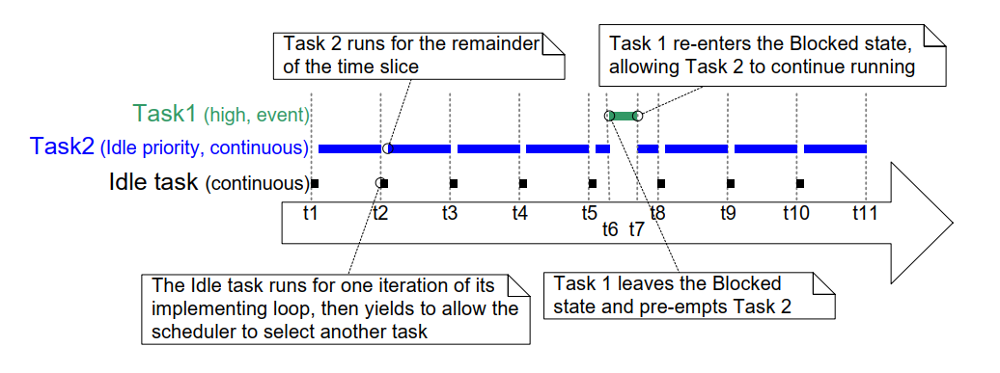

## 4.12 Scheduling Algorithms

### 4.12.1 A Recap of Task States and Events

The task that is actually running (using processing time) is in the
*Running* state. On a single core processor there can only be one task in
the *Running* state at any given time. It is also possible to run FreeRTOS
on more than one core (asymmetric multiprocessing, or AMP), or have
FreeRTOS schedule tasks across multiple cores (symmetric
multiprocessing, or SMP). Neither of those scenarios are described here.

Tasks that are not actually running, but are not in either the Blocked
state or the *Suspended* state, are in the *Ready* state. Tasks in the Ready
state are available to be selected by the scheduler as the task to enter
the *Running* state. The scheduler will always choose the highest priority
Ready state task to enter the *Running* state.

Tasks can wait in the *Blocked* state for an event and they are automatically
moved back to the *Ready* state when the event occurs. Temporal events
occur at a particular time, for example, when a block time expires, and
are normally used to implement periodic or timeout behavior.
Synchronization events occur when a task or interrupt service routine
sends information using a task notification, queue, event group, message
buffer, stream buffer, or one of the many types of semaphore. They are
generally used to signal asynchronous activity, such as data arriving at
a peripheral.

### 4.12.2 Selecting the Scheduling Algorithm

The scheduling algorithm is the software routine that decides which
*Ready* state task to transition into the *Running* state.

All the examples so far have used the same scheduling algorithm, but the
algorithm can be changed using the `configUSE_PREEMPTION` and
`configUSE_TIME_SLICING` configuration constants. Both constants are
defined in FreeRTOSConfig.h.

A third configuration constant, `configUSE_TICKLESS_IDLE`, also affects
the scheduling algorithm, as its use can result in the tick interrupt
being turned off completely for extended periods.
`configUSE_TICKLESS_IDLE` is an advanced option provided specifically for
use in applications that must minimize their power consumption.
The descriptions provided in this section assume `configUSE_TICKLESS_IDLE`
is set to 0, which is the default setting if the constant is left
undefined.

In all possible single core configurations the FreeRTOS scheduler
selects tasks that share a priority in turn. This 'take it in turn'
policy is often referred to as 'Round Robin Scheduling'. A Round Robin
scheduling algorithm does not guarantee time is shared equally between
tasks of equal priority, only that *Ready* state tasks of equal priority
enter the *Running* state in turn.

***
| Scheduling Algorithm            | Prioritized | `configUSE_PREEMPTION` | `configUSE_TIME_SLICING` |
|---------------------------------|-------------|------------------------|--------------------------|
| Preemptive With Time Slicing    | Yes         | 1 | 1   |
| Preemptive Without Time Slicing | Yes         | 1 | 0   |
| Co-Operative                    | No          | 0 | Any |

***Table 5*** *The FreeRTOSConfig.h settings to configure the kernel scheduling algorithms*
* * *

### 4.12.3 Prioritized Preemptive Scheduling with Time Slicing

The configuration shown in the Table 5 sets the FreeRTOS scheduler to use a
scheduling algorithm called 'Fixed Priority Preemptive Scheduling with
Time Slicing', which is the scheduling algorithm used by most small RTOS
applications, and the algorithm used by all the examples presented in
this book so far. The next table provides a description of the terminology
used in the algorithm's name.

**An explanation of the terms used to describe the scheduling policy:**

- Fixed Priority

  Scheduling algorithms described as 'Fixed Priority' do not change the priority
  assigned to the tasks being scheduled, but also do not prevent the tasks
  themselves from changing their own priority or that of other tasks.

- Preemptive

  Preemptive scheduling algorithms will immediately 'preempt' the *Running* state
  task if a task that has a priority higher than the *Running* state task enters
  the *Ready* state. Being preempted means being involuntarily moved out of the
  *Running* state and into the *Ready* state (without explicitly yielding or
  blocking) to allow a different task to enter the *Running* state. Task preemption
  can occur at any time, not just in the RTOS tick interrupt.

- Time Slicing

  Time slicing is used to share processing time between tasks of equal priority,
  even when the tasks do not explicitly yield or enter the *Blocked* state.
  Scheduling algorithms described as using *Time Slicing* select a new task to
  enter the *Running* state at the end of each time slice if there are other *Ready*
  state tasks that have the same priority as the Running task. A time slice is equal
  to the time between two RTOS tick interrupts.

Figure 4.18 and Figure 4.19 demonstrate how tasks are scheduled when a fixed
priority preemptive scheduling with time slicing algorithm is used.
Figure 4.18 shows the sequence in which tasks are selected to enter the
*Running* state when all the tasks in an application have a unique
priority. Figure 4.19 shows the sequence in which tasks are selected to
enter the *Running* state when two tasks in an application share a
priority.

***

***Figure 4.18*** *Execution pattern highlighting task prioritization and preemption
in a hypothetical application in which each task has been assigned a unique
priority*
***

Referring to Figure 4.18:

- Idle Task

  The idle task is running at the lowest priority, so it gets preempted
  every time a higher priority task enters the *Ready* state, for example, at
  times t3, t5 and t9.

- Task 3

  Task 3 is an event-driven task that executes with a relatively low
  priority, but above the Idle priority. It spends most of its time in the
  *Blocked* state waiting for its event of interest, transitioning from the
  *Blocked* state to the *Ready* state each time the event occurs. All
  FreeRTOS inter-task communication mechanisms (task notifications,
  queues, semaphores, event groups, etc.) can be used to signal events and
  unblock tasks in this way.

  Events occur at times t3 and t5, and also somewhere between t9 and t12.
  The events occurring at times t3 and t5 are processed immediately because, at
  these times, Task 3 is the highest priority task that is able to run.
  The event that occurs somewhere between times t9 and t12 is not
  processed until t12 because, until then, the higher priority tasks Task
  1 and Task 2 are still executing. It is only at time t12 that both Task
  1 and Task 2 are in the *Blocked* state, making Task 3 the highest
  priority *Ready* state task.

- Task 2

  Task 2 is a periodic task that executes at a priority above the priority
  of Task 3, but below the priority of Task 1. The task's period interval
  means Task 2 wants to execute at times t1, t6, and t9.

  At time t6, Task 3 is in the *Running* state, but Task 2 has the higher
  relative priority so preempts Task 3 and starts executing immediately.
  Task 2 completes its processing and re-enters the *Blocked* state at time
  t7, at which point Task 3 can re-enter the *Running* state to complete its
  processing. Task 3 itself Blocks at time t8.

- Task 1

  Task 1 is also an event-driven task. It executes with the highest
  priority of all, so can preempt any other task in the system. The only
  Task 1 event shown occurs at time t10, at which time Task 1 preempts
  Task 2. Task 2 can complete its processing only after Task 1 has
  re-entered the *Blocked* state at time t11.

***

***Figure 4.19*** *Execution pattern highlighting task prioritization and time slicing
in a hypothetical application in which two tasks run at the same priority*
***

Referring to Figure 4.19:

- The Idle Task and Task 2

  The Idle task and Task 2 are both continuous processing tasks, and both
  have a priority of 0 (the lowest possible priority). The scheduler only
  allocates processing time to the priority 0 tasks when there are no
  higher priority tasks that are able to run, and shares the time that is
  allocated to the priority 0 tasks by time slicing. A new time slice
  starts on each tick interrupt, which in Figure 4.19 occurs at times t1, t2,
  t3, t4, t5, t8, t9, t10 and t11.

  The Idle task and Task 2 enter the *Running* state in turn, which can
  result in both tasks being in the *Running* state for part of the same
  time slice, as happens between time t5 and time t8.

- Task 1

  The priority of Task 1 is higher than the Idle priority. Task 1 is an
  event driven task that spends most of its time in the *Blocked* state
  waiting for its event of interest, transitioning from the *Blocked* state
  to the *Ready* state each time the event occurs.

  The event of interest occurs at time t6. At t6 Task 1 becomes the
  highest priority task that is able to run, and therefore Task 1
  preempts the Idle task part way through a time slice. Processing of the
  event completes at time t7, at which point Task 1 re-enters the Blocked
  state.

Figure 4.19 shows the Idle task sharing processing time with a task
created by the application writer. Allocating that much processing time
to the Idle task might not be desirable if the Idle priority tasks
created by the application writer have work to do, but the Idle task
does not. The `configIDLE_SHOULD_YIELD` compile time configuration
constant can be used to change how the Idle task is scheduled:

- If `configIDLE_SHOULD_YIELD` is set to 0 then the Idle task remains in
  the *Running* state for the entirety of its time slice, unless it is
  preempted by a higher priority task.

- If `configIDLE_SHOULD_YIELD` is set to 1 then the Idle task yields
  (voluntarily gives up whatever remains of its allocated time slice)
  on each iteration of its loop if there are other Idle priority tasks
  in the *Ready* state.

The execution pattern shown in Figure 4.19 is what would be observed when
`configIDLE_SHOULD_YIELD` is set to 0. The execution pattern shown in
Figure 4.20 is what would be observed in the same scenario when
`configIDLE_SHOULD_YIELD` is set to 1.

***

***Figure 4.20*** *The execution pattern for the same scenario as shown in Figure 4.19,
but this time with `configIDLE_SHOULD_YIELD` set to 1*
***

Figure 4.20 also shows that when `configIDLE_SHOULD_YIELD` is set to 1, the
task selected to enter the *Running* state after the Idle task does not
execute for an entire time slice, but instead executes for whatever
remains of the time slice during which the Idle task yielded.

### 4.12.4 Prioritized Preemptive Scheduling without Time Slicing

Prioritized Preemptive Scheduling without time slicing maintains the
same task selection and preemption algorithms as described in the
previous section, but does not use time slicing to share processing time
between tasks of equal priority.

The Table 5 shows the FreeRTOSConfig.h settings that configure the FreeRTOS
scheduler to use prioritized preemptive scheduling without time slicing.

As was demonstrated in Figure 4.19, if time slicing is used, and there is
more than one ready state task at the highest priority that is able to
run, then the scheduler selects a new task to enter the *Running* state
during each RTOS tick interrupt (a tick interrupt marking the end of a
time slice). If time slicing is not used, then the scheduler only
selects a new task to enter the *Running* state when either:

- A higher priority task enters the *Ready* state.

- The task in the *Running* state enters the *Blocked* or *Suspended* state.

There are fewer task context switches when time slicing is not used than
when time slicing is used. Therefore, turning time slicing off results
in a reduction in the scheduler's processing overhead. However, turning
time slicing off can also result in tasks of equal priority receiving
greatly different amounts of processing time, a scenario demonstrated by
Figure 4.21. For this reason, running the scheduler without time slicing
is considered an advanced technique that should only be used by
experienced users.

***

***Figure 4.21*** *Execution pattern that demonstrates how tasks of equal priority can
receive hugely different amounts of processing time when time slicing is not used*
***

Referring to Figure 4.21, which assumes `configIDLE_SHOULD_YIELD` is set to 0:

- Tick Interrupts

  Tick interrupts occur at times t1, t2, t3, t4, t5, t8, t11, t12 and
  t13.

- Task 1

  Task 1 is a high priority event driven task that spends most of its
  time in the *Blocked* state waiting for its event of interest. Task 1
  transitions from the *Blocked* state to the *Ready* state (and
  subsequently, as it is the highest priority *Ready* state task, on into
  the *Running* state) each time the event occurs. Figure 4.21 shows Task 1
  processing an event between times t6 and t7, then again between times
  t9 and t10.

- The Idle Task and Task 2

  The Idle task and Task 2 are both continuous processing tasks, and both
  have a priority of 0 (the idle priority). Continuous processing tasks do
  not enter the *Blocked* state.

  Time slicing is not being used, so an idle priority task that is in the
  *Running* state will remain in the *Running* state until it is preempted by
  the higher priority Task 1.

  In Figure 4.21 the Idle task starts running at time t1, and remains in the
  *Running* state until it is preempted by Task 1 at time t6, which is more
  than four complete tick periods after it entered the *Running* state.

  Task 2 starts running at time t7, which is when Task 1 re-enters the
  *Blocked* state to wait for another event. Task 2 remains in the Running
  state until it too is preempted by Task 1 at time t9, which is less than
  one tick period after it entered the *Running* state.

  At time t10 the Idle task re-enters the *Running* state, despite having
  already received more than four times more processing time than Task 2.

### 4.12.5 Cooperative Scheduling

This book focuses on preemptive scheduling, but FreeRTOS can also use
cooperative scheduling. The Table 5 shows the FreeRTOSConfig.h settings
that configure the FreeRTOS scheduler to use cooperative scheduling.

When using the cooperative scheduler (and therefore assuming
application-provided interrupt service routines do not explicitly
request context switches) a context switch only occurs when the Running
state task enters the *Blocked* state, or the *Running* state task explicitly
yields (manually requests a re-schedule) by calling `taskYIELD()`. Tasks
are never preempted, so time slicing cannot be used.

Figure 4.22 demonstrates the behavior of the cooperative scheduler. The
horizontal dashed lines in Figure 4.22 show when a task is in the Ready
state.

***

***Figure 4.22*** *Execution pattern demonstrating the behavior of the cooperative scheduler*
***

Referring to Figure 4.22:

- Task 1

  Task 1 has the highest priority. It starts in the *Blocked* state,
  waiting for a semaphore.

  At time t3, an interrupt gives the semaphore, causing Task 1 to leave
  the *Blocked* state and enter the *Ready* state (giving semaphores from
  interrupts is covered in Chapter 6).

  At time t3, Task 1 is the highest priority *Ready* state task, and if the
  preemptive scheduler had been used Task 1 would become the Running
  state task. However, as the cooperative scheduler is being used, Task
  1 remains in the *Ready* state until time t4, which is when the Running
  state task calls `taskYIELD()`.

- Task 2

  The priority of Task 2 is between that of Task 1 and Task 3. It starts
  in the *Blocked* state, waiting for a message that is sent to it by Task
  3 at time t2.

  At time t2, Task 2 is the highest priority *Ready* state task, and if the
  preemptive scheduler had been used Task 2 would become the Running
  state task. However, as the cooperative scheduler is being used, Task
  2 remains in the *Ready* state until the *Running* state task either
  enters the *Blocked* state or calls `taskYIELD()`.

  The *Running* state task calls `taskYIELD()` at time t4, but by then Task
  1 is the highest priority *Ready* state task, so Task 2 does not
  actually become the *Running* state task until Task 1 re-enters the
  *Blocked* state at time t5.

  At time t6, Task 2 re-enters the *Blocked* state to wait for the next
  message, at which point Task 3 is once again the highest priority
  *Ready* state task.

In a multi-tasking application the application writer must take care
that a resource is not accessed by more than one task simultaneously, as
simultaneous access could corrupt the resource. As an example, consider
the following scenario in which the accessed resource is a UART (serial
port). Two tasks write strings to the UART; Task 1 writes
"abcdefghijklmnop", and Task 2 writes "123456789":

1. Task 1 is in the *Running* state and starts to write its string. It
   writes "abcdefg" to the UART, but leaves the *Running* state before
   writing any further characters.

1. Task 2 enters the *Running* state and writes "123456789" to the UART,
   before leaving the *Running* state.

1. Task 1 re-enters the *Running* state and writes the remaining
   characters of its string to the UART.

In that scenario, what is actually written to the UART is
"abcdefg123456789hijklmnop". The string written by Task 1 has not been
written to the UART in an unbroken sequence as intended, but instead it
has been corrupted, because the string written to the UART by Task 2
appears within it.

Using the cooperative scheduler normally makes it easier to avoid
problems caused by simultaneous access than when using the preemptive
scheduler[^7]:

[^7]: Methods of safely sharing resources between tasks are covered
later in this book. Resources provided by FreeRTOS itself, such as
queues and semaphores, are always safe to share between tasks.

- When you use the preemptive scheduler the *Running* state task can be
  preempted at any time, including when a resource it is sharing with
  another task is in an inconsistent state. As just demonstrated by
  the UART example, leaving a resource in an inconsistent state can
  result in data corruption.

- When you use the cooperative scheduler you control when a switch to
  another task occurs. You can, therefore, ensure a switch to another
  task does not occur while a resource is in an inconsistent state.

- In the above UART example, you can ensure Task 1 does not leave the
  *Running* state until after writing its entire string to the UART
  and, in doing so, remove the possibility of the string being corrupted by the
  activities of another task.

As demonstrated in Figure 4.22, using the cooperative scheduler makes
systems less responsive than when using the preemptive scheduler:

- When using the preemptive scheduler, the scheduler starts running a
  task immediately when the task becomes the highest priority *Ready*
  state task. This is often essential in real-time systems which must
  respond to high priority events within a defined time period.

- When using the cooperative scheduler, a switch to a task that has
  become the highest priority *Ready* state task is not performed until
  the *Running* state task enters the *Blocked* state or calls
  `taskYIELD()`.