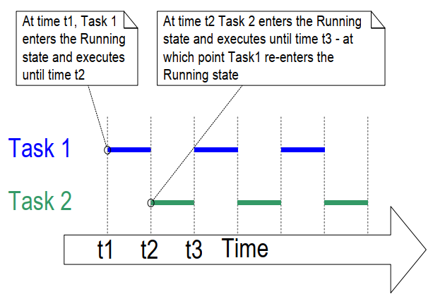

## 4.4 Task Creation

Six API functions may be used to create tasks:
`xTaskCreate()`,
`xTaskCreateStatic()`,
`xTaskCreateRestricted()`,
`xTaskCreateRestrictedStatic()`,
`xTaskCreateAffinitySet()`, and
`xTaskCreateStaticAffinitySet()`

Each task requires two blocks of RAM: one to hold its Task Control Block (TCB)
and one to store its stack. FreeRTOS API functions with "Static" in their names
use pre-allocated blocks of RAM passed into the functions as parameters.
Conversely, API functions without "Static" in their names allocate the required
RAM dynamically at runtime from the system heap.

Some FreeRTOS ports support tasks running in a "restricted" or "unprivileged" mode.
FreeRTOS API functions with "Restricted" in their names create tasks that
execute with limited access to the system's memory. API functions without
"Restricted" in their names create tasks that execute in "privileged mode" and
have access to the system's entire memory map.

FreeRTOS ports that support Symmetric Multi Processing (SMP) allow different tasks
to run simultaneously on multiple cores of the same CPU. For these ports, you may
specify which core a task will run on by using functions with "Affinity" in the name.

The FreeRTOS task creation API functions are quite complex. Most examples in this
document use `xTaskCreate()` because it is the simplest of these functions.

### 4.4.1 The xTaskCreate() API Function

Listing 4.3 shows the `xTaskCreate()` API function prototype.
`xTaskCreateStatic()` has two additional parameters that point to the
memory pre-allocated to hold the task's data structure and stack,
respectively. [Section 2.5: Data Types and Coding Style Guide](ch02.md#25-data-types-and-coding-style-guide)
describes the data types and naming conventions used.


<a name="list4.3" title="Listing 4.3 The xTaskCreate() API function prototype"></a>


```c
BaseType_t xTaskCreate( TaskFunction_t pvTaskCode,
                        const char * const pcName,
                        configSTACK_DEPTH_TYPE usStackDepth,
                        void * pvParameters,
                        UBaseType_t uxPriority,
                        TaskHandle_t * pxCreatedTask );
```

***Listing 4.3*** *The xTaskCreate() API function prototype*

**xTaskCreate() Parameters and return value:**

- `pvTaskCode`

  Tasks are simply C functions that never exit and, as such, are normally
  implemented as an infinite loop. The `pvTaskCode` parameter is simply a
  pointer to the function that implements the task (in effect, just the
  function's name).

- `pcName`

  A descriptive name for the task. FreeRTOS does not use this in
  any way and it is included purely as a debugging aid. Identifying a task by
  a human-readable name is much simpler than identifying it by its handle.

  The application-defined constant `configMAX_TASK_NAME_LEN` defines the
  maximum length a task name can be, including the NULL terminator.
  Supplying a longer string results in the string being truncated.

- `usStackDepth`

  Specifies the size of the stack to allocate for use by the task.
  Use `xTaskCreateStatic()` instead of `xTaskCreate()` to use pre-allocated
  memory instead of dynamically allocated memory.

  Note the value specifies the number of words the stack can hold, not
  the number of bytes. For example, if the stack is 32-bits wide and
  `usStackDepth` is 128, then `xTaskCreate()` allocates 512 bytes of stack
  space (128 * 4 bytes).

  `configSTACK_DEPTH_TYPE` is a macro that allows the application writer
  to specify the data type used to hold stack sizes. `configSTACK_DEPTH_TYPE`
  defaults to `uint16_t` if left undefined, so #define `configSTACK_DEPTH_TYPE`
  to `unsigned long` or `size_t` in `FreeRTOSConfig.h` if the stack depth multiplied
  by the stack width is greater than 65535 (the largest possible 16-bit number).

  [Section 13.3 Stack Overflow](ch13.md#133-stack-overflow), describes a
  practical method of choosing an optimal stack size.

- `pvParameters`

  Functions that implement tasks accept a single void pointer (`void *`)
  parameter. `pvParameters` is the value passed into the task using that
  parameter.

- `uxPriority`

  Defines the task's priority. 0 is the lowest priority and
  `(configMAX_PRIORITIES – 1)` is the highest priority. [Section 4.5](#45-task-priorities)
  describes the user defined `configMAX_PRIORITIES` constant.

  If a `uxPriority` greater than `(configMAX_PRIORITIES – 1)` is defined, it will
  be capped to `(configMAX_PRIORITIES – 1)`.

- `pxCreatedTask`

  Pointer to a location to store a handle to the created task. This handle may
  be used in future API calls to, for example, change the task's priority or delete
  the task.

  `pxCreatedTask` is an optional parameter and may be set to NULL if the
  task's handle is not required.

- Return values

  There are two possible return values:

  - `pdPASS`

    This indicates the task was created successfully.

  - `pdFAIL`

    This indicates there was not enough heap memory available to create
    the task. [Chapter 3](ch03.md#3-heap-memory-management) provides more
    information on heap memory management.


<a name="example4.1" title="Example 4.1 Creating tasks"></a>
---
***Example 4.1*** *Creating tasks*

---

The following example demonstrates the steps needed to create two simple tasks
and then start the newly created tasks. The tasks simply print out a string
periodically by using a crude busy loop to create the period delay. Both
tasks are created at the same priority and are identical except for the
string they print out—see Listing 4.4 and Listing 4.5 for their respective
implementations. See chapter 8 for warnings about using `printf()` in
tasks.

<a name="list4.4" title="Listing 4.4 Implementation of the first task used in Example 4.1"></a>


```c
void vTask1( void * pvParameters )
{
    /* ulCount is declared volatile to ensure it is not optimized out. */
    volatile unsigned long ulCount;

    for( ;; )
    {
        /* Print out the name of the current task task. */
        vPrintLine( "Task 1 is running" );

        /* Delay for a period. */
        for( ulCount = 0; ulCount < mainDELAY_LOOP_COUNT; ulCount++ )
        {
            /*
             * This loop is just a very crude delay implementation. There is
             * nothing to do in here. Later examples will replace this crude
             * loop with a proper delay/sleep function.
             */
        }
    }
}
```

***Listing 4.4*** *Implementation of the first task used in Example 4.1*


<a name="list4.5" title="Listing 4.5 Implementation of the second task used in Example 4.1"></a>


```c
void vTask2( void * pvParameters )
{
    /* ulCount is declared volatile to ensure it is not optimized out. */
    volatile unsigned long ulCount;

    /* As per most tasks, this task is implemented in an infinite loop. */
    for( ;; )
    {
        /* Print out the name of this task. */
        vPrintLine( "Task 2 is running" );

        /* Delay for a period. */
        for( ulCount = 0; ulCount < mainDELAY_LOOP_COUNT; ulCount++ )
        {
            /*
             * This loop is just a very crude delay implementation. There is
             * nothing to do in here. Later examples will replace this crude
             * loop with a proper delay/sleep function.
             */
        }
    }
}
```

***Listing 4.5*** *Implementation of the second task used in Example 4.1*

The main() function creates the tasks before starting the scheduler—see
Listing 4.6 for its implementation.


<a name="list4.6" title="Listing 4.6 Starting the Example 4.1 tasks"></a>


```c
int main( void )
{
    /*
     * Variables declared here may no longer exist after starting the FreeRTOS
     * scheduler. Do not attempt to access variables declared on the stack used
     * by main() from tasks.
     */

    /*
     * Create one of the two tasks. Note that a real application should check
     * the return value of the xTaskCreate() call to ensure the task was
     * created successfully.
     */
    xTaskCreate( vTask1,  /* Pointer to the function that implements the task.*/
                 "Task 1",/* Text name for the task. */
                 1000,    /* Stack depth in words. */
                 NULL,    /* This example does not use the task parameter. */
                 1,       /* This task will run at priority 1. */
                 NULL );  /* This example does not use the task handle. */

    /* Create the other task in exactly the same way and at the same priority.*/
    xTaskCreate( vTask2, "Task 2", 1000, NULL, 1, NULL );

    /* Start the scheduler so the tasks start executing. */
    vTaskStartScheduler();

    /*
     * If all is well main() will not reach here because the scheduler will now
     * be running the created tasks. If main() does reach here then there was
     * not enough heap memory to create either the idle or timer tasks
     * (described later in this book). Chapter 3 provides more information on
     * heap memory management.
     */
    for( ;; );
}
```

***Listing 4.6*** *Starting the Example 4.1 tasks*

Executing the example produces the output shown in Figure 4.2.


<a name="fig4.2" title="Figure 4.2 The output produced when executing Example 4.1"></a>

***

```console
C:\Temp>rtosdemo
Task 1 is running
Task 2 is running
Task 1 is running
Task 2 is running
Task 1 is running
Task 2 is running
Task 1 is running
Task 2 is running
Task 1 is running
Task 2 is running
Task 1 is running
Task 2 is running
Task 1 is running
Task 2 is running
```

***Figure 4.2*** *The output produced when executing Example 4.1[^4]*

***

[^4]: The screen shot shows each task printing out its message exactly
once before the next task executes. This is an artificial scenario
that results from using the FreeRTOS Windows simulator. The Windows
simulator is not truly real time. Also, writing to the Windows
console takes a relatively long time and results in a chain of
Windows system calls. Executing the same code on a genuine embedded
target with a fast and non-blocking print function may result in
each task printing its string many times before being switched out
to allow the other task to run.

Figure 4.2 shows the two tasks appearing to execute simultaneously;
however, both tasks execute on the same processor core, so that cannot
be the case. In reality, both tasks are rapidly entering and exiting the
*Running* state. Both tasks are running at the same priority and so share
time on the same processor core. Figure 4.3 shows their actual execution
pattern.

The arrow along the bottom of Figure 4.3 shows time passing from time t1
onwards. The colored lines show which task is executing at each point in
time—for example, Task 1 is executing between times t1 and t2.

Only one task can exist in the *Running* state at any one time. So, as one
task enters the *Running* state (the task is switched in), the other
enters the *Not Running* state (the task is switched out).


<a name="fig4.3" title="Figure 4.3 The actual execution pattern of the two Example 4.1 tasks"></a>

***

***Figure 4.3*** *The actual execution pattern of the two Example 4.1 tasks*
***

Example 4.1 created both tasks from within `main()`, prior to starting the
scheduler. It is also possible to create a task from within another
task. For example, Task 2 could have been created from within Task 1, as
shown by Listing 4.7.


<a name="list4.7" title="Listing 4.7 Creating a task from within another task after the scheduler has started"></a>


```c
void vTask1( void * pvParameters )
{
    const char *pcTaskName = "Task 1 is running\r\n";
    volatile unsigned long ul; /* volatile to ensure ul is not optimized away. */

    /*
     * If this task code is executing then the scheduler must already have
     * been started. Create the other task before entering the infinite loop.
     */
    xTaskCreate( vTask2, "Task 2", 1000, NULL, 1, NULL );

    for( ;; )
    {
        /* Print out the name of this task. */
        vPrintLine( pcTaskName );

        /* Delay for a period. */
        for( ul = 0; ul < mainDELAY_LOOP_COUNT; ul++ )
        {
            /*
             * This loop is just a very crude delay implementation. There is
             * nothing to do in here. Later examples will replace this crude
             * loop with a proper delay/sleep function.
             */
        }
    }
}
```

***Listing 4.7*** *Creating a task from within another task after the scheduler has started*

<a name="example4.2" title="Example 4.2 Using the task parameter"></a>
---
***Example 4.2*** *Using the task parameter*

---

The two tasks created in Example 4.1 are almost identical, the only
difference between them is the text string they print out. If you create
two instances of a single task implementation, and use the task
parameter to pass the string into each instance, this would remove the
duplication.

Example 4.2 replaces the two task functions used in Example 4.1 with a
single task function called `vTaskFunction()`, as shown in Listing 4.8.
Note how the task parameter is cast to a `char *` to obtain the string
the task should print out.


<a name="list4.8" title="Listing 4.8 The single task function used to create two tasks in Example 4.2"></a>

```c
void vTaskFunction( void * pvParameters )
{

    char *pcTaskName;
    volatile unsigned long ul; /* volatile to ensure ul is not optimized away. */

    /*
     * The string to print out is passed in via the parameter. Cast this to a
     * character pointer.
     */
    pcTaskName = ( char * ) pvParameters;

    /* As per most tasks, this task is implemented in an infinite loop. */
    for( ;; )
    {
        /* Print out the name of this task. */
        vPrintLine( pcTaskName );

        /* Delay for a period. */
        for( ul = 0; ul < mainDELAY_LOOP_COUNT; ul++ )
        {
            /*
             * This loop is just a very crude delay implementation. There is
             * nothing to do in here. Later exercises will replace this crude
             * loop with a proper delay/sleep function.
             */
        }
    }
}
```

***Listing 4.8*** *The single task function used to create two tasks in Example 4.2*

Listing 4.9 creates two instances of the task implemented by
`vTaskFunction()`, using the task's parameter to pass a different string
into each. Both tasks execute independently under the control of the
FreeRTOS scheduler and with their own stack, and so with their own copies of
the `pcTaskName` and `ul` variables.


<a name="list4.9" title="Listing 4.9 The main() function for Example 2"></a>


```c
/*
 * Define the strings that will be passed in as the task parameters. These are
 * defined const and not on the stack used by main() to ensure they remain
 * valid when the tasks are executing.
 */
static const char * pcTextForTask1 = "Task 1 is running";
static const char * pcTextForTask2 = "Task 2 is running";

int main( void )
{
    /*
     * Variables declared here may no longer exist after starting the FreeRTOS
     * scheduler. Do not attempt to access variables declared on the stack used
     * by main() from tasks.
     */

    /* Create one of the two tasks. */
    xTaskCreate( vTaskFunction,             /* Pointer to the function that
                                               implements the task. */
                 "Task 1",                  /* Text name for the task. This is to
                                               facilitate debugging only. */
                 1000,                      /* Stack depth - small microcontrollers
                                               will use much less stack than this.*/
                 ( void * ) pcTextForTask1, /* Pass the text to be printed into
                                               the task using the task parameter. */
                 1,                         /* This task will run at priority 1. */
                 NULL );                    /* The task handle is not used in
                                               this example. */

    /*
     * Create the other task in exactly the same way. Note this time that
     * multiple tasks are being created from the SAME task implementation
     * (vTaskFunction). Only the value passed in the parameter is different.
     * Two instances of the same task definition are being created.
     */
    xTaskCreate( vTaskFunction,
                 "Task 2",
                 1000,
                 ( void * ) pcTextForTask2,
                 1,
                 NULL );

    /* Start the scheduler so the tasks start executing. */
    vTaskStartScheduler();

    /*
     * If all is well main() will not reach here because the scheduler will
     * now be running the created tasks. If main() does reach here then there
     * was not enough heap memory to create either the idle or timer tasks
     * (described later in this book). Chapter 3 provides more information on
     * heap memory management.
     */
    for( ;; )
    {
    }
}
```

***Listing 4.9*** *The main() function for Example 2*


The output from Example 4.2 is exactly as per that shown for example 1 in Figure
4.2.