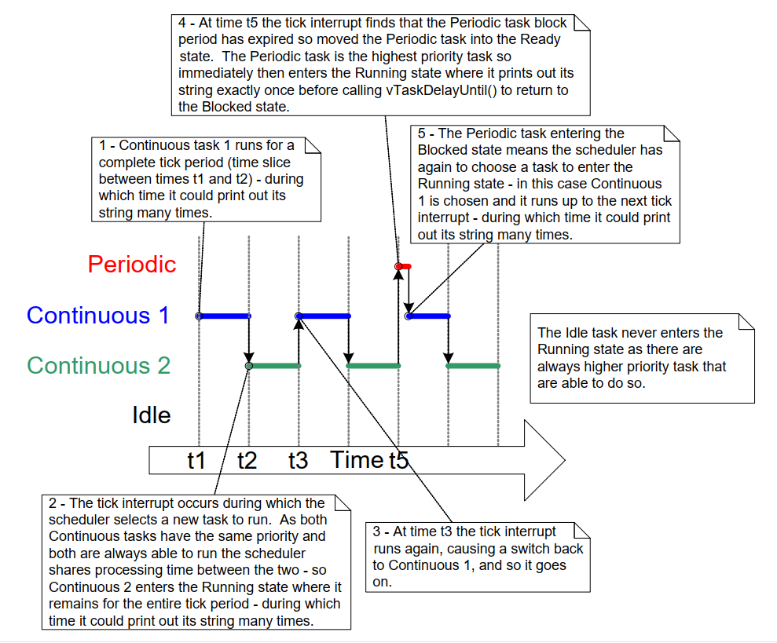

## 4.7 Expanding the *Not Running* State

So far, the created tasks have always had processing to perform and have
never had to wait for anything—and since they never had to wait for anything,
they were always able to enter the *Running* state. Such 'continuous processing'
tasks have limited usefulness because they can only be created at the very lowest
priority. If they run at any other priority, they will prevent tasks of lower
priority from ever running at all.

To make these tasks useful, they must be re-written to be event-driven. An
event-driven task only has work (processing) to perform after an event
triggers it and cannot enter the *Running* state before that time.
The scheduler always selects the highest priority task that can run. If
a high-priority task cannot be selected because it is waiting for an
event, the scheduler must, instead, select a lower-priority task that
can run. Therefore, writing event-driven tasks means tasks can be
created at different priorities without the highest priority tasks
starving all the lower priority tasks of processing time.

### 4.7.1 The *Blocked* State

A task waiting for an event is said to be in the 'Blocked' state, a
sub-state of the *Not Running* state.

Tasks can enter the *Blocked* state to wait for two different types of
events:

1. Temporal (time-related) events— these events occur either when a delay period
   expires or an absolute time is reached. For example, a task may
   enter the *Blocked* state to wait for 10 milliseconds to pass.

1. Synchronization events— these events originate from another task
   or interrupt. For example, a task may enter the *Blocked* state to
   wait for data to arrive on a queue. Synchronization events cover a
   broad range of event types.

FreeRTOS queues, binary semaphores, counting semaphores, mutexes,
recursive mutexes, event groups, stream buffers, message buffers, and
direct to task notifications can all create synchronization events.
Later chapters cover most of these features.

A task can block on a synchronization event with a timeout, effectively
blocking on both types of event simultaneously. For example, a task may
choose to wait for a maximum of 10 milliseconds for data to arrive on a
queue. The task will leave the *Blocked* state if data arrives within 10
milliseconds or if 10 milliseconds pass without data arriving.

### 4.7.2 The *Suspended* State

*Suspended* is also a sub-state of *Not Running*. Tasks in the Suspended
state are not available to the scheduler. The only way to enter the
Suspended state is through a call to the `vTaskSuspend()` API function,
and the only way out is through a call to the `vTaskResume()` or
`xTaskResumeFromISR()` API functions. Most applications do not use the
Suspended state.

### 4.7.3 The Ready State

Tasks that are in the *Not Running* state and are not *Blocked* or *Suspended*
are said to be in the *Ready* state. They can run, and are therefore 'ready' to
run, but are not currently in the *Running* state.

### 4.7.4 Completing the State Transition Diagram

Figure 4.7 expands on the simplified state diagram to include all of the
*Not Running* sub-states described in this section. The tasks created in the
 examples so far have not used the *Blocked* or *Suspended* states. They have
 only transitioned between the *Ready* state and the *Running* state as shown by
 the bold lines in Figure 4.7.


<a name="fig4.7" title="Figure 4.7 Full task state machine"></a>

***

***Figure 4.7*** *Full task state machine*
***

<a name="example4.4" title="Example 4.4 Using the Blocked state to create a delay"></a>
---
***Example 4.4*** *Using the *Blocked* state to create a delay</i></h3>

---

All the tasks created in the examples presented so far have been
'periodic'—they have delayed for a period and then printed out their string,
before delaying once more, and so on. The delay has been generated very
crudely using a null loop—the task polled an incrementing
loop counter until it reached a fixed value. Example 4.3 clearly
demonstrated the disadvantage of this method. The higher priority task
remained in the *Running* state while it executed the null loop,
'starving' the lower priority task of any processing time.

There are several other disadvantages to any form of polling, not least
of which is its inefficiency. During polling, the task does not really
have any work to do, but it still uses the maximum processing time, and so
wastes processor cycles. Example 4.4 corrects this behavior by replacing
the polling null loop with a call to the `vTaskDelay()` API function, whose
prototype is shown in Listing 4.12. The new task definition is
shown in Listing 4.13. Note that the `vTaskDelay()` API function is
available only when `INCLUDE_vTaskDelay` is set to 1 in FreeRTOSConfig.h.

`vTaskDelay()` places the calling task into the *Blocked* state for a fixed
number of tick interrupts. The task does not use any processing time
while it is in the *Blocked* state, so the task only uses processing time
when there is actually work to be done.


<a name="list4.12" title="Listing 4.12 The vTaskDelay() API function prototype"></a>


```c
void vTaskDelay( TickType_t xTicksToDelay );
```

***Listing 4.12*** *The vTaskDelay() API function prototype*

**vTaskDelay parameters:**

- `xTicksToDelay`

  The number of tick interrupts that the calling task will remain
  in the *Blocked* state before being transitioned back into the Ready
  state.

  For example, if a task called `vTaskDelay( 100 )` when the tick count
  was 10,000, then it would immediately enter the *Blocked* state, and
  remain in the *Blocked* state until the tick count reached 10,100.

  The macro `pdMS_TO_TICKS()` can be used to convert a time specified in
  milliseconds into a time specified in ticks. For example, calling
  `vTaskDelay( pdMS_TO_TICKS( 100 ) )` results in the calling task remaining
  in the *Blocked* state for 100 milliseconds.


<a name="list4.13" title="Listing 4.13 The source code for the example task after replacing the null loop delay with a call..."></a>


```c
void vTaskFunction( void * pvParameters )
{
    char * pcTaskName;
    const TickType_t xDelay250ms = pdMS_TO_TICKS( 250 );

    /*
     * The string to print out is passed in via the parameter. Cast this to a
     * character pointer.
     */
    pcTaskName = ( char * ) pvParameters;

    /* As per most tasks, this task is implemented in an infinite loop. */
    for( ;; )
    {
        /* Print out the name of this task. */
        vPrintLine( pcTaskName );

        /*
         * Delay for a period. This time a call to vTaskDelay() is used which
         * places the task into the Blocked state until the delay period has
         * expired. The parameter takes a time specified in 'ticks', and the
         * pdMS_TO_TICKS() macro is used (where the xDelay250ms constant is
         * declared) to convert 250 milliseconds into an equivalent time in
         * ticks.
         */
        vTaskDelay( xDelay250ms );
    }
}
```

***Listing 4.13*** *The source code for the example task after replacing the null loop
delay with a call to vTaskDelay()*

Even though the two tasks are still being created at different
priorities, both will now run. The output of Example 4.4, which is shown
in Figure 4.8, confirms the expected behavior.


<a name="fig4.8" title="Figure 4.8 The output produced when Example 4.4 is executed"></a>

***

```console
C:\Temp>rtosdemo
Task 2 is running
Task 1 is running
Task 2 is running
Task 1 is running
Task 2 is running
Task 1 is running
Task 2 is running
Task 1 is running
Task 2 is running
Task 1 is running
Task 2 is running
Task 1 is running
Task 2 is running
Task 1 is running
Task 2 is running
Task 1 is running
```

***Figure 4.8*** *The output produced when Example 4.4 is executed*
***

The execution sequence shown in Figure 4.9 explains why both tasks run,
even though they are created at different priorities. The execution of
the scheduler itself is omitted for simplicity.

The idle task is created automatically when the scheduler is started, to
ensure there is always at least one task that can run (at least one task
in the *Ready* state). [Section 4.8: The Idle Task and the Idle Task Hook](#48-the-idle-task-and-the-idle-task-hook)
describes the Idle task in more detail.


<a name="fig4.9" title="Figure 4.9 The execution sequence when the tasks use vTaskDelay() in place of the null loop"></a>

***

***Figure 4.9*** *The execution sequence when the tasks use vTaskDelay() in place of
the null loop*
***

Only the implementation of the two tasks has changed, not their
functionality. Comparing Figure 4.9 with Figure 4.4 demonstrates clearly
that this functionality is being achieved in a much more efficient
manner.

Figure 4.4 shows the execution pattern when the tasks use a null loop to
create a delay and so are always able to run. As a result, they use one
hundred percent of the available processor time between them. Figure 4.9
shows the execution pattern when the tasks enter the *Blocked* state for
the entirety of their delay period. They use processor time only when they
actually have work that needs to be performed (in this case simply a
message to be printed out), and as a result only use a tiny fraction of
the available processing time.

In the scenario shown in Figure 4.9, each time the tasks leave the *Blocked* state
they execute for a fraction of a tick period before re-entering the
Blocked state. Most of the time there are no application tasks that can
run (no application tasks in the *Ready* state) and, therefore, no
application tasks that can be selected to enter the *Running* state. While
this is the case, the idle task runs. The amount of processing time
allocated to the idle is a measure of the spare processing capacity in
the system. Using an RTOS can significantly increase the spare
processing capacity simply by allowing an application to be completely
event driven.

The bold lines in Figure 4.10 show the transitions performed by the tasks
in Example 4.4, with each task now transitioning through the *Blocked* state
before being returned to the *Ready* state.


<a name="fig4.10" title="Figure 4.10 Bold lines indicate the state transitions performed by the tasks..."></a>

***

***Figure 4.10*** *Bold lines indicate the state transitions performed by the tasks
in Example 4.4*
***


### 4.7.5 The vTaskDelayUntil() API Function

`vTaskDelayUntil()` is similar to `vTaskDelay()`. As just demonstrated, the
`vTaskDelay()` parameter specifies the number of tick interrupts that
should occur between a task calling `vTaskDelay()`, and the same task once
again transitioning out of the *Blocked* state. The length of time the
task remains in the blocked state is specified by the `vTaskDelay()`
parameter, but the time at which the task leaves the blocked state is
relative to the time at which `vTaskDelay()` was called.

The parameters to `vTaskDelayUntil()` specify, instead, the exact tick
count value at which the calling task should be moved from the Blocked
state into the *Ready* state. `vTaskDelayUntil()` is the API function to use
when a fixed execution period is required (where you want your task to
execute periodically with a fixed frequency), as the time at which the
calling task is unblocked is absolute, rather than relative to when the
function was called (as is the case with `vTaskDelay()`).


<a name="list4.14" title="Listing 4.14 vTaskDelayUntil() API function prototype"></a>

```c
void vTaskDelayUntil( TickType_t * pxPreviousWakeTime,
                      TickType_t xTimeIncrement );
```

***Listing 4.14*** *vTaskDelayUntil() API function prototype*

**vTaskDelayUntil() parameters**

- `pxPreviousWakeTime`

  This parameter is named on the assumption that `vTaskDelayUntil()`
  is being used to implement a task that executes periodically and with a
  fixed frequency. In this case, `pxPreviousWakeTime` holds the time at
  which the task last left the *Blocked* state (was 'woken' up). This time
  is used as a reference point to calculate the time at which the task
  should next leave the *Blocked* state.

  The variable pointed to by `pxPreviousWakeTime` is updated
  automatically in the `vTaskDelayUntil()` function; it would not
  normally be modified by the application code, but must be initialized to
  the current tick count before its first use. Listing 4.15 demonstrates how
  to initialise the variable.

- `xTimeIncrement`

  This parameter is also named on the assumption that
  `vTaskDelayUntil()` is being used to implement a task that executes
  periodically and with a fixed frequency that is set by the
  `xTimeIncrement` value.

  `xTimeIncrement` is specified in 'ticks'. The macro `pdMS_TO_TICKS()` can
  be used to convert a time specified in milliseconds into a time
  specified in ticks.

<a name="example4.5" title="Example 4.5 Converting the example tasks to use vTaskDelayUntil()"></a>
---
***Example 4.5*** *Converting the example tasks to use vTaskDelayUntil()*

---

The two tasks created in Example 4.4 are periodic tasks, but using
`vTaskDelay()` does not guarantee that the frequency at which they run is
fixed, as the time at which the tasks leave the *Blocked* state is
relative to when they call `vTaskDelay()`. Converting the tasks to use
`vTaskDelayUntil()` instead of `vTaskDelay()` solves this potential problem.


<a name="list4.15" title="Listing 4.15 The implementation of the example task using vTaskDelayUntil()"></a>


```c
void vTaskFunction( void * pvParameters )
{
    char * pcTaskName;
    TickType_t xLastWakeTime;

    /*
     * The string to print out is passed in via the parameter. Cast this to a
     * character pointer.
     */
    pcTaskName = ( char * ) pvParameters;

    /*
     * The xLastWakeTime variable needs to be initialized with the current tick
     * count. Note that this is the only time the variable is written to
     * explicitly. After this xLastWakeTime is automatically updated within
     * vTaskDelayUntil().
     */
    xLastWakeTime = xTaskGetTickCount();

    /* As per most tasks, this task is implemented in an infinite loop. */
    for( ;; )
    {
        /* Print out the name of this task. */
        vPrintLine( pcTaskName );

        /*
         * This task should execute every 250 milliseconds exactly. As per
         * the vTaskDelay() function, time is measured in ticks, and the
         * pdMS_TO_TICKS() macro is used to convert milliseconds into ticks.
         * xLastWakeTime is automatically updated within vTaskDelayUntil(), so
         * is not explicitly updated by the task.
         */
        vTaskDelayUntil( &xLastWakeTime, pdMS_TO_TICKS( 250 ) );
    }
}
```

***Listing 4.15*** *The implementation of the example task using vTaskDelayUntil()*

The output produced by Example 4.5 is exactly as per that shown for Example 4.4
in Figure 4.8.

<a name="example4.6" title="Example 4.6 Combining blocking and non-blocking tasks"></a>
---
***Example 4.6*** *Combining blocking and non-blocking tasks*

---

The previous examples examined the behavior of both polling and blocking
tasks in isolation. This example re-enforces what we have already said regarding
the expected system behavior and demonstrates the execution sequence when the
two schemes are combined, as follows:

1. Two tasks are created at priority 1. These do nothing other than continuously
   print out a string.

   These tasks never make API function calls that could cause them to enter the
   *Blocked* state, so are always in either the Ready or the *Running* state.
   Tasks of this nature are called 'continuous processing' tasks, as they always
   have work to do (albeit rather trivial work, in this case).
   Listing 4.16 shows the source code for the continuous processing tasks.

1. A third task is then created at priority 2, which is above the priority of
   the other two tasks. The third task also just prints out a string, but this
   time periodically, so it uses the `vTaskDelayUntil()` API function to place
   itself into the *Blocked* state between each print iteration.

Listing 4.17 shows the source code of the periodic task.


<a name="list4.16" title="Listing 4.16 The continuous processing task used in Example 4.6"></a>


```c
void vContinuousProcessingTask( void * pvParameters )
{
    char * pcTaskName;

    /*
     * The string to print out is passed in via the parameter. Cast this to a
     * character pointer.
     */
    pcTaskName = ( char * ) pvParameters;

    /* As per most tasks, this task is implemented in an infinite loop. */
    for( ;; )
    {
        /*
         * Print out the name of this task. This task just does this repeatedly
         * without ever blocking or delaying.
         */
        vPrintLine( pcTaskName );
    }
}
```

***Listing 4.16*** *The continuous processing task used in Example 4.6*


<a name="list4.17" title="Listing 4.17 The periodic task used in Example 4.6"></a>


```c
void vPeriodicTask( void * pvParameters )
{
    TickType_t xLastWakeTime;

    const TickType_t xDelay3ms = pdMS_TO_TICKS( 3 );

    /*
     * The xLastWakeTime variable needs to be initialized with the current tick
     * count. Note that this is the only time the variable is explicitly
     * written to. After this xLastWakeTime is managed automatically by the
     * vTaskDelayUntil() API function.
     */
    xLastWakeTime = xTaskGetTickCount();

    /* As per most tasks, this task is implemented in an infinite loop. */
    for( ;; )
    {
        /* Print out the name of this task. */
        vPrintLine( "Periodic task is running" );

        /*
         * The task should execute every 3 milliseconds exactly – see the
         * declaration of xDelay3ms in this function.
         */
        vTaskDelayUntil( &xLastWakeTime, xDelay3ms );
    }
}
```

***Listing 4.17*** *The periodic task used in Example 4.6*

Figure 4.11 shows the output produced by Example 4.6, with an explanation of the
observed behavior given by the execution sequence shown in Figure 4.12.

<a name="fig4.11" title="Figure 4.11 The output produced when Example 4.6 is executed"></a>

***

```console
Continuous task 2 running
Continuous task 2 running
Periodic task is running
Continuous task 1 running
Continuous task 1 running
Continuous task 1 running
Continuous task 1 running
Continuous task 1 running
Continuous task 2 running
Continuous task 2 running
Continuous task 2 running
Continuous task 2 running
Continuous task 2 running
Continuous task 1 running
Continuous task 1 running
Continuous task 1 running
Continuous task 1 running
Continuous task 1 running
Continuous task 1 running
Continuous task 1 running
Continuous task 1 running
Continuous task 1 running
Periodic task is running
Continuous task 2 running
Continuous task 2 running
```

***Figure 4.11*** *The output produced when Example 4.6 is executed*
***


<a name="fig4.12" title="Figure 4.12 The execution pattern of Example 4.6"></a>

***

***Figure 4.12*** *The execution pattern of Example 4.6*
***