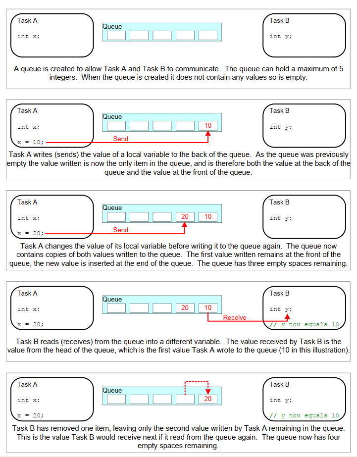

## 5.2 Characteristics of a Queue

### 5.2.1 Data Storage

A queue can hold a finite number of fixed size data items[^8]. The
maximum number of items a queue can hold is called its 'length'. Both
the length and the size of each data item are set when the queue is
created.

[^8]: FreeRTOS message buffers, described in chapter TBD, provide a
lighter weight alternative to queues that hold variable length
messages.

Queues are normally used as First In First Out (FIFO) buffers, where
data is written to the end (tail) of the queue and removed from the
front (head) of the queue. Figure 5.1 demonstrates data being written to
and read from a queue that is being used as a FIFO. It is also possible
to write to the front of a queue, and to overwrite data that is already
at the front of a queue.

***Figure 5.1*** **An example sequence of writes to, and reads from a queue**

There are two ways in which queue behaviour can be implemented:

1. Queue by copy

    Queuing by copy means the data sent to the queue is copied byte for
    byte into the queue.

1. Queue by reference

    Queuing by reference means the queue only holds pointers to the data
    sent to the queue, not the data itself.

FreeRTOS uses the queue by copy method because it is both more
powerful and simpler to use than queueing by reference because:

- Queuing by copy does not prevent the queue from also being used to
  queue by reference. For example, when the size of the data being
  queued makes it impractical to copy the data into the queue, then a
  pointer to the data can be copied into the queue instead.

- A stack variable can be sent directly to a queue, even though the
  variable will not exist after the function in which it is declared
  has exited.

- Data can be sent to a queue without first allocating a buffer to
  hold the data—you then copy the data into the allocated buffer
  and queue a reference to the buffer.

- The sending task can immediately re-use the variable or buffer that
  was sent to the queue.

- The sending task and the receiving task are completely
  de-coupled; an application designer does not need to concern
  themself with which task 'owns' the data, or which task is
  responsible for releasing the data.

- The RTOS takes complete responsibility for allocating the memory
  used to store data.

- Memory protected systems restrict access to RAM, in which case
  queueing by reference can only be accomplished if the sending and
  receiving tasks can both access the referenced data. Queuing by copy
  allows data to pass across memory protection boundaries.

### 5.2.2 Access by Multiple Tasks

Queues are objects in their own right and can be accessed by any task
or ISR that knows of their existence. Any number of tasks can write to
the same queue, and any number of tasks can read from the same queue. In
practice, it is very common for a queue to have multiple writers, but
much less common for a queue to have multiple readers.

### 5.2.3 Blocking on Queue Reads

When a task attempts to read from a queue, it can optionally specify a
'block' time. This is the time the task is kept in the Blocked state to
wait for data to become available from the queue, if the queue
is already empty. A task that is in the Blocked state waiting for data
to become available from a queue is automatically moved to the Ready
state when another task or interrupt places data into the queue. The
task will also be moved automatically from the Blocked state to the
Ready state if the specified block time expires before data becomes
available.

Queues can have multiple readers, so it is possible for a single queue
to have more than one task blocked on it waiting for data. When this is
the case, only one task is unblocked when data becomes available. The
task that is unblocked is always the highest priority task that is
waiting for data. If two or more blocked tasks have equal priority, then the
task that is unblocked is the one that has been waiting the longest.

### 5.2.4 Blocking on Queue Writes

Just as it can when reading from a queue, a task can optionally specify a block
time when writing to a queue. In this case, the block time is the
maximum time the task will be held in the Blocked state to wait for
space to become available on the queue, should the queue already be
full.

Queues can have multiple writers, so it is possible for a full queue to
have more than one task blocked on it waiting to complete a send
operation. When this is the case, only one task is unblocked when space
on the queue becomes available. The task that is unblocked is always the
highest priority task that is waiting for space. If two or more blocked tasks
have equal priority, then the task that is unblocked is the one that has been
waiting the longest.

### 5.2.5 Blocking on Multiple Queues

Queues can be grouped into sets, allowing a task to enter the Blocked
state to wait for data to become available on any of the queues in the
set. Section 5.6, Receiving From Multiple Queues, demonstrates queue
sets.

### 5.2.6 Creating Queues: Statically Allocated and Dynamically Allocated Queues

Queues are referenced by handles, which are variables of type
`QueueHandle_t`. A queue must be explicitly created before it can be used.

Two API functions create queues: `xQueueCreate()`, `xQueueCreateStatic()`.

Each queue requires two blocks of RAM, the first to hold its data
structure, and the second to hold queued data. `xQueueCreate()` allocates
the required RAM from the heap (dynamically). `xQueueCreateStatic()` uses
pre-allocated RAM passed into the function as parameters.