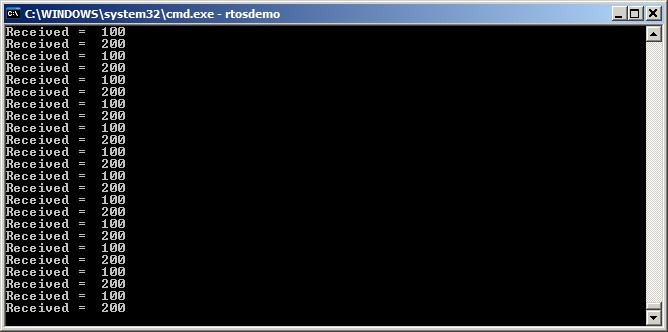

## 5.3 Using a Queue

### 5.3.1 The xQueueCreate() API Function

Listing 5.1 shows the `xQueueCreate()` function prototype.
`xQueueCreateStatic()` has two additional parameters that point to the
memory pre-allocated to hold the queue's data structure and data storage
area, respectively.

<a name="list5.1" title="Listing 5.1 The xQueueCreate() API function prototype"></a>

```c
QueueHandle_t xQueueCreate( UBaseType_t uxQueueLength, UBaseType_t uxItemSize );
```
***Listing 5.1*** *The xQueueCreate() API function prototype*


**xQueueCreate() parameters and return value:**

- `uxQueueLength`

  The maximum number of items that the queue being created can hold at
  any one time.

- `uxItemSize`

  The size in bytes of each data item that can be stored in the queue.

- Return value

  If NULL is returned, then the queue cannot be created because
  there is insufficient heap memory available for FreeRTOS to allocate the
  queue data structures and storage area. Chapter 2 provides more
  information on the FreeRTOS heap.

  If a non-NULL value is returned then the queue was created
  successfully and the returned value is the handle to the created
  queue.

`xQueueReset()` is an API function that restores a previously created queue
to its original empty state.


### 5.3.2 The xQueueSendToBack() and xQueueSendToFront() API Functions

As might be expected, `xQueueSendToBack()` sends data to the back (tail)
of a queue, and `xQueueSendToFront()` sends data to the front (head) of a
queue.

`xQueueSend()` is equivalent to, and exactly the same as,
`xQueueSendToBack()`.

> *Note: Never call `xQueueSendToFront()` or `xQueueSendToBack()` from an
> interrupt service routine. The interrupt-safe versions
>`xQueueSendToFrontFromISR()` and `xQueueSendToBackFromISR()` should be used
> in their place. These are described in Chapter 7.*

<a name="list5.2" title="Listing 5.2 The xQueueSendToFront() API function prototype"></a>


```c
BaseType_t xQueueSendToFront( QueueHandle_t xQueue,
                              const void * pvItemToQueue,
                              TickType_t xTicksToWait );
```
***Listing 5.2*** *The xQueueSendToFront() API function prototype*


<a name="list5.3" title="Listing 5.3 The xQueueSendToBack() API function prototype"></a>


```c
BaseType_t xQueueSendToBack( QueueHandle_t xQueue,
                             const void * pvItemToQueue,
                             TickType_t xTicksToWait );
```
***Listing 5.3*** *The xQueueSendToBack() API function prototype*


**xQueueSendToFront() and xQueueSendToBack() function parameters and return value**

- `xQueue`

  The handle of the queue to which the data is being sent (written).
  The queue handle will have been returned from the call to `xQueueCreate()`
  or `xQueueCreateStatic()` which are used to create the queue.

- `pvItemToQueue`

  A pointer to the data to be copied into the queue.

  The size of each item the queue can hold is set when the queue is
  created, so that many bytes are copied from `pvItemToQueue` into the queue
  storage area.

- `xTicksToWait`

  The maximum amount of time the task should remain in the Blocked
  state to wait for space to become available on the queue, should the
  queue already be full.
  
  Both `xQueueSendToFront()` and `xQueueSendToBack()` will return
  immediately if `xTicksToWait` is zero and the queue is already full.
  
  The block time is specified in tick periods, so the absolute time it
  represents is dependent on the tick frequency. The macro `pdMS_TO_TICKS()`
  can be used to convert a time specified in milliseconds into a time
  specified in ticks.
  
  Setting `xTicksToWait` to `portMAX_DELAY` will cause the task to wait
  indefinitely (without timing out), provided `INCLUDE_vTaskSuspend` is set
  to 1 in FreeRTOSConfig.h.

- Return value

  There are two possible return values:

  - `pdPASS`

    `pdPASS` is returned when data was successfully sent to the queue.

    If a block time was specified (`xTicksToWait` was not zero), then it is
    possible the calling task was placed into the Blocked state to wait for
    space to become available in the queue before the function returned,
    but data was successfully written to the queue before the block time
    expired.

  - `errQUEUE_FULL` (same value as `pdFAIL`)

    `errQUEUE_FULL` is returned if data could not be written to the queue
    because the queue was already full.

    If a block time was specified (`xTicksToWait` was not zero) then the
    calling task will have been placed into the Blocked state to wait for
    another task or interrupt to make space in the queue, but the specified
    block time expired before that happened.


### 5.3.3 The xQueueReceive() API Function

`xQueueReceive()` receives (reads) an item from a queue. The received item
is removed from the queue.

> *Note: Never call `xQueueReceive()` from an interrupt service routine. The
> interrupt-safe `xQueueReceiveFromISR()` API function is described in
> Chapter 7.*

<a name="list5.4" title="Listing 5.4 The xQueueReceive() API function prototype"></a>

```c
BaseType_t xQueueReceive( QueueHandle_t xQueue,
                          void * const pvBuffer,
                          TickType_t xTicksToWait );
```
***Listing 5.4*** *The xQueueReceive() API function prototype*


**xQueueReceive() function parameters and return values**

- `xQueue`

  The handle of the queue from which the data is being received
  (read). The queue handle will have been returned from the call to
  `xQueueCreate()` or `xQueueCreateStatic()` used to create the queue.

- `pvBuffer`

  A pointer to the memory into which the received data will be copied.

  The size of each data item that the queue holds is set when the queue
  is created. The memory pointed to by `pvBuffer` must be at least large
  enough to hold that many bytes.

- `xTicksToWait`

  The maximum amount of time the task should remain in the Blocked
  state to wait for data to become available on the queue, if the
  queue is already be empty.

  If `xTicksToWait` is zero, then `xQueueReceive()` will return immediately
  if the queue is already empty.

  The block time is specified in tick periods, so the absolute time it
  represents is dependent on the tick frequency. The macro `pdMS_TO_TICKS()`
  can be used to convert a time specified in milliseconds into a time
  specified in ticks.

  Setting `xTicksToWait` to `portMAX_DELAY` will cause the task to wait
  indefinitely (without timing out) provided `INCLUDE_vTaskSuspend` is set
  to 1 in FreeRTOSConfig.h.

- Return value

  There are two possible return values:
  
  - `pdPASS`

    `pdPASS` is returned when data was successfully read from the queue.

    If a block time was specified (`xTicksToWait` was not zero), then it is
    possible the calling task was placed into the Blocked state to wait for
    data to become available on the queue, but data was successfully read
    from the queue before the block time expired.</p>

  - `errQUEUE_EMPTY` (same value as `pdFAIL`)

    `errQUEUE_EMPTY` is returned if data cannot be read from the queue
    because the queue is already empty.

    If a block time was specified (`xTicksToWait` was not zero,) then the
    calling task will have been placed into the Blocked state to wait for
    another task or interrupt to send data to the queue, but the block time
    expired before that happened.


### 5.3.4 The uxQueueMessagesWaiting() API Function

`uxQueueMessagesWaiting()` queries the number of items currently in a queue.

> *Note: Never call `uxQueueMessagesWaiting()` from an interrupt service
> routine. The interrupt-safe `uxQueueMessagesWaitingFromISR()` should be
> used in its place.*

<a name="list5.5" title="Listing 5.5 The uxQueueMessagesWaiting() API function prototype"></a>

```c
UBaseType_t uxQueueMessagesWaiting( QueueHandle_t xQueue );
```
***Listing 5.5*** *The uxQueueMessagesWaiting() API function prototype*


**uxQueueMessagesWaiting() function parameters and return value**

- `xQueue`

  The handle of the queue being queried. The queue handle will have
  been returned from the call to `xQueueCreate()` or `xQueueCreateStatic()`
  which are used to create the queue.

- Return value

  The number of items currently in the queue being queried. If zero is returned, 
  then the queue is empty.


<a name="example5.1" title="Example 5.1 Blocking when receiving from a queue"></a>
---
***Example 5.1*** *Blocking when receiving from a queue*

---

This example demonstrates creating a queue, sending data to the queue
from multiple tasks, and receiving data from the queue. The queue is
created to hold data items of type `int32_t`. The tasks that send to the
queue do not specify a block time, whereas the task that receives from
the queue does.

The tasks that send to the queue have a lower priority than the task
that receives from the queue. This means the queue should never contain
more than one item because, as soon as data is sent to the queue the
receiving task will unblock, pre-empt the sending task (because it has a
higher priority), and remove the data, leaving the queue empty once
again.

The example creates two instances of the task shown in Listing 5.6, one
that continuously writes the value 100 to the queue, and another that
continuously writes the value 200 to the same queue. The task parameter
is used to pass these values into each task instance.

<a name="list5.6" title="Listing 5.6 Implementation of the sending task used in Example 5.1"></a>

```c
static void vSenderTask( void *pvParameters )
{

    int32_t lValueToSend;

    BaseType_t xStatus;

    /* Two instances of this task are created so the value that is sent to
       the queue is passed in via the task parameter - this way each instance 
       can use a different value. The queue was created to hold values of type 
       int32_t, so cast the parameter to the required type. */
    lValueToSend = ( int32_t ) pvParameters;

    /* As per most tasks, this task is implemented within an infinite loop. */
    for( ;; )
    {

        /* Send the value to the queue.

           The first parameter is the queue to which data is being sent. The
           queue was created before the scheduler was started, so before this 
           task started to execute.

           The second parameter is the address of the data to be sent, in this 
           case the address of lValueToSend.

           The third parameter is the Block time – the time the task should be 
           kept in the Blocked state to wait for space to become available on 
           the queue should the queue already be full. In this case a block 
           time is not specified because the queue should never contain more 
           than one item, and therefore never be full. */
        xStatus = xQueueSendToBack( xQueue, &lValueToSend, 0 );

        if( xStatus != pdPASS )
        {
            /* The send operation could not complete because the queue was full-
               this must be an error as the queue should never contain more than
               one item! */
            vPrintString( "Could not send to the queue.\r\n" );
        }
    }
}
```
***Listing 5.6*** *Implementation of the sending task used in Example 5.1*


Listing 5.7 shows the implementation of the task that receives data from
the queue. The receiving task specifies a block time of 100
milliseconds, then enters the Blocked state to wait for data to become
available. It leaves the Blocked state when either data is available on
the queue, or 100 milliseconds passes without data becoming available.
In this example, there are two tasks continuously writing to the queue
so the 100 milliseconds timeout never expires.

<a name="list5.7" title="Listing 5.7  Implementation of the receiver task for Example 5.1"></a>

```c
static void vReceiverTask( void *pvParameters )
{
    /* Declare the variable that will hold the values received from the
       queue. */
    int32_t lReceivedValue;
    BaseType_t xStatus;
    const TickType_t xTicksToWait = pdMS_TO_TICKS( 100 );

    /* This task is also defined within an infinite loop. */
    for( ;; )
    {
        /* This call should always find the queue empty because this task will
           immediately remove any data that is written to the queue. */
        if( uxQueueMessagesWaiting( xQueue ) != 0 )
        {
            vPrintString( "Queue should have been empty!\r\n" );
        }

        /* Receive data from the queue.

           The first parameter is the queue from which data is to be received.
           The queue is created before the scheduler is started, and therefore
           before this task runs for the first time.

           The second parameter is the buffer into which the received data will
           be placed. In this case the buffer is simply the address of a 
           variable that has the required size to hold the received data.

           The last parameter is the block time – the maximum amount of time 
           that the task will remain in the Blocked state to wait for data to 
           be available should the queue already be empty. */
        xStatus = xQueueReceive( xQueue, &lReceivedValue, xTicksToWait );

        if( xStatus == pdPASS )
        {
            /* Data was successfully received from the queue, print out the
               received value. */
            vPrintStringAndNumber( "Received = ", lReceivedValue );
        }
        else
        {
            /* Data was not received from the queue even after waiting for 
               100ms. This must be an error as the sending tasks are free 
               running and will be continuously writing to the queue. */
            vPrintString( "Could not receive from the queue.\r\n" );
        }
    }
}
```
***Listing 5.7***  *Implementation of the receiver task for Example 5.1*


Listing 5.8 contains the definition of the `main()` function. This simply
creates the queue and the three tasks before starting the scheduler. The
queue is created to hold a maximum of five `int32_t` values, even though
the relative task priorities mean the queue will never hold more than
one item at a time.

<a name="list5.8" title="Listing 5.8 The implementation of main() in Example 5.1"></a>

```c
/* Declare a variable of type QueueHandle_t. This is used to store the
   handle to the queue that is accessed by all three tasks. */
QueueHandle_t xQueue;

int main( void )
{
    /* The queue is created to hold a maximum of 5 values, each of which is
       large enough to hold a variable of type int32_t. */
    xQueue = xQueueCreate( 5, sizeof( int32_t ) );

    if( xQueue != NULL )
    {
        /* Create two instances of the task that will send to the queue. The
           task parameter is used to pass the value that the task will write 
           to the queue, so one task will continuously write 100 to the queue 
           while the other task will continuously write 200 to the queue. Both
           tasks are created at priority 1. */
        xTaskCreate( vSenderTask, "Sender1", 1000, ( void * ) 100, 1, NULL );
        xTaskCreate( vSenderTask, "Sender2", 1000, ( void * ) 200, 1, NULL );

        /* Create the task that will read from the queue. The task is created
           with priority 2, so above the priority of the sender tasks. */
        xTaskCreate( vReceiverTask, "Receiver", 1000, NULL, 2, NULL );

        /* Start the scheduler so the created tasks start executing. */
        vTaskStartScheduler();
    }
    else
    {
        /* The queue could not be created. */
    }

    /* If all is well then main() will never reach here as the scheduler will
       now be running the tasks. If main() does reach here then it is likely
       that there was insufficient FreeRTOS heap memory available for the idle 
       task to be created. Chapter 3 provides more information on heap memory 
       management. */
    for( ;; );
}
```
***Listing 5.8*** *The implementation of main() in Example 5.1*

Figure 5.2 shows the output produced by Example 5.1.

<a name="fig5.2" title="Figure 5.2 The output produced when Example 5.1 is executed"></a>

<div align="center">


***Figure 5.2*** **The output produced when Example 5.1 is executed**
</div>


Figure 5.3 demonstrates the sequence of execution.

<a name="fig5.3" title="Figure 5.3 The sequence of execution produced by Example 5.1"></a>

<div align="center">


***Figure 5.3*** **The sequence of execution produced by Example 5.1**
</div>