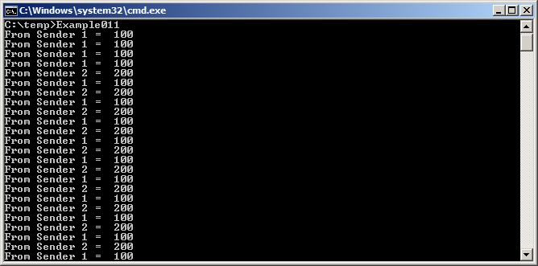

## 5.4 Receiving Data From Multiple Sources

It is common in FreeRTOS designs for a task to receive data from more
than one source. The receiving task needs to know where the data came
from to determine what to do with it. An easy design pattern to achieve
that uses a single queue to transfer structures that contain both the
data value and data source, as demonstrated in Figure 5.4.

<a name="fig5.4" title="Figure 5.4 An example scenario where structures are sent on a queue"></a>

<div align="center">


***Figure 5.4*** **An example scenario where structures are sent on a queue**
</div>

Referring to Figure 5.4:

- The created queue holds structures of type `Data_t`. The structure
  allows both a data value and an enumerated type indicating what the
  data means to be sent to the queue in one message.

- A central Controller task performs the primary system function. This
  has to react to inputs and changes to the system state communicated
  to it on the queue.

- A CAN bus task is used to encapsulate the CAN bus interfacing
  functionality. When the CAN bus task has received and decoded a
  message, it sends the already decoded message to the Controller task
  in a `Data_t` structure. The `eDataID` member of the transferred
  structure tells the Controller task what the data is. In the case 
  shown here, it is a motor speed value. The `lDataValue` member of the
  transferred structure tells the Controller task the actual motor
  speed value.

- A Human Machine Interface (HMI) task is used to encapsulate all the
  HMI functionality. The machine operator can probably input commands
  and query values in a number of ways that have to be detected and
  interpreted within the HMI task. When a new command is input, the
  HMI task sends the command to the Controller task in a `Data_t`
  structure. The `eDataID` member of the transferred structure tells the
  Controller task what the data is. In the case shown here, it is a new
  set point value. The `lDataValue` member of the transferred structure
  tells the Controller task the actual set point value.

Chapter (RB-TBD) shows how to extend this design pattern such that
the controller task can reply directly to the task that queued a structure.


<a name="example5.2" title="Example 5.2 Blocking when sending to a queue, and sending structures on a queue"></a>
---
***Example 5.2*** *Blocking when sending to a queue, and sending structures on a queue*

---

Example 5.2 is similar to Example 5.1, but with reversed task priorities,
so the receiving task has a lower priority than the sending tasks. Also,
the created queue holds structures rather than integers.

Listing 5.9 shows the definition of the structure used by Example 5.2.

<a name="list5.9" title="Listing 5.9 The definition of the structure that is to be passed on a queue, plus the declaration of two variables for use by the example"></a>

```c
/* Define an enumerated type used to identify the source of the data. */
typedef enum
{
    eSender1,
    eSender2
} DataSource_t;

/* Define the structure type that will be passed on the queue. */
typedef struct
{
    uint8_t ucValue;
    DataSource_t eDataSource;
} Data_t;

/* Declare two variables of type Data_t that will be passed on the queue. */
static const Data_t xStructsToSend[ 2 ] =
{
    { 100, eSender1 }, /* Used by Sender1. */
    { 200, eSender2 }  /* Used by Sender2. */
};
```
***Listing 5.9*** *The definition of the structure that is to be passed on a queue, plus the declaration of two variables for use by the example*

In Example 5.1, the receiving task has the highest priority, so the queue
never contains more than one item. This happens because the receiving task
pre-empts the sending tasks as soon as data is placed into the queue.
In Example 5.2, the sending tasks have the higher priority, so the queue
will normally be full. This is because, as soon as the receiving task
removes an item from the queue, it is pre-empted by one of the sending
tasks which then immediately re-fills the queue. The sending task then
re-enters the Blocked state to wait for space to become available on the
queue again.

Listing 5.10 shows the implementation of the sending task. The sending
task specifies a block time of 100 milliseconds, so it enters the
Blocked state to wait for space to become available each time the queue
becomes full. It leaves the Blocked state when either space is available
on the queue, or 100 milliseconds passes without space becoming
available. In this example, the receiving tasks continuously make space
in the queue, so the 100 milliseconds timeout never expires.

<a name="list5.10" title="Listing 5.10 The implementation of the sending task for Example 5.2"></a>

```c
static void vSenderTask( void *pvParameters )
{
    BaseType_t xStatus;
    const TickType_t xTicksToWait = pdMS_TO_TICKS( 100 );

    /* As per most tasks, this task is implemented within an infinite loop. */
    for( ;; )
    {
        /* Send to the queue.

           The second parameter is the address of the structure being sent. The
           address is passed in as the task parameter so pvParameters is used
           directly.

           The third parameter is the Block time - the time the task should be 
           kept in the Blocked state to wait for space to become available on 
           the queue if the queue is already full. A block time is specified 
           because the sending tasks have a higher priority than the receiving 
           task so the queue is expected to become full. The receiving task 
           will remove items from the queue when both sending tasks are in the 
           Blocked state. */
        xStatus = xQueueSendToBack( xQueue, pvParameters, xTicksToWait );

        if( xStatus != pdPASS )
        {
            /* The send operation could not complete, even after waiting for 
               100ms. This must be an error as the receiving task should make 
               space in the queue as soon as both sending tasks are in the 
               Blocked state. */
            vPrintString( "Could not send to the queue.\r\n" );
        }
    }
}
```
***Listing 5.10*** *The implementation of the sending task for Example 5.2*


The receiving task has the lowest priority so it only runs only when both
sending tasks are in the Blocked state. The sending tasks only enter the
Blocked state when the queue is full, so the receiving task will only
execute when the queue is already full. Therefore, it always expects to
receive data even when it does not specify a block time.

Listing 5.11 shows the implementation of the receiving task.

<a name="list5.11" title="Listing 5.11 The definition of the receiving task for Example 5.2"></a>

```c
static void vReceiverTask( void *pvParameters )
{
    /* Declare the structure that will hold the values received from the
       queue. */
    Data_t xReceivedStructure;
    BaseType_t xStatus;

    /* This task is also defined within an infinite loop. */
    for( ;; )
    {
        /* Because it has the lowest priority this task will only run when the
           sending tasks are in the Blocked state. The sending tasks will only
           enter the Blocked state when the queue is full so this task always 
           expects the number of items in the queue to be equal to the queue 
           length, which is 3 in this case. */
        if( uxQueueMessagesWaiting( xQueue ) != 3 )
        {
            vPrintString( "Queue should have been full!\r\n" );
        }

        /* Receive from the queue.

           The second parameter is the buffer into which the received data will
           be placed. In this case the buffer is simply the address of a 
           variable that has the required size to hold the received structure.

           The last parameter is the block time - the maximum amount of time 
           that the task will remain in the Blocked state to wait for data to 
           be available if the queue is already empty. In this case a block 
           time is not necessary because this task will only run when the 
           queue is full. */
        xStatus = xQueueReceive( xQueue, &xReceivedStructure, 0 );

        if( xStatus == pdPASS )
        {
            /* Data was successfully received from the queue, print out the
               received value and the source of the value. */
            if( xReceivedStructure.eDataSource == eSender1 )
            {
                vPrintStringAndNumber( "From Sender 1 = ", 
                                       xReceivedStructure.ucValue );
            }
            else
            {
                vPrintStringAndNumber( "From Sender 2 = ", 
                                       xReceivedStructure.ucValue );
            }
        }
        else
        {
            /* Nothing was received from the queue. This must be an error as 
               this task should only run when the queue is full. */
            vPrintString( "Could not receive from the queue.\r\n" );
        }
    }
}
```
***Listing 5.11*** *The definition of the receiving task for Example 5.2*

`main()` changes only slightly from the previous example. The queue is
created to hold three `Data_t` structures, and the priorities of the
sending and receiving tasks are reversed. Listing 5.12 shows the
implementation of `main()`.

<a name="list5.12" title="Listing 5.12 The implementation of main() for Example 5.2"></a>

```c
int main( void )
{
    /* The queue is created to hold a maximum of 3 structures of type Data_t. */
    xQueue = xQueueCreate( 3, sizeof( Data_t ) );

    if( xQueue != NULL )
    {
        /* Create two instances of the task that will write to the queue. The
           parameter is used to pass the structure that the task will write to
           the queue, so one task will continuously send xStructsToSend[ 0 ]
           to the queue while the other task will continuously send 
           xStructsToSend[ 1 ]. Both tasks are created at priority 2, which is
           above the priority of the receiver. */
        xTaskCreate( vSenderTask, "Sender1", 1000, &( xStructsToSend[ 0 ] ),
                     2, NULL );
        xTaskCreate( vSenderTask, "Sender2", 1000, &( xStructsToSend[ 1 ] ),
                     2, NULL );

        /* Create the task that will read from the queue. The task is created
           with priority 1, so below the priority of the sender tasks. */
        xTaskCreate( vReceiverTask, "Receiver", 1000, NULL, 1, NULL );

        /* Start the scheduler so the created tasks start executing. */
        vTaskStartScheduler();
    }
    else
    {
        /* The queue could not be created. */
    }

    /* If all is well then main() will never reach here as the scheduler will
       now be running the tasks. If main() does reach here then it is likely
       that there was insufficient heap memory available for the idle task to 
       be created. Chapter 3 provides more information on heap memory 
       management. */
    for( ;; );
}
```
***Listing 5.12*** *The implementation of main() for Example 5.2*

Figure 5.5 shows the output produced by Example 5.2.

<a name="fig5.5" title="Figure 5.5 The output produced by Example 5.2"></a>

<div align="center">


***Figure 5.5*** **The output produced by Example 5.2**
</div>

Figure 5.6 demonstrates the sequence of execution that results from
having the priority of the sending tasks above the priority of the
receiving task. Given below is a further explanation of Figure 5.6, and
description on why the first four messages originate from the same task.

<a name="fig5.6" title="Figure 5.6 The sequence of execution produced by Example 5.2"></a>

<div align="center">


***Figure 5.6*** **The sequence of execution produced by Example 5.2**
</div>

**Key to Figure 5.6**

- t1

  Task Sender 1 executes and sends 3 data items to the queue.

- t2

  The queue is full so Sender 1 enters the Blocked state to wait for
  its next send to complete. Task Sender 2 is now the highest priority
  task that can run, so it enters the Running state.

- t3

  Task Sender 2 finds the queue is already full, so it enters the Blocked
  state to wait for its first send to complete. Task Receiver is now the
  highest priority task that can run, so it enters the Running state.

- t4

  Two tasks that have a priority higher than the receiving task's
  priority are waiting for space to become available on the queue,
  resulting in task Receiver being pre-empted as soon as it has removed
  one item from the queue. Tasks Sender 1 and Sender 2 have the same
  priority, so the scheduler selects the task that has been waiting the
  longest as the task that will enter the Running state—in this case that
  is task Sender 1.

- t5

  Task Sender 1 sends another data item to the queue. There was
  only one space in the queue, so task Sender 1 enters the Blocked state
  to wait for its next send to complete. Task Receiver is again the
  highest priority task that can run so it enters the Running state.

  Task Sender 1 has now sent four items to the queue, and task Sender 2
  is still waiting to send its first item to the queue.

- t6

  Two tasks that have a priority higher than the receiving task's
  priority are waiting for space to become available on the queue, so task
  Receiver is pre-empted as soon as it has removed one item from the
  queue. This time Sender 2 has been waiting longer than Sender 1, so
  Sender 2 enters the Running state.

- t7

  Task Sender 2 sends a data item to the queue. There was only one
  space in the queue so Sender 2 enters the Blocked state to wait for its
  next send to complete. Both tasks Sender 1 and Sender 2 are waiting for
  space to become available on the queue, so task Receiver is the only
  task that can enter the Running state.