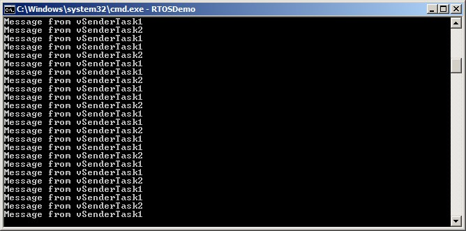

## 5.6 Receiving From Multiple Queues

### 5.6.1 Queue Sets

Often application designs require a single task to receive data of
different sizes, data with different meanings, and data from different
sources. The previous section demonstrated how to do this in a neat and
efficient way using a single queue that receives structures. However,
sometimes an application's designer is working with constraints that
limit their design choices, necessitating the use of a separate queue
for some data sources. For example, third party code being integrated
into a design might assume the presence of a dedicated queue. In such
cases a 'queue set' can be used.

Queue sets allow a task to receive data from more than one queue without
the task polling each queue in turn to determine which, if any, contains
data.

A design that uses a queue set to receive data from multiple sources is
less neat, and less efficient, than a design that achieves the same
functionality using a single queue that receives structures. For that
reason, it is recommended to only use queue sets if design constraints
make their use absolutely necessary.

The following sections describe how to use a queue set by:

- Creating a queue set.

- Adding queues to the set.

  Semaphores can also be added to a queue set. Semaphores are described later in this book.

- Reading from the queue set to determine which queues within the set contain data.

  When a queue that is a member of a set receives data, the handle of
  the receiving queue is sent to the queue set, and returned when a
  task calls a function that reads from the queue set. Therefore, if a
  queue handle is returned from a queue set, then the queue referenced
  by the handle is known to contain data, and the task can then read
  from that queue directly.

  > *Note: If a queue is a member of a queue set then you must read from
  > the queue each time its handle is received from the queue set, and you
  > must not read from the queue before its handle is received from the
  > queue set.*

Queue set functionality is enabled by setting the `configUSE_QUEUE_SETS`
compile time configuration constant to 1 in FreeRTOSConfig.h.


### 5.6.2 The xQueueCreateSet() API Function

A queue set must be explicitly created before it can be used. At the
time of writing there is no implementation of `xQueueCreateSetStatic()`.
However queue sets are themselves queues, so it is possible to create a
set using pre-allocated memory by using a specially crafted call to
`xQueueCreateStatic()`.

Queues sets are referenced by handles, which are variables of type
`QueueSetHandle_t`. The `xQueueCreateSet()` API function creates a queue set
and returns a `QueueSetHandle_t` that references the created queue set.

<a name="list5.21" title="Listing 5.21 The xQueueCreateSet() API function prototype"></a>

```c
QueueSetHandle_t xQueueCreateSet( const UBaseType_t uxEventQueueLength);
```
***Listing 5.21*** *The xQueueCreateSet() API function prototype*


**xQueueCreateSet() parameters and return value**

- `uxEventQueueLength`

  When a queue that is a member of a queue set receives data, the
  handle of the receiving queue is sent to the queue set.
  `uxEventQueueLength` defines the maximum number of queue handles the queue
  set being created can hold at any one time.

  Queue handles are only sent to a queue set when a queue within the
  set receives data. A queue cannot receive data if it is full, so no
  queue handles can be sent to the queue set if all the queues in the set
  are full. Therefore, the maximum number of items the queue set will ever
  have to hold at one time is the sum of the lengths of every queue in the
  set.

  As an example, if there are three empty queues in the set, and each
  queue has a length of five, then in total the queues in the set can
  receive fifteen items (three queues multiplied by five items each)
  before all the queues in the set are full. In that example
  `uxEventQueueLength` must be set to fifteen to guarantee the queue set can
  receive every item sent to it.

  Semaphores can also be added to a queue set. Semaphores are covered
  later in this book. For the purposes of calculating the necessary
  `uxEventQueueLength`, the length of a binary semaphore is one, the length
  of a mutex is one, and the length of a counting semaphore is given by
  the semaphore's maximum count value.

  As another example, if a queue set will contain a queue that has a
  length of three, and a binary semaphore (which has a length of one),
  `uxEventQueueLength` must be set to four (three plus one).

- Return Value

  If NULL is returned, then the queue set cannot be created because
  there is insufficient heap memory available for FreeRTOS to allocate the
  queue set data structures and storage area. Chapter 3 provides more
  information on the FreeRTOS heap.

  If a non-NULL value is returned then the queue set was created
  successfully and the returned value is the handle to the created queue set.


### 5.6.3 The xQueueAddToSet() API Function

`xQueueAddToSet()` adds a queue or semaphore to a queue set. Semaphores
are described later in this book.

<a name="list5.22" title="Listing 5.22 The xQueueAddToSet() API function prototype"></a>

```c
BaseType_t xQueueAddToSet( QueueSetMemberHandle_t xQueueOrSemaphore,
                           QueueSetHandle_t xQueueSet );
```
***Listing 5.22*** *The xQueueAddToSet() API function prototype*

**xQueueAddToSet() parameters and return value**

- `xQueueOrSemaphore`

  The handle of the queue or semaphore that is being added to the queue set.

  Queue handles and semaphore handles can both be cast to the `QueueSetMemberHandle_t` type.

- `xQueueSet`

  The handle of the queue set to which the queue or semaphore is being added.

- Return Value

  There are two possible return values:

  1. `pdPASS`

      This indicates the queue set was created successfully.

  1. `pdFAIL`

     This indicates the queue or semaphore could not be added to the queue set.

  Queues and binary semaphores can only be added to a set when they are
  empty. Counting semaphores can only be added to a set when their count
  is zero. Queues and semaphores can only be a member of one set at a time.


### 5.6.4 The xQueueSelectFromSet() API Function

`xQueueSelectFromSet()` reads a queue handle from the queue set.

When a queue or semaphore that is a member of a set receives data, the
handle of the receiving queue or semaphore is sent to the queue set, and
returned when a task calls `xQueueSelectFromSet()`. If a handle is
returned from a call to `xQueueSelectFromSet()` then the queue or
semaphore referenced by the handle is known to contain data and the
calling task must then read from the queue or semaphore directly.

> *Note: Do not read data from a queue or semaphore that is a member of a
> set unless the handle of the queue or semaphore has first been returned
> from a call to `xQueueSelectFromSet()`. Only read one item from a queue or
> semaphore each time the queue handle or semaphore handle is returned
> from a call to `xQueueSelectFromSet()`.*

<a name="list5.23" title="Listing 5.23 The xQueueSelectFromSet() API function prototype"></a>

```c
QueueSetMemberHandle_t xQueueSelectFromSet( QueueSetHandle_t xQueueSet,
                                            const TickType_t xTicksToWait );
```
***Listing 5.23*** *The xQueueSelectFromSet() API function prototype*

**xQueueSelectFromSet() parameters and return value**

- `xQueueSet`

  The handle of the queue set from which a queue handle or semaphore
  handle is being received (read). The queue set handle will have been
  returned from the call to `xQueueCreateSet()` used to create the queue
  set.

- `xTicksToWait`

  The maximum amount of time the calling task should remain in the
  Blocked state to wait to receive a queue or semaphore handle from the
  queue set, if all the queues and semaphore in the set are empty.

  If `xTicksToWait` is zero then `xQueueSelectFromSet()` will return
  immediately if all the queues and semaphores in the set are empty.

  The block time is specified in tick periods, so the absolute time it
  represents is dependent on the tick frequency. The macro `pdMS_TO_TICKS()`
  can be used to convert a time specified in milliseconds to a time
  specified in ticks.

  Setting `xTicksToWait` to `portMAX_DELAY` will cause the task to wait
  indefinitely (without timing out) provided `INCLUDE_vTaskSuspend` is set
  to 1 in FreeRTOSConfig.h.

- Return Value

  A return value that is not NULL will be the handle of a queue or
  semaphore that is known to contain data. If a block time was specified
  (`xTicksToWait` was not zero), then it is possible the calling task was
  placed into the Blocked state to wait for data to become available from
  a queue or semaphore in the set, but a handle was successfully read from
  the queue set before the block time expired. Handles are returned as a
  `QueueSetMemberHandle_t` type, which can be cast to either a `QueueHandle_t`
  type or `SemaphoreHandle_t` type.

  If the return value is NULL then a handle could not be read from the
  queue set. If a block time was specified (`xTicksToWait` was not zero)
  then the calling task was placed in the Blocked state to
  wait for another task or interrupt to send data to a queue or semaphore
  in the set, but the block time expired before that happened.


<a name="example5.3" title="Example 5.3 Using a Queue Set"></a>
---
***Example 5.3*** *Using a Queue Set</i></h3>

---

This example creates two sending tasks and one receiving task. The
sending tasks send data to the receiving task on two separate queues,
one queue for each task. The two queues are added to a queue set, and
the receiving task reads from the queue set to determine which of the
two queues contain data.

The tasks, queues, and the queue set are all created in `main()`—see
Listing 5.24 for its implementation.

<a name="list5.24" title="Listing 5.24  Implementation of main() for Example 5.3"></a>

```c
/* Declare two variables of type QueueHandle_t. Both queues are added
   to the same queue set. */
static QueueHandle_t xQueue1 = NULL, xQueue2 = NULL;

/* Declare a variable of type QueueSetHandle_t. This is the queue set
   to which the two queues are added. */
static QueueSetHandle_t xQueueSet = NULL;

int main( void )
{
    /* Create the two queues, both of which send character pointers. The 
       priority of the receiving task is above the priority of the sending 
       tasks, so the queues will never have more than one item in them at 
       any one time*/
    xQueue1 = xQueueCreate( 1, sizeof( char * ) );
    xQueue2 = xQueueCreate( 1, sizeof( char * ) );

    /* Create the queue set. Two queues will be added to the set, each of
       which can contain 1 item, so the maximum number of queue handles the 
       queue set will ever have to hold at one time is 2 (2 queues multiplied 
       by 1 item per queue). */
    xQueueSet = xQueueCreateSet( 1 * 2 );

    /* Add the two queues to the set. */
    xQueueAddToSet( xQueue1, xQueueSet );
    xQueueAddToSet( xQueue2, xQueueSet );

    /* Create the tasks that send to the queues. */
    xTaskCreate( vSenderTask1, "Sender1", 1000, NULL, 1, NULL );
    xTaskCreate( vSenderTask2, "Sender2", 1000, NULL, 1, NULL );

    /* Create the task that reads from the queue set to determine which of
       the two queues contain data. */
    xTaskCreate( vReceiverTask, "Receiver", 1000, NULL, 2, NULL );

    /* Start the scheduler so the created tasks start executing. */
    vTaskStartScheduler();

    /* As normal, vTaskStartScheduler() should not return, so the following
       lines will never execute. */
    for( ;; );
    return 0;
}
```
***Listing 5.24*** *Implementation of main() for Example 5.3*

The first sending task uses `xQueue1` to send a character pointer to the
receiving task every 100 milliseconds. The second sending task uses
`xQueue2` to send a character pointer to the receiving task every 200
milliseconds. The character pointers point to a string that identifies
the sending task. Listing 5.25 shows the implementation of both tasks.

<a name="list5.25" title="Listing 5.25 The sending tasks used in Example 5.3"></a>

```c
void vSenderTask1( void *pvParameters )
{
    const TickType_t xBlockTime = pdMS_TO_TICKS( 100 );
    const char * const pcMessage = "Message from vSenderTask1\r\n";

    /* As per most tasks, this task is implemented within an infinite loop. */

    for( ;; )
    {

        /* Block for 100ms. */
        vTaskDelay( xBlockTime );

        /* Send this task's string to xQueue1. It is not necessary to use a
           block time, even though the queue can only hold one item. This is 
           because the priority of the task that reads from the queue is 
           higher than the priority of this task; as soon as this task writes 
           to the queue it will be pre-empted by the task that reads from the 
           queue, so the queue will already be empty again by the time the 
           call to xQueueSend() returns. The block time is set to 0. */
        xQueueSend( xQueue1, &pcMessage, 0 );
    }
}

/*-----------------------------------------------------------*/

void vSenderTask2( void *pvParameters )
{
    const TickType_t xBlockTime = pdMS_TO_TICKS( 200 );
    const char * const pcMessage = "Message from vSenderTask2\r\n";

    /* As per most tasks, this task is implemented within an infinite loop. */
    for( ;; )
    {
        /* Block for 200ms. */
        vTaskDelay( xBlockTime );

        /* Send this task's string to xQueue2. It is not necessary to use a
           block time, even though the queue can only hold one item. This is 
           because the priority of the task that reads from the queue is 
           higher than the priority of this task; as soon as this task writes 
           to the queue it will be pre-empted by the task that reads from the 
           queue, so the queue will already be empty again by the time the 
           call to xQueueSend() returns. The block time is set to 0. */
        xQueueSend( xQueue2, &pcMessage, 0 );
    }
}
```
***Listing 5.25*** *The sending tasks used in Example 5.3*


The queues written to by the sending tasks are members of the same queue
set. Each time a task sends to one of the queues, the handle of the
queue is sent to the queue set. The receiving task calls
`xQueueSelectFromSet()` to read the queue handles from the queue set.
After the receiving task receives a queue handle from the set, it knows
the queue referenced by the received handle contains data, so it reads the
data from the queue directly. The data it reads from the queue is a
pointer to a string, which the receiving task prints out.

If a call to `xQueueSelectFromSet()` times out, it returns NULL. In Example
5.3, `xQueueSelectFromSet()` is called with an indefinite block time, so it
will never time out, and can only return a valid queue handle.
Therefore, the receiving task does not need to check to see if
`xQueueSelectFromSet()` returned NULL before using the returned value.

`xQueueSelectFromSet()` only returns a queue handle if the queue
referenced by the handle contains data, so it is not necessary to use a
block time when reading from the queue.

Listing 5.26 shows the implementation of the receive task.

<a name="list5.26" title="Listing 5.26 The receive task used in Example 5.3"></a>

```c
void vReceiverTask( void *pvParameters )
{
    QueueHandle_t xQueueThatContainsData;
    char *pcReceivedString;

    /* As per most tasks, this task is implemented within an infinite loop. */
    for( ;; )
    {
        /* Block on the queue set to wait for one of the queues in the set to
           contain data. Cast the QueueSetMemberHandle_t value returned from
           xQueueSelectFromSet() to a QueueHandle_t, as it is known all the 
           members of the set are queues (the queue set does not contain any 
           semaphores). */
        xQueueThatContainsData = ( QueueHandle_t ) xQueueSelectFromSet(
                                                     xQueueSet, portMAX_DELAY );

        /* An indefinite block time was used when reading from the queue set,
           so xQueueSelectFromSet() will not have returned unless one of the 
           queues in the set contained data, and xQueueThatContainsData cannot
           be NULL. Read from the queue. It is not necessary to specify a 
           block time because it is known the queue contains data. The block 
           time is set to 0. */
        xQueueReceive( xQueueThatContainsData, &pcReceivedString, 0 );

        /* Print the string received from the queue. */
        vPrintString( pcReceivedString );
    }
}
```
***Listing 5.26*** *The receive task used in Example 5.3*

Figure 5.7 shows the output produced by Example 5.3. It can be seen that
the receiving task receives strings from both sending tasks. The block
time used by `vSenderTask1()` is half of the block time used by
`vSenderTask2()`, which causes the strings sent by `vSenderTask1()` to print out
twice as often as those sent by `vSenderTask2()`.

<a name="fig5.7" title="Figure 5.7 The output produced when Example 5.3 is executed"></a>

<div align="center">


***Figure 5.7*** **The output produced when Example 5.3 is executed**
</div>


### 5.6.5 More Realistic Queue Set Use Cases

Example 5.3 demonstrated a very simplistic case; the queue set only
contained queues, and the two queues it contained were both used to send
a character pointer. In a real application, a queue set might contain
both queues and semaphores, and the queues might not all hold the same
data type. When this is the case, it is necessary to test the value
returned by `xQueueSelectFromSet()`, before using the returned value.
Listing 5.27 demonstrates how to use the value returned from
`xQueueSelectFromSet()` when the set has the following members:

- A binary semaphore.
- A queue from which character pointers are read.
- A queue from which `uint32_t` values are read.

Listing 5.27 assumes the queues and semaphore have already been created
and added to the queue set.

<a name="list5.27" title="Listing 5.27 Using a queue set that contains queues and semaphores"></a>

```c
/* The handle of the queue from which character pointers are received. */
QueueHandle_t xCharPointerQueue;

/* The handle of the queue from which uint32_t values are received. */
QueueHandle_t xUint32tQueue;

/* The handle of the binary semaphore. */
SemaphoreHandle_t xBinarySemaphore;

/* The queue set to which the two queues and the binary semaphore belong. */
QueueSetHandle_t xQueueSet;

void vAMoreRealisticReceiverTask( void *pvParameters )
{
    QueueSetMemberHandle_t xHandle;
    char *pcReceivedString;
    uint32_t ulRecievedValue;
    const TickType_t xDelay100ms = pdMS_TO_TICKS( 100 );

    for( ;; )
    {
        /* Block on the queue set for a maximum of 100ms to wait for one of the
           members of the set to contain data. */
        xHandle = xQueueSelectFromSet( xQueueSet, xDelay100ms );

        /* Test the value returned from xQueueSelectFromSet(). If the returned
           value is NULL then the call to xQueueSelectFromSet() timed out. If 
           the returned value is not NULL then the returned value will be the 
           handle of one of the set's members. The QueueSetMemberHandle_t 
           value can be cast to either a QueueHandle_t or a SemaphoreHandle_t.
           Whether an explicit cast is required depends on the compiler. */

        if( xHandle == NULL )
        {
            /* The call to xQueueSelectFromSet() timed out. */
        }
        else if( xHandle == ( QueueSetMemberHandle_t ) xCharPointerQueue )
        {
            /* The call to xQueueSelectFromSet() returned the handle of the 
               queue that receives character pointers. Read from the queue. 
               The queue is known to contain data, so a block time of 0 is 
               used. */
            xQueueReceive( xCharPointerQueue, &pcReceivedString, 0 );

            /* The received character pointer can be processed here... */
        }
        else if( xHandle == ( QueueSetMemberHandle_t ) xUint32tQueue )
        {
            /* The call to xQueueSelectFromSet() returned the handle of the 
               queue that receives uint32_t types. Read from the queue. The 
               queue is known to contain data, so a block time of 0 is used. */
            xQueueReceive(xUint32tQueue, &ulRecievedValue, 0 );

            /* The received value can be processed here... */
        }
        else if( xHandle == ( QueueSetMemberHandle_t ) xBinarySemaphore )
        {
            /* The call to xQueueSelectFromSet() returned the handle of the 
               binary semaphore. Take the semaphore now. The semaphore is 
               known to be available so a block time of 0 is used. */
            xSemaphoreTake( xBinarySemaphore, 0 );

            /* Whatever processing is necessary when the semaphore is taken 
               can be performed here... */
        }
    }
}
```
***Listing 5.27*** *Using a queue set that contains queues and semaphores*