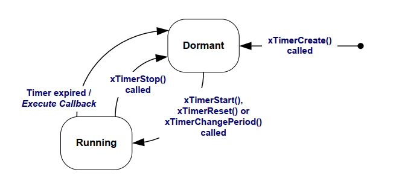

## 6.3 Attributes and States of a Software Timer

### 6.3.1 Period of a Software Timer

A software timer's 'period' is the time between the software timer being
started, and the software timer's callback function executing.

### 6.3.2 One-shot and Auto-reload Timers

There are two types of software timer:

1. One-shot timers

   Once started, a one-shot timer will execute its callback function
   once only. A one-shot timer can be restarted manually, but will not
   restart itself.

1. Auto-reload timers

   Once started, an auto-reload timer will re-start itself each time it
   expires, resulting in periodic execution of its callback function.

Figure 6.1 shows the difference in behavior between a one-shot timer and
an auto-reload timer. The dashed vertical lines mark the times at which
a tick interrupt occurs.


<a name="fig6.1" title="Figure 6.1 The difference in behavior between one-shot and auto-reload software timers"></a>

<div align="center">


***Figure 6.1*** **The difference in behavior between one-shot and auto-reload software timers**
</div>

Referring to Figure 6.1:

- Timer 1

  Timer 1 is a one-shot timer that has a period of 6 ticks. It is
  started at time t1, so its callback function executes 6 ticks later,
  at time t7. As timer 1 is a one-shot timer, its callback function does
  not execute again.

- Timer 2

  Timer 2 is an auto-reload timer that has a period of 5 ticks. It is
  started at time t1, so its callback function executes every 5 ticks
  after time t1. In Figure 6.1 this is at times t6, t11 and t16.


### 6.3.3 Software Timer States

A software timer can be in one of the following two states:

- Dormant

  A Dormant software timer exists, and can be referenced by its handle,
  but is not running, so its callback functions will not execute.

- Running

  A Running software timer will execute its callback function after a
  time equal to its period has elapsed since the software timer entered
  the Running state, or since the software timer was last reset.

Figure 6.2 and Figure 6.3 show the possible transitions between the
Dormant and Running states for an auto-reload timer and a one-shot timer
respectively. The key difference between the two diagrams is the state
entered after the timer has expired; the auto-reload timer executes its
callback function then re-enters the Running state, the one-shot timer
executes its callback function then enters the Dormant state.


<a name="fig6.2" title="Figure 6.2 Auto-reload software timer states and transitions"></a>
<a name="fig6.3" title="Figure 6.3 One-shot software timer states and transitions"></a>

<div align="center">


***Figure 6.2*** **Auto-reload software timer states and transitions*


***Figure 6.3*** *One-shot software timer states and transitions**
</div>

The `xTimerDelete()` API function deletes a timer. A timer can be deleted
at any time. The function prototype is demonstrated by Listing 6.2.


<a name="list6.2" title="Listing 6.2 The xTimerDelete() API function prototype"></a>

```c
BaseType_t xTimerDelete( TimerHandle_t xTimer, TickType_t xTicksToWait );
```
***Listing 6.2*** *The xTimerDelete() API function prototype*


**xTimerDelete() parameters and return value**

- `xTimer`

  The handle of the timer being deleted.

- `xTicksToWait`

  Specifies the time, in ticks, that the calling task should be held
  in the Blocked state to wait for the delete command to be successfully
  sent to the timer command queue, should the queue already be full when
  xTimerDelete() was called.  xTicksToWait is ignored if xTimerDelete()
  is called before the scheduler is started.

- Return value

  There are two possible return values:

  - `pdPASS`

    `pdPASS` will be returned if the command was successfully sent to the
     timer command queue.

  - `pdFAIL`

    `pdFAIL` will be returned if the delete command could not be sent to
    the timer command queue even after xBlockTime ticks had passed.