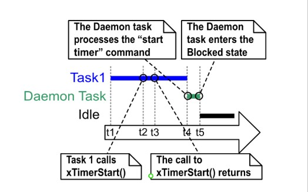

## 6.4 The Context of a Software Timer

### 6.4.1 The RTOS Daemon (Timer Service) Task

All software timer callback functions execute in the context of the same
RTOS daemon (or 'timer service') task[^10].

[^10]: The task used to be called the 'timer service task', because
originally it was only used to execute software timer callback
functions. Now the same task is used for other purposes too, so it
is known by the more generic name of the 'RTOS daemon task'.

The daemon task is a standard FreeRTOS task that is created
automatically when the scheduler is started. Its priority and stack size
are set by the `configTIMER_TASK_PRIORITY` and
`configTIMER_TASK_STACK_DEPTH` compile time configuration constants
respectively. Both constants are defined within FreeRTOSConfig.h.

Software timer callback functions must not call FreeRTOS API functions
that will result in the calling task entering the Blocked state, as to
do so will result in the daemon task entering the Blocked state.

### 6.4.2 The Timer Command Queue

Software timer API functions send commands from the calling task to the
daemon task on a queue called the 'timer command queue'. This is shown
in Figure 6.4. Examples of commands include 'start a timer', 'stop a
timer' and 'reset a timer'.

The timer command queue is a standard FreeRTOS queue that is created
automatically when the scheduler is started. The length of the timer
command queue is set by the `configTIMER_QUEUE_LENGTH` compile time
configuration constant in FreeRTOSConfig.h.

***Figure 6.4*** **The timer command queue being used by a software timer API function to communicate with the RTOS daemon task**

### 6.4.3 Daemon Task Scheduling

The daemon task is scheduled like any other FreeRTOS task; it will only
process commands, or execute timer callback functions, when it is the
highest priority task that is able to run. Figure 6.5 and Figure 6.6
demonstrate how the `configTIMER_TASK_PRIORITY` setting affects the
execution pattern.

Figure 6.5 shows the execution pattern when the priority of the daemon
task is below the priority of a task that calls the `xTimerStart()` API
function.

***Figure 6.5*** **The execution pattern when the priority of a task calling xTimerStart() is above the priority of the daemon task**

Referring to Figure 6.5, in which the priority of Task 1 is higher than
the priority of the daemon task, and the priority of the daemon task is
higher than the priority of the Idle task:

1.  At time t1

    Task 1 is in the Running state, and the daemon task is in the
    Blocked state.

    The daemon task will leave the Blocked state if a command is sent to
    the timer command queue, in which case it will process the command,
    or if a software timer expires, in which case it will execute the
    software timer's callback function.

1. At time t2

   Task 1 calls `xTimerStart()`.

   `xTimerStart()` sends a command to the timer command queue, causing
   the daemon task to leave the Blocked state. The priority of Task 1
   is higher than the priority of the daemon task, so the daemon task
   does not pre-empt Task 1.

   Task 1 is still in the Running state, and the daemon task has left
   the Blocked state and entered the Ready state.

1. At time t3

   Task 1 completes executing the `xTimerStart()` API function. Task 1
   executed `xTimerStart()` from the start of the function to the end of
   the function, without leaving the Running state.

1. At time t4

   Task 1 calls an API function that results in it entering the Blocked
   state. The daemon task is now the highest priority task in the Ready
   state, so the scheduler selects the daemon task as the task to enter
   the Running state. The daemon task then starts to process the
   command sent to the timer command queue by Task 1.

   > *Note: The time at which the software timer being started will
   > expire is calculated from the time the 'start a timer' command was
   > sent to the timer command queue—it is not calculated from the time
   > the daemon task received the 'start a timer' command from the timer
   > command queue.*

1. At time t5

   The daemon task has completed processing the command sent to it by
   Task 1, and attempts to receive more data from the timer command
   queue. The timer command queue is empty, so the daemon task
   re-enters the Blocked state. The daemon task will leave the Blocked
   state again if a command is sent to the timer command queue, or if a
   software timer expires.

   The Idle task is now the highest priority task in the Ready state,
   so the scheduler selects the Idle task as the task to enter the
   Running state.

Figure 6.6 shows a similar scenario to that shown by Figure 6.5, but this
time the priority of the daemon task is above the priority of the task
that calls `xTimerStart()`.

***Figure 6.6*** **The execution pattern when the priority of a task calling xTimerStart() is below the priority of the daemon task**

Referring to Figure 6.6, in which the priority of the daemon task is
higher than the priority of Task 1, and the priority of the Task 1 is
higher than the priority of the Idle task:

1. At time t1

   As before, Task 1 is in the Running state, and the daemon task is in
   the Blocked state.

1. At time t2

   Task 1 calls `xTimerStart()`.

   `xTimerStart()` sends a command to the timer command queue, causing
   the daemon task to leave the Blocked state. The priority of the
   daemon task is higher than the priority of Task 1, so the scheduler
   selects the daemon task as the task to enter the Running state.

   Task 1 was pre-empted by the daemon task before it had completed
   executing the `xTimerStart()` function, and is now in the Ready state.

   The daemon task starts to process the command sent to the timer
   command queue by Task 1.

1. At time t3

   The daemon task has completed processing the command sent to it by
   Task 1, and attempts to receive more data from the timer command
   queue. The timer command queue is empty, so the daemon task
   re-enters the Blocked state.

   Task 1 is now the highest priority task in the Ready state, so the
   scheduler selects Task 1 as the task to enter the Running state.

1. At time t4

   Task 1 was pre-empted by the daemon task before it had completed
   executing the `xTimerStart()` function, and only exits (returns from)
   `xTimerStart()` after it has re-entered the Running state.

1. At time t5

   Task 1 calls an API function that results in it entering the Blocked
   state. The Idle task is now the highest priority task in the Ready
   state, so the scheduler selects the Idle task as the task to enter
   the Running state.

In the scenario shown by Figure 6.5, time passed between Task 1 sending a
command to the timer command queue, and the daemon task receiving and
processing the command. In the scenario shown by Figure 6.6, the daemon
task had received and processed the command sent to it by Task 1 before
Task 1 returned from the function that sent the command.

Commands sent to the timer command queue contain a time stamp. The time
stamp is used to account for any time that passes between a command
being sent by an application task, and the same command being processed
by the daemon task. For example, if a 'start a timer' command is sent to
start a timer that has a period of 10 ticks, the time stamp is used to
ensure the timer being started expires 10 ticks after the command was
sent, not 10 ticks after the command was processed by the daemon task.