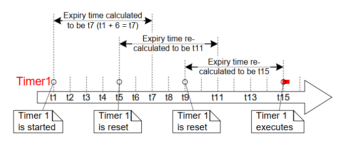

## 6.8 Resetting a Software Timer

Resetting a software timer means to re-start the timer; the timer's
expiry time is recalculated to be relative to when the timer was reset,
rather than when the timer was originally started. This is demonstrated
by Figure 6.9, which shows a timer that has a period of 6 being started,
then reset twice, before eventually expiring and executing its callback
function.


<a name="fig6.9" title="Figure 6.9 Starting and resetting a software timer that has a period of 6 ticks"></a>

<div align="center">


***Figure 6.9*** **Starting and resetting a software timer that has a period of 6 ticks**
</div>

Referring to Figure 6.9:

- Timer 1 is started at time t1. It has a period of 6, so the time at
  which it will execute its callback function is originally calculated
  to be t7, which is 6 ticks after it was started.

- Timer 1 is reset before time t7 is reached, so before it had expired
  and executed its callback function. Timer 1 is reset at time t5, so
  the time at which it will execute its callback function is
  re-calculated to be t11, which is 6 ticks after it was reset.

- Timer 1 is reset again before time t11, so again before it had
  expired and executed its callback function. Timer 1 is reset at time
  t9, so the time at which it will execute its callback function is
  re-calculated to be t15, which is 6 ticks after it was last reset.

- Timer 1 is not reset again, so it expires at time t15, and its
  callback function is executed accordingly.


### 6.8.1 The xTimerReset() API Function

A timer is reset using the `xTimerReset()` API function.

`xTimerReset()` can also be used to start a timer that is in the Dormant state.

> *Note: Never call `xTimerReset()` from an interrupt service routine. The
> interrupt-safe version `xTimerResetFromISR()` should be used in its
> place.*


<a name="list6.14" title="Listing 6.14 The xTimerReset() API function prototype"></a>

```c
BaseType_t xTimerReset( TimerHandle_t xTimer, TickType_t xTicksToWait );
```
***Listing 6.14*** *The xTimerReset() API function prototype*


**xTimerReset() parameters and return value**

- `xTimer`

  The handle of the software timer being reset or started. The handle
  will have been returned from the call to `xTimerCreate()` used to create
  the software timer.

- `xTicksToWait`

  `xTimerReset()` uses the timer command queue to send the
  'reset' command to the daemon task. `xTicksToWait` specifies the maximum
  amount of time the calling task should remain in the Blocked state to
  wait for space to become available on the timer command queue, if
  the queue is already full.

  `xTimerReset()` will return immediately if `xTicksToWait` is zero and the
  timer command queue is already full.

  If `INCLUDE_vTaskSuspend` is set to 1 in `FreeRTOSConfig.h` then setting
  `xTicksToWait` to `portMAX_DELAY` will result in the calling task remaining
  in the Blocked state indefinitely (without a timeout) to wait for space
  to become available in the timer command queue.

- Returned value

  There are two possible return values:

  - `pdPASS`

    `pdPASS` will be returned only if data was successfully sent to the
    timer command queue.

    If a block time was specified (`xTicksToWait` was not zero), then it is
    possible the calling task was placed into the Blocked state to wait for
    space to become available in the timer command queue before the function
    returned, but data was successfully written to the timer command queue
    before the block time expired.

    `pdFAIL`

    `pdFAIL` will be returned if the 'reset' command could not be written
    to the timer command queue because the queue was already full.

    If a block time was specified (`xTicksToWait` was not zero) then the
    calling task will have been placed into the Blocked state to wait for
    the daemon task to make room in the queue, but the specified block time
    expired before that happened.


<a name="example6.3" title="Example 6.3 Resetting a software timer"></a>
---
***Example 6.3*** *Resetting a software timer*

---

This example simulates the behavior of the backlight on a cell phone. The backlight:

- Turns on when a key is pressed.

- Remains on provided further keys are pressed within a certain time period.

- Automatically turns off if no key presses are made within a certain time period.

A one-shot software timer is used to implement this behavior:

- The \[simulated\] backlight is turned on when a key is pressed, and
  turned off in the software timer's callback function.

- The software timer is reset each time a key is pressed.

- The time period during which a key must be pressed to prevent the
  backlight being turned off is therefore equal to the period of the
  software timer; if the software timer is not reset by a key press
  before the timer expires, then the timer's callback function
  executes, and the backlight is turned off.

The `xSimulatedBacklightOn` variable holds the backlight state.
`xSimulatedBacklightOn` is set to `pdTRUE` to indicate the backlight is on,
and `pdFALSE` to indicate the backlight is off.

The software timer callback function is shown in Listing 6.15.


<a name="list6.15" title="Listing 6.15 The callback function for the one-shot timer used in Example 6.3"></a>

```c
static void prvBacklightTimerCallback( TimerHandle_t xTimer )
{
    TickType_t xTimeNow = xTaskGetTickCount();

    /* The backlight timer expired, turn the backlight off. */
    xSimulatedBacklightOn = pdFALSE;

    /* Print the time at which the backlight was turned off. */
    vPrintStringAndNumber(
            "Timer expired, turning backlight OFF at time\t\t", xTimeNow );
}
```
***Listing 6.15*** *The callback function for the one-shot timer used in Example 6.3*


Example 6.3 creates a task to poll the keyboard[^11]. The task is shown
in Listing 6.16, but for the reasons described in the next paragraph,
Listing 6.16 is not intended to be representative of an optimal design.

[^11]: Printing to the Windows console, and reading keys from the
Windows console, both result in the execution of Windows system
calls. Windows system calls, including use of the Windows console,
disks, or TCP/IP stack, can adversely affect the behavior of the
FreeRTOS Windows port, and should normally be avoided.*

Using FreeRTOS allows your application to be event driven. Event driven
designs use processing time very efficiently, because processing time is
only used if an event has occurred, and processing time is not wasted
polling for events that have not occurred. Example 6.3 could not be made
event driven because it is not practical to process keyboard interrupts
when using the FreeRTOS Windows port, so the much less efficient polling
technique had to be used instead. If Listing 6.16 was an interrupt service
routine, then `xTimerResetFromISR()` would be used in place of
`xTimerReset()`.


<a name="list6.16" title="Listing 6.16 The task used to reset the software timer in Example 6.3"></a>

```c
static void vKeyHitTask( void *pvParameters )
{
    const TickType_t xShortDelay = pdMS_TO_TICKS( 50 );
    TickType_t xTimeNow;

    vPrintString( "Press a key to turn the backlight on.\r\n" );

    /* Ideally an application would be event driven, and use an interrupt to
       process key presses. It is not practical to use keyboard interrupts
       when using the FreeRTOS Windows port, so this task is used to poll for
       a key press. */
    for( ;; )
    {
        /* Has a key been pressed? */
        if( _kbhit() != 0 )
        {
            /* A key has been pressed. Record the time. */
            xTimeNow = xTaskGetTickCount();

            if( xSimulatedBacklightOn == pdFALSE )
            {

                /* The backlight was off, so turn it on and print the time at
                   which it was turned on. */
                xSimulatedBacklightOn = pdTRUE;
                vPrintStringAndNumber(
                    "Key pressed, turning backlight ON at time\t\t",
                    xTimeNow );
            }
            else
            {
                /* The backlight was already on, so print a message to say the
                   timer is about to be reset and the time at which it was
                   reset. */
                vPrintStringAndNumber(
                    "Key pressed, resetting software timer at time\t\t",
                    xTimeNow );
            }

            /* Reset the software timer. If the backlight was previously off,
               then this call will start the timer. If the backlight was
               previously on, then this call will restart the timer. A real
               application may read key presses in an interrupt. If this
               function was an interrupt service routine then
               xTimerResetFromISR() must be used instead of xTimerReset(). */
            xTimerReset( xBacklightTimer, xShortDelay );

            /* Read and discard the key that was pressed – it is not required
               by this simple example. */
            ( void ) _getch();
        }
    }
}
```
***Listing 6.16*** *The task used to reset the software timer in Example 6.3*

The output produced when Example 6.3 is executed is shown in Figure 6.10.
With reference to Figure 6.10:

- The first key press occurred when the tick count was 812. At that
  time the backlight was turned on, and the one-shot timer was
  started.

- Further key presses occurred when the tick count was 1813, 3114,
  4015 and 5016. All of these key presses resulted in the timer being
  reset before the timer had expired.

- The timer expired when the tick count was 10016. At that time the
  backlight was turned off.


<a name="fig6.10" title="Figure 6.10 The output produced when Example 6.3 is executed"></a>

<div align="center">


***Figure 6.10*** **The output produced when Example 6.3 is executed**
</div>

It can be seen in Figure 6.10 that the timer had a period of 5000 ticks;
the backlight was turned off exactly 5000 ticks after a key was last
pressed, so 5000 ticks after the timer was last reset.