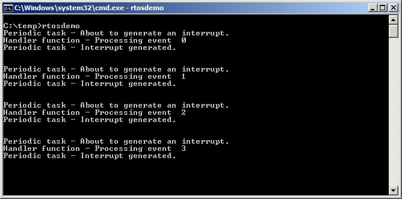

## 7.6 Deferring Work to the RTOS Daemon Task

The deferred interrupt handling examples presented so far have required
the application writer to create a task for each interrupt that uses the
deferred processing technique. It is also possible to use the
`xTimerPendFunctionCallFromISR()`[^19] API function to defer interrupt
processing to the RTOS daemon task, which removes the need to create a
separate task for each interrupt. Deferring interrupt processing to the
daemon task is called 'centralized deferred interrupt processing'.

[^19]: The daemon task was originally
called the timer service task because it was originally only used to
execute software timer callback functions. Hence,
`xTimerPendFunctionCall()` is implemented in timers.c, and, in
accordance with the convention of prefixing a function's name with
the name of the file in which the function is implemented, the
function's name is prefixed with 'Timer'.

Chapter 6 described how software timer-related FreeRTOS API functions
send commands to the daemon task on the timer command queue. The
`xTimerPendFunctionCall()` and `xTimerPendFunctionCallFromISR()` API
functions use the same timer command queue to send an 'execute function'
command to the daemon task. The function sent to the daemon task is then
executed in the context of the daemon task.

Advantages of centralized deferred interrupt processing include:

- Lower resource usage

  It removes the need to create a separate task for each deferred
  interrupt.

- Simplified user model

  The deferred interrupt handling function is a standard C function.

Disadvantages of centralized deferred interrupt processing include:

- Less flexibility

  It is not possible to set the priority of each deferred interrupt
  handling task separately. Each deferred interrupt handling function
  executes at the priority of the daemon task. As described in Chapter
  6, the priority of the daemon task is set by the
  `configTIMER_TASK_PRIORITY` compile time configuration constant within
  FreeRTOSConfig.h.

- Less determinism

  `xTimerPendFunctionCallFromISR()` sends a command to the back of the
  timer command queue. Commands that were already in the timer command
  queue will be processed by the daemon task before the 'execute
  function' command sent to the queue by
  `xTimerPendFunctionCallFromISR()`.

Different interrupts have different timing constraints, so it is common
to use both methods of deferring interrupt processing within the same
application.


### 7.6.1 The xTimerPendFunctionCallFromISR() API Function

`xTimerPendFunctionCallFromISR()` is the interrupt safe version of
`xTimerPendFunctionCall()`. Both API functions allow a function provided
by the application writer to be executed by, and therefore in the
context of, the RTOS daemon task. Both the function to be executed, and
the value of the function's input parameters, are sent to the daemon
task on the timer command queue. When the function actually executes is
therefore dependent on the priority of the daemon task relative to other
tasks in the application.


<a name="list7.14" title="Listing 7.14 The xTimerPendFunctionCallFromISR() API function prototype"></a>

```c
BaseType_t xTimerPendFunctionCallFromISR( PendedFunction_t
                                          xFunctionToPend,
                                          void *pvParameter1,
                                          uint32_t ulParameter2,
                                          BaseType_t *pxHigherPriorityTaskWoken );
```
***Listing 7.14*** *The xTimerPendFunctionCallFromISR() API function prototype*


<a name="list7.15" title="Listing 7.15 The prototype to which a function passed in the xFunctionToPend parameter of xTimerPendFunctionCallFromISR()..."></a>

```c
void vPendableFunction( void *pvParameter1, uint32_t ulParameter2 );
```
***Listing 7.15*** *The prototype to which a function passed in the xFunctionToPend parameter of xTimerPendFunctionCallFromISR() must conform*


**xTimerPendFunctionCallFromISR() parameters and return value**

- `xFunctionToPend`

  A pointer to the function that will be executed in the daemon task
  (in effect, just the function name). The prototype of the function must
  be the same as that shown in Listing 7.15.

- `pvParameter1`

  The value that will be passed into the function that is executed by
  the daemon task as that function's `pvParameter1` parameter. The parameter
  has a `void *` type to allow it to be used to pass any data type. For
  example, integer types can be directly cast to a `void *`, alternatively
  the `void *` can be used to point to a structure.

- `ulParameter2`

  The value that will be passed into the function that is executed by
  the daemon task as that function's `ulParameter2` parameter.

- `pxHigherPriorityTaskWoken`

  `xTimerPendFunctionCallFromISR()` writes to the timer command
  queue. If the RTOS daemon task was in the Blocked state to wait for data
  to become available on the timer command queue, then writing to the
  timer command queue will cause the daemon task to leave the Blocked
  state. If the priority of the daemon task is higher than the priority of
  the currently executing task (the task that was interrupted), then,
  internally, `xTimerPendFunctionCallFromISR()` will set
  `*pxHigherPriorityTaskWoken` to `pdTRUE`.

  If `xTimerPendFunctionCallFromISR()` sets this value to `pdTRUE`, then a
  context switch must be performed before the interrupt is exited. This
  will ensure that the interrupt returns directly to the daemon task, as
  the daemon task will be the highest priority Ready state task.

- Return value

  There are two possible return values:

  - `pdPASS`

    `pdPASS` will be returned if the 'execute function' command was written
    to the timer command queue.

  - `pdFAIL`

    `pdFAIL` will be returned if the 'execute function' command could not
    be written to the timer command queue because the timer command queue
    was already full. Chapter 6 describes how to set the length of the timer
    command queue.


<a name="example7.3" title="Example 7.3 Centralized deferred interrupt processing"></a>
---
***Example 7.3*** *Centralized deferred interrupt processing*

---

Example 7.3 provides similar functionality to Example 7.1, but without
using a semaphore, and without creating a task specifically to perform
the processing necessitated by the interrupt. Instead, the processing is
performed by the RTOS daemon task.

The interrupt service routine used by Example 7.3 is shown in Listing 7.16.
It calls `xTimerPendFunctionCallFromISR()` to pass a pointer to a
function called `vDeferredHandlingFunction()` to the daemon task. The
deferred interrupt processing is performed by the
`vDeferredHandlingFunction()` function.

The interrupt service routine increments a variable called
`ulParameterValue` each time it executes. `ulParameterValue` is used as the
value of `ulParameter2` in the call to `xTimerPendFunctionCallFromISR()`, so it
will also be used as the value of `ulParameter2` in the call to
`vDeferredHandlingFunction()` when `vDeferredHandlingFunction()` is executed
by the daemon task. The function's other parameter, `pvParameter1`, is not
used in this example.


<a name="list7.16" title="Listing 7.16 The software interrupt handler used in Example 7.3"></a>

```c
static uint32_t ulExampleInterruptHandler( void )
{
    static uint32_t ulParameterValue = 0;
    BaseType_t xHigherPriorityTaskWoken;

    /* The xHigherPriorityTaskWoken parameter must be initialized to pdFALSE
       as it will get set to pdTRUE inside the interrupt safe API function if
       a context switch is required. */
    xHigherPriorityTaskWoken = pdFALSE;

    /* Send a pointer to the interrupt's deferred handling function to the
       daemon task. The deferred handling function's pvParameter1 parameter
       is not used so just set to NULL. The deferred handling function's
       ulParameter2 parameter is used to pass a number that is incremented by
       one each time this interrupt handler executes. */
    xTimerPendFunctionCallFromISR( vDeferredHandlingFunction, /* Function to execute */
                                   NULL, /* Not used */
                                   ulParameterValue, /* Incrementing value. */
                                   &xHigherPriorityTaskWoken );
    ulParameterValue++;

    /* Pass the xHigherPriorityTaskWoken value into portYIELD_FROM_ISR(). If
       xHigherPriorityTaskWoken was set to pdTRUE inside
       xTimerPendFunctionCallFromISR() then calling portYIELD_FROM_ISR() will
       request a context switch. If xHigherPriorityTaskWoken is still pdFALSE
       then calling portYIELD_FROM_ISR() will have no effect. Unlike most
       FreeRTOS ports, the Windows port requires the ISR to return a value -
       the return statement is inside the Windows version
       of portYIELD_FROM_ISR(). */
    portYIELD_FROM_ISR( xHigherPriorityTaskWoken );
}
```
***Listing 7.16*** *The software interrupt handler used in Example 7.3*


The implementation of `vDeferredHandlingFunction()` is shown in Listing
7.17. It prints out a fixed string, and the value of its `ulParameter2`
parameter.

`vDeferredHandlingFunction()` must have the prototype shown in Listing
7.15, even though, in this example, only one of its parameters is
actually used.


<a name="list7.17" title="Listing 7.17 The function that performs the processing necessitated by the interrupt in Example 7.3"></a>

```c
static void vDeferredHandlingFunction( void *pvParameter1, uint32_t ulParameter2 )
{
    /* Process the event - in this case just print out a message and the value
       of ulParameter2. pvParameter1 is not used in this example. */
    vPrintStringAndNumber( "Handler function - Processing event ", ulParameter2 );
}
```
***Listing 7.17*** *The function that performs the processing necessitated by the interrupt in Example 7.3*


The `main()` function used by Example 7.3 is shown in Listing 7.18. It is
simpler than the `main()` function used by Example 7.1 because it does not
create either a semaphore or a task to perform the deferred interrupt
processing.

`vPeriodicTask()` is the task that periodically generates software
interrupts. It is created with a priority below the priority of the
daemon task to ensure it is pre-empted by the daemon task as soon as the
daemon task leaves the Blocked state.


<a name="list7.18" title="Listing 7.18 The implementation of main() for Example 7.3"></a>

```c
int main( void )
{
    /* The task that generates the software interrupt is created at a priority
       below the priority of the daemon task. The priority of the daemon task
       is set by the configTIMER_TASK_PRIORITY compile time configuration
       constant in FreeRTOSConfig.h. */
    const UBaseType_t ulPeriodicTaskPriority = configTIMER_TASK_PRIORITY - 1;

    /* Create the task that will periodically generate a software interrupt. */
    xTaskCreate( vPeriodicTask, "Periodic", 1000, NULL, ulPeriodicTaskPriority,
                 NULL );

    /* Install the handler for the software interrupt. The syntax necessary to
       do this is dependent on the FreeRTOS port being used. The syntax shown
       here can only be used with the FreeRTOS windows port, where such
       interrupts are only simulated. */
    vPortSetInterruptHandler( mainINTERRUPT_NUMBER, ulExampleInterruptHandler );

    /* Start the scheduler so the created task starts executing. */
    vTaskStartScheduler();

    /* As normal, the following line should never be reached. */
    for( ;; );
}
```
***Listing 7.18*** *The implementation of main() for Example 7.3*


Example 7.3 produces the output shown in Figure 7.10. The priority of the
daemon task is higher than the priority of the task that generates the
software interrupt, so `vDeferredHandlingFunction()` is executed by the
daemon task as soon as the interrupt is generated. That results in the
message output by `vDeferredHandlingFunction()` appear in between the
two messages output by the periodic task, just as it did when a
semaphore was used to unblock a dedicated deferred interrupt processing
task. Further explanation is provided in Figure 7.11.


<a name="fig7.10" title="Figure 7.10 The output produced when Example 7.3 is executed"></a>
<a name="fig7.11" title="Figure 7.11 The sequence of execution when Example 7.3 is executed"></a>

<div align="center">


***Figure 7.10*** **The output produced when Example 7.3 is executed*


***Figure 7.11*** *The sequence of execution when Example 7.3 is executed**
</div>