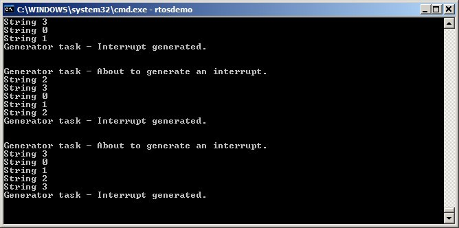

## 7.7 Using Queues within an Interrupt Service Routine

Binary and counting semaphores are used to communicate events. Queues
are used to communicate events and to transfer data.

`xQueueSendToFrontFromISR()` is the version of `xQueueSendToFront()` that is
safe to use in an interrupt service routine, `xQueueSendToBackFromISR()`
is the version of `xQueueSendToBack()` that is safe to use in an interrupt
service routine, and `xQueueReceiveFromISR()` is the version of
`xQueueReceive()` that is safe to use in an interrupt service routine.


### 7.7.1 The xQueueSendToFrontFromISR() and xQueueSendToBackFromISR() API Functions


<a name="list7.19" title="Listing 7.19 The xQueueSendToFrontFromISR() API function prototype"></a>

```c
BaseType_t xQueueSendToFrontFromISR( QueueHandle_t xQueue,
                                     const void *pvItemToQueue
                                     BaseType_t *pxHigherPriorityTaskWoken );
```
***Listing 7.19*** *The xQueueSendToFrontFromISR() API function prototype*


<a name="list7.20" title="Listing 7.20 The xQueueSendToBackFromISR() API function prototype"></a>

```c
BaseType_t xQueueSendToBackFromISR( QueueHandle_t xQueue,
                                    const void *pvItemToQueue
                                    BaseType_t *pxHigherPriorityTaskWoken );
```
***Listing 7.20*** *The xQueueSendToBackFromISR() API function prototype*


`xQueueSendFromISR()` and `xQueueSendToBackFromISR()` are functionally equivalent.

**xQueueSendToFrontFromISR() and xQueueSendToBackFromISR() parameters and return values**

- `xQueue`

  The handle of the queue to which the data is being sent (written).
  The queue handle will have been returned from the call to `xQueueCreate()`
  used to create the queue.

- `pvItemToQueue`

  A pointer to the item that is to be placed on the queue.

  The size of each item the queue will hold was defined when the queue was
  created, so this many bytes will be copied from `pvItemToQueue` into the
  queue storage area.

- `pxHigherPriorityTaskWoken`

  It is possible that a single queue will have one or more tasks
  blocked on it, waiting for data to become available. Calling
  `xQueueSendToFrontFromISR()` or `xQueueSendToBackFromISR()` can make data
  available, and so cause such a task to leave the Blocked state. If
  calling the API function causes a task to leave the Blocked state, and
  the unblocked task has a priority higher than the currently executing
  task (the task that was interrupted), then, internally, the API function
  will set `*pxHigherPriorityTaskWoken` to `pdTRUE`.

  If `xQueueSendToFrontFromISR()` or `xQueueSendToBackFromISR()` sets this
  value to `pdTRUE`, then a context switch should be performed before the
  interrupt is exited. This will ensure that the interrupt returns
  directly to the highest priority Ready state task.

- Return value

  There are two possible return values:

  - `pdPASS`

    `pdPASS` is returned only if data has been sent successfully to the queue.

  - `errQUEUE_FULL

    `errQUEUE_FULL` is returned if data cannot be sent to the queue because
    the queue is already full.


### 7.7.2 Considerations When Using a Queue From an ISR

Queues provide an easy and convenient way of passing data from an
interrupt to a task, but it is not efficient to use a queue if data is
arriving at a high frequency.

Many of the demo applications in the FreeRTOS download include a simple
UART driver that uses a queue to pass characters out of the UART's
receive ISR. In those demos a queue is used for two reasons: to
demonstrate queues being used from an ISR, and to deliberately load the
system in order to test the FreeRTOS port. The ISRs that use a queue in
this manner are definitely not intended to represent an efficient
design, and unless the data is arriving slowly, it is recommended that
production code does not copy this technique. More efficient techniques,
that are suitable for production code, include:

- Using Direct Memory Access (DMA) hardware to receive and buffer
  characters. This method has practically no software overhead. A
  direct to task notification[^20] can then be used to unblock the
  task that will process the buffer only after a break in transmission
  has been detected.

  [^20]: Direct to task notifications provide the most efficient method of
  unblocking a task from an ISR. Direct to task notifications are
  covered in Chapter 10, Task Notifications.

- Copying each received character into a thread safe RAM buffer[^21].
  Again, a direct to task notification can be used to unblock the task
  that will process the buffer after a complete message has been
  received, or after a break in transmission has been detected.

  [^21]: The 'Stream Buffer', provided as part of FreeRTOS+TCP
  ([https://www.FreeRTOS.org/tcp](http://www.FreeRTOS.org/tcp)), can
  be used for this purpose.

- Processing the received characters directly within the ISR, then
  using a queue to send just the result of processing the data (rather
  than the raw data) to a task. This was previously demonstrated by
  Figure 5.4.

<a name="example7.4" title="Example 7.4 Sending and receiving on a queue from within an interrupt"></a>
---
***Example 7.4*** *Sending and receiving on a queue from within an interrupt*

---

This example demonstrates `xQueueSendToBackFromISR()` and
`xQueueReceiveFromISR()` being used within the same interrupt. As before,
for convenience the interrupt is generated by software.

A periodic task is created that sends five numbers to a queue every 200
milliseconds. It generates a software interrupt only after all five
values have been sent. The task implementation is shown in Listing 7.21.


<a name="list7.21" title="Listing 7.21 The implementation of the task that writes to the queue in Example 7.4"></a>

```c
static void vIntegerGenerator( void *pvParameters )
{
    TickType_t xLastExecutionTime;
    uint32_t ulValueToSend = 0;
    int i;

    /* Initialize the variable used by the call to vTaskDelayUntil(). */
    xLastExecutionTime = xTaskGetTickCount();

    for( ;; )
    {
        /* This is a periodic task. Block until it is time to run again. The
           task will execute every 200ms. */
        vTaskDelayUntil( &xLastExecutionTime, pdMS_TO_TICKS( 200 ) );

        /* Send five numbers to the queue, each value one higher than the
           previous value. The numbers are read from the queue by the interrupt
           service routine. The interrupt service routine always empties the
           queue, so this task is guaranteed to be able to write all five
           values without needing to specify a block time. */
        for( i = 0; i < 5; i++ )
        {
            xQueueSendToBack( xIntegerQueue, &ulValueToSend, 0 );
            ulValueToSend++;
        }

        /* Generate the interrupt so the interrupt service routine can read the
           values from the queue. The syntax used to generate a software
           interrupt is dependent on the FreeRTOS port being used. The syntax
           used below can only be used with the FreeRTOS Windows port, in which
           such interrupts are only simulated. */
        vPrintString( "Generator task - About to generate an interrupt.\r\n" );
        vPortGenerateSimulatedInterrupt( mainINTERRUPT_NUMBER );
        vPrintString( "Generator task - Interrupt generated.\r\n\r\n\r\n" );
    }
}
```
***Listing 7.21*** *The implementation of the task that writes to the queue in Example 7.4*


The interrupt service routine calls `xQueueReceiveFromISR()` repeatedly
until all the values written to the queue by the periodic task have been
read out, and the queue is left empty. The last two bits of each
received value are used as an index into an array of strings. A pointer
to the string at the corresponding index position is then sent to a
different queue using a call to `xQueueSendFromISR()`. The implementation
of the interrupt service routine is shown in Listing 7.22.


<a name="list7.22" title="Listing 7.22 The implementation of the interrupt service routine used by Example 7.4"></a>

```c
static uint32_t ulExampleInterruptHandler( void )
{
    BaseType_t xHigherPriorityTaskWoken;
    uint32_t ulReceivedNumber;

    /* The strings are declared static const to ensure they are not allocated
       on the interrupt service routine's stack, and so exist even when the
       interrupt service routine is not executing. */

    static const char *pcStrings[] =
    {
        "String 0\r\n",
        "String 1\r\n",
        "String 2\r\n",
        "String 3\r\n"
    };

    /* As always, xHigherPriorityTaskWoken is initialized to pdFALSE to be
       able to detect it getting set to pdTRUE inside an interrupt safe API
       function.  Note that as an interrupt safe API function can only set
       xHigherPriorityTaskWoken to pdTRUE, it is safe to use the same
       xHigherPriorityTaskWoken variable in both the call to
       xQueueReceiveFromISR() and the call to xQueueSendToBackFromISR(). */
    xHigherPriorityTaskWoken = pdFALSE;

    /* Read from the queue until the queue is empty. */
    while( xQueueReceiveFromISR( xIntegerQueue,
                                 &ulReceivedNumber,
                                 &xHigherPriorityTaskWoken ) != errQUEUE_EMPTY )
    {
        /* Truncate the received value to the last two bits (values 0 to 3
           inclusive), then use the truncated value as an index into the
           pcStrings[] array to select a string (char *) to send on the other
           queue. */
        ulReceivedNumber &= 0x03;
        xQueueSendToBackFromISR( xStringQueue,
                                 &pcStrings[ ulReceivedNumber ],
                                 &xHigherPriorityTaskWoken );
    }

    /* If receiving from xIntegerQueue caused a task to leave the Blocked
       state, and if the priority of the task that left the Blocked state is
       higher than the priority of the task in the Running state, then
       xHigherPriorityTaskWoken will have been set to pdTRUE inside
       xQueueReceiveFromISR().

       If sending to xStringQueue caused a task to leave the Blocked state, and
       if the priority of the task that left the Blocked state is higher than
       the priority of the task in the Running state, then
       xHigherPriorityTaskWoken will have been set to pdTRUE inside
       xQueueSendToBackFromISR().

       xHigherPriorityTaskWoken is used as the parameter to portYIELD_FROM_ISR().
       If xHigherPriorityTaskWoken equals pdTRUE then calling portYIELD_FROM_ISR()
       will request a context switch. If xHigherPriorityTaskWoken is still
       pdFALSE then calling portYIELD_FROM_ISR() will have no effect.

       The implementation of portYIELD_FROM_ISR() used by the Windows port
       includes a return statement, which is why this function does not
       explicitly return a value. */
    portYIELD_FROM_ISR( xHigherPriorityTaskWoken );
}
```
***Listing 7.22*** *The implementation of the interrupt service routine used by Example 7.4*


The task that receives the character pointers from the interrupt service
routine blocks on the queue until a message arrives, printing out each
string as it is received. Its implementation is shown in Listing 7.23.


<a name="list7.23" title="Listing 7.23 The task that prints out the strings received from the interrupt service routine in Example 7.4"></a>

```c
static void vStringPrinter( void *pvParameters )
{
    char *pcString;

    for( ;; )
    {
        /* Block on the queue to wait for data to arrive. */
        xQueueReceive( xStringQueue, &pcString, portMAX_DELAY );

        /* Print out the string received. */
        vPrintString( pcString );
    }
}
```
***Listing 7.23*** *The task that prints out the strings received from the interrupt service routine in Example 7.4*

As normal, `main()` creates the required queues and tasks before starting
the scheduler. Its implementation is shown in Listing 7.24.


<a name="list7.24" title="Listing 7.24 The main() function for Example 7.4"></a>

```c
int main( void )
{
    /* Before a queue can be used it must first be created. Create both queues
       used by this example. One queue can hold variables of type uint32_t, the
       other queue can hold variables of type char*. Both queues can hold a
       maximum of 10 items. A real application should check the return values
       to ensure the queues have been successfully created. */
    xIntegerQueue = xQueueCreate( 10, sizeof( uint32_t ) );
    xStringQueue = xQueueCreate( 10, sizeof( char * ) );

    /* Create the task that uses a queue to pass integers to the interrupt
       service routine. The task is created at priority 1. */
    xTaskCreate( vIntegerGenerator, "IntGen", 1000, NULL, 1, NULL );

    /* Create the task that prints out the strings sent to it from the
       interrupt service routine. This task is created at the higher
       priority of 2. */
    xTaskCreate( vStringPrinter, "String", 1000, NULL, 2, NULL );

    /* Install the handler for the software interrupt. The syntax necessary to
       do this is dependent on the FreeRTOS port being used. The syntax shown
       here can only be used with the FreeRTOS Windows port, where such
       interrupts are only simulated. */
    vPortSetInterruptHandler( mainINTERRUPT_NUMBER, ulExampleInterruptHandler );

    /* Start the scheduler so the created tasks start executing. */
    vTaskStartScheduler();

    /* If all is well then main() will never reach here as the scheduler will
       now be running the tasks. If main() does reach here then it is likely
       that there was insufficient heap memory available for the idle task
       to be created. Chapter 2 provides more information on heap memory
       management. */
    for( ;; );
}
```
***Listing 7.24*** *The main() function for Example 7.4*

The output produced when Example 7.4 is executed is shown in Figure 7.12.
As can be seen, the interrupt receives all five integers, and produces
five strings in response. More explanation is given in Figure 7.13.


<a name="fig7.12" title="Figure 7.12 The output produced when Example 7.4 is executed"></a>
<a name="fig7.13" title="Figure 7.13 The sequence of execution produced by Example 7.4"></a>

<div align="center">


***Figure 7.12*** **The output produced when Example 7.4 is executed*


***Figure 7.13*** *The sequence of execution produced by Example 7.4**
</div>