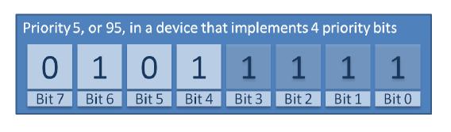

## 7.8 Interrupt Nesting

It is common for confusion to arise between task priorities and
interrupt priorities. This section discusses interrupt priorities, which
are the priorities at which interrupt service routines (ISRs) execute
relative to each other. The priority assigned to a task is in no way
related to the priority assigned to an interrupt. Hardware decides when
an ISR will execute, whereas software decides when a task will execute.
An ISR executed in response to a hardware interrupt will interrupt a
task, but a task cannot pre-empt an ISR.

Ports that support interrupt nesting require one or both of the
constants detailed below to be defined in FreeRTOSConfig.h.
`configMAX_SYSCALL_INTERRUPT_PRIORITY` and
`configMAX_API_CALL_INTERRUPT_PRIORITY` both define the same property.
Older FreeRTOS ports use `configMAX_SYSCALL_INTERRUPT_PRIORITY`, and newer
FreeRTOS ports use `configMAX_API_CALL_INTERRUPT_PRIORITY`.

**Constants that control interrupt nesting**

- `configMAX_SYSCALL_INTERRUPT_PRIORITY` or `configMAX_API_CALL_INTERRUPT_PRIORITY`

  Sets the highest interrupt priority from which interrupt-safe
  FreeRTOS API functions can be called.

- `configKERNEL_INTERRUPT_PRIORITY`

  Sets the interrupt priority used by the tick interrupt, and must
  always be set to the lowest possible interrupt priority.

  If the FreeRTOS port in use does not also use the
  `configMAX_SYSCALL_INTERRUPT_PRIORITY` constant, then any interrupt that
  uses interrupt-safe FreeRTOS API functions must also execute at the
  priority defined by `configKERNEL_INTERRUPT_PRIORITY`.

Each interrupt source has a numeric priority, and a logical priority:

- Numeric priority

  The numeric priority is simply the number assigned to the interrupt
  priority. For example, if an interrupt is assigned a priority of 7,
  then its numeric priority is 7. Likewise, if an interrupt is assigned
  a priority of 200, then its numeric priority is 200.

- Logical priority

  An interrupt's logical priority describes that interrupt's precedence
  over other interrupts.

  If two interrupts of differing priority occur at the same time, then
  the processor will execute the ISR for whichever of the two interrupts
  has the higher logical priority before it executes the ISR for
  whichever of the two interrupts has the lower logical priority.

  An interrupt can interrupt (nest with) any interrupt that has a lower
  logical priority, but an interrupt cannot interrupt (nest with) any
  interrupt that has an equal or higher logical priority.

The relationship between an interrupt's numeric priority and logical
priority is dependent on the processor architecture; on some processors,
the higher the numeric priority assigned to an interrupt the *higher*
that interrupt's logical priority will be, while on other processor
architectures the higher the numeric priority assigned to an interrupt
the *lower* that interrupt's logical priority will be.

A full interrupt nesting model is created by setting
`configMAX_SYSCALL_INTERRUPT_PRIORITY` to a higher logical interrupt
priority than `configKERNEL_INTERRUPT_PRIORITY`. This is demonstrated in
Figure 7.14, which shows a scenario where:

- The processor has seven unique interrupt priorities.
- Interrupts assigned a numeric priority of 7 have a higher logical
  priority than interrupts assigned a numeric priority of 1.
- `configKERNEL_INTERRUPT_PRIORITY` is set to one.
- `configMAX_SYSCALL_INTERRUPT_PRIORITY` is set to three.

***Figure 7.14*** **Constants affecting interrupt nesting behavior**

Referring to Figure 7.14:

- Interrupts that use priorities 1 to 3, inclusive, are prevented from
  executing while the kernel or the application is inside a critical
  section. ISRs running at these priorities can use interrupt-safe
  FreeRTOS API functions. Critical sections are described in Chapter 8.

- Interrupts that use priority 4, or above, are not affected by
  critical sections, so nothing the scheduler does will prevent these
  interrupts from executing immediately—within the limitations of the
  hardware itself. ISRs executing at these priorities cannot use any
  FreeRTOS API functions.

- Typically, functionality that requires very strict timing accuracy
  (motor control, for example) would use a priority above
  `configMAX_SYSCALL_INTERRUPT_PRIORITY` to ensure the scheduler does
  not introduce jitter into the interrupt response time.

### 7.8.1 A Note to ARM Cortex-M[^22] and ARM GIC Users

[^22]: This section only partially applies to Cortex-M0 and Cortex-M0+ cores.

Interrupt configuration on Cortex-M processors is confusing, and prone
to error. To assist your development, the FreeRTOS Cortex-M ports
automatically check the interrupt configuration, but only if
`configASSERT()` is defined. `configASSERT()` is described in section 11.2.

The ARM Cortex cores, and ARM Generic Interrupt Controllers (GICs), use
numerically *low* priority numbers to represent logically *high*
priority interrupts. This can seem counter-intuitive, and is easy to
forget. If you wish to assign an interrupt a logically low priority,
then it must be assigned a numerically high value. If you wish to assign
an interrupt a logically high priority, then it must be assigned a
numerically low value.

The Cortex-M interrupt controller allows a maximum of eight bits to be
used to specify each interrupt priority, making 255 the lowest possible
priority. Zero is the highest priority. However, Cortex-M
microcontrollers normally only implement a subset of the eight possible
bits. The number of bits actually implemented is dependent on the
microcontroller family.

When only a subset of the eight possible bits has been implemented, it
is only the most significant bits of the byte that can be used—leaving
the least significant bits unimplemented. Unimplemented bits can take
any value, but it is normal to set them to 1. This is demonstrated by
Figure 7.15, which shows how a priority of binary 101 is stored in a
Cortex-M microcontroller that implements four priority bits.

***Figure 7.15*** **How a priority of binary 101 is stored by a Cortex-M microcontroller that implements four priority bits**

In Figure 7.15 the binary value 101 has been shifted into the most
significant four bits because the least significant four bits are not
implemented. The unimplemented bits have been set to 1.

Some library functions expect priority values to be specified after they
have been shifted up into the implemented (most significant) bits. When
using such a function, the priority shown in Figure 7.15 can be specified
as decimal 95. Decimal 95 is binary 101 shifted up by four to make
binary 101nnnn (where 'n' is an unimplemented bit), and with the
unimplemented bits set to 1 to make binary 1011111.

Some library functions expect priority values to be specified before
they have been shifted up into the implemented (most significant) bits.
When using such a function the priority shown in Figure 7.15 must be
specified as decimal 5. Decimal 5 is binary 101 without any shift.

`configMAX_SYSCALL_INTERRUPT_PRIORITY` and `configKERNEL_INTERRUPT_PRIORITY`
must be specified in a way that allows them to be written directly to
the Cortex-M registers, so after the priority values have been shifted
up into the implemented bits.

`configKERNEL_INTERRUPT_PRIORITY` must always be set to the lowest
possible interrupt priority. Unimplemented priority bits can be set to
1, so the constant can always be set to 255, no matter how many priority
bits are actually implemented.

Cortex-M interrupts will default to a priority of zero—the highest
possible priority. The implementation of the Cortex-M hardware does not
permit `configMAX_SYSCALL_INTERRUPT_PRIORITY` to be set to 0, so the
priority of an interrupt that uses the FreeRTOS API must never be left
at its default value.