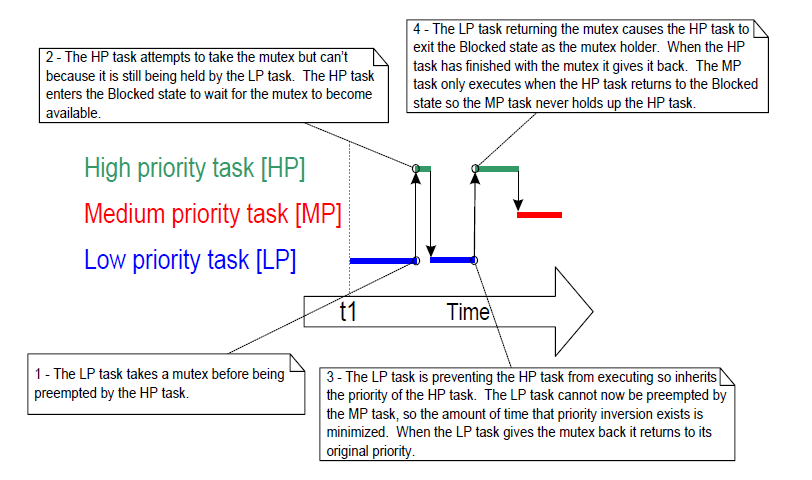

## 8.3 Mutexes (and Binary Semaphores)

A Mutex is a special type of binary semaphore that is used to control
access to a resource that is shared between two or more tasks. The word
MUTEX originates from 'MUTual EXclusion'. `configUSE_MUTEXES` must be set
to 1 in FreeRTOSConfig.h for mutexes to be available.

When used in a mutual exclusion scenario, the mutex can be thought of as
a token that is associated with the resource being shared. For a task to
access the resource legitimately, it must first successfully 'take' the
token (be the token holder). When the token holder has finished with the
resource, it must 'give' the token back. Only when the token has been
returned can another task successfully take the token, and then safely
access the same shared resource. A task is not permitted to access the
shared resource unless it holds the token. This mechanism is shown in
Figure 8.1.

Even though mutexes and binary semaphores share many characteristics,
the scenario shown in Figure 8.1 (where a mutex is used for mutual
exclusion) is completely different to that shown in Figure 7.6 (where a
binary semaphore is used for synchronization). The primary difference is
what happens to the semaphore after it has been obtained:

- A semaphore that is used for mutual exclusion must always be
  returned.
- A semaphore that is used for synchronization is normally discarded
  and not returned.


<a name="fig8.1" title="Figure 8.1 Mutual exclusion implemented using a mutex"></a>

<div align="center">


***Figure 8.1*** **Mutual exclusion implemented using a mutex**
</div>

The mechanism works purely through the discipline of the application
writer. There is no reason why a task cannot access the resource at any
time, but each task 'agrees' not to do so, unless it is able to become
the mutex holder.


### 8.3.1 The xSemaphoreCreateMutex() API Function

FreeRTOS also includes the `xSemaphoreCreateMutexStatic()`
function, which allocates the memory required to create a mutex
statically at compile time: A mutex is a type of semaphore. Handles to
all the various types of FreeRTOS semaphore are stored in a variable of
type `SemaphoreHandle_t`.

Before a mutex can be used, it must be created. To create a mutex type
semaphore, use the `xSemaphoreCreateMutex()` API function.


<a name="list8.10" title="Listing 8.10 The xSemaphoreCreateMutex() API function prototype"></a>

```c
SemaphoreHandle_t xSemaphoreCreateMutex( void );
```
***Listing 8.10*** *The xSemaphoreCreateMutex() API function prototype*


**xSemaphoreCreateMutex() return value**

- Return value

  If NULL is returned, then the mutex could not be created because
  there is insufficient heap memory available for FreeRTOS to allocate the
  mutex data structures. Chapter 3 provides more information on heap
  memory management.

  A non-NULL return value indicates that the mutex has been created
  successfully. The returned value should be stored as the handle to the
  created mutex.


<a name="example8.1" title="Example 8.1 Rewriting vPrintString() to use a semaphore"></a>
---
***Example 8.1*** *Rewriting vPrintString() to use a semaphore*

---

This example creates a new version of `vPrintString()` called
`prvNewPrintString()`, then calls the new function from multiple tasks.
`prvNewPrintString()` is functionally identical to `vPrintString()`, but
controls access to standard out using a mutex, rather than by locking
the scheduler. The implementation of `prvNewPrintString()` is shown in
Listing 8.11.


<a name="list8.11" title="Listing 8.11 The implementation of prvNewPrintString()"></a>

```c
static void prvNewPrintString( const char *pcString )
{
    /* The mutex is created before the scheduler is started, so already exists
       by the time this task executes.

       Attempt to take the mutex, blocking indefinitely to wait for the mutex
       if it is not available straight away. The call to xSemaphoreTake() will
       only return when the mutex has been successfully obtained, so there is 
       no need to check the function return value. If any other delay period 
       was used then the code must check that xSemaphoreTake() returns pdTRUE 
       before accessing the shared resource (which in this case is standard 
       out). As noted earlier in this book, indefinite time outs are not 
       recommended for production code. */
    xSemaphoreTake( xMutex, portMAX_DELAY );
    {
        /* The following line will only execute once the mutex has been 
           successfully obtained. Standard out can be accessed freely now as 
           only one task can have the mutex at any one time. */
        printf( "%s", pcString );
        fflush( stdout );

        /* The mutex MUST be given back! */
    }
    xSemaphoreGive( xMutex );
}
```
***Listing 8.11*** *The implementation of prvNewPrintString()*


`prvNewPrintString()` is called repeatedly by two instances of a task
implemented by `prvPrintTask()`. A random delay time is used between each
call. The task parameter is used to pass a unique string into each
instance of the task. The implementation of `prvPrintTask()` is shown in
Listing 8.12.


<a name="list8.12" title="Listing 8.12 The implementation of prvPrintTask() for Example 8.1"></a>

```c
static void prvPrintTask( void *pvParameters )
{
    char *pcStringToPrint;
    const TickType_t xMaxBlockTimeTicks = 0x20;

    /* Two instances of this task are created. The string printed by the task 
       is passed into the task using the task's parameter. The parameter is 
       cast to the required type. */
    pcStringToPrint = ( char * ) pvParameters;

    for( ;; )
    {
        /* Print out the string using the newly defined function. */
        prvNewPrintString( pcStringToPrint );

        /* Wait a pseudo random time. Note that rand() is not necessarily
           reentrant, but in this case it does not really matter as the code 
           does not care what value is returned. In a more secure application 
           a version of rand() that is known to be reentrant should be used - 
           or calls to rand() should be protected using a critical section. */
        vTaskDelay( ( rand() % xMaxBlockTimeTicks ) );
    }
}
```
***Listing 8.12*** *The implementation of prvPrintTask() for Example 8.1*


As normal, `main()` simply creates the mutex, creates the tasks, then
starts the scheduler. The implementation is shown in Listing 8.13.

The two instances of `prvPrintTask()` are created at different priorities,
so the lower priority task will sometimes be pre-empted by the higher
priority task. As a mutex is used to ensure each task gets mutually
exclusive access to the terminal, even when pre-emption occurs, the
strings that are displayed will be correct and in no way corrupted. The
frequency of pre-emption can be increased by reducing the maximum time
the tasks spend in the Blocked state, which is set by the
`xMaxBlockTimeTicks` constant.

Notes specific to using Example 8.1 with the FreeRTOS Windows port:

- Calling `printf()` generates a Windows system call. Windows system
  calls are outside the control of FreeRTOS, and can introduce
  instability.

- The way in which Windows system calls execute mean it is rare to see
  a corrupted string, even when the mutex is not used.


<a name="list8.13" title="Listing 8.13 The implementation of main() for Example 8.1"></a>

```c
int main( void )
{
    /* Before a semaphore is used it must be explicitly created. In this
       example a mutex type semaphore is created. */
    xMutex = xSemaphoreCreateMutex();

    /* Check the semaphore was created successfully before creating the
       tasks. */
    if( xMutex != NULL )
    {
        /* Create two instances of the tasks that write to stdout. The string
           they write is passed in to the task as the task's parameter. The 
           tasks are created at different priorities so some pre-emption will 
           occur. */
        xTaskCreate( prvPrintTask, "Print1", 1000,
                     "Task 1 ***************************************\r\n",
                     1, NULL );

        xTaskCreate( prvPrintTask, "Print2", 1000,
                     "Task 2 ---------------------------------------\r\n", 
                     2, NULL );

        /* Start the scheduler so the created tasks start executing. */
        vTaskStartScheduler();
    }

    /* If all is well then main() will never reach here as the scheduler will
       now be running the tasks. If main() does reach here then it is likely 
       that there was insufficient heap memory available for the idle task to 
       be created.  Chapter 3 provides more information on heap memory 
       management. */
    for( ;; );
}
```
***Listing 8.13*** *The implementation of main() for Example 8.1*


The output produced when Example 8.1 is executed is shown in Figure 8.2. A
possible execution sequence is described in Figure 8.3.

<a name="fig8.2" title="Figure 8.2 The output produced when Example 8.1 is executed"></a>

<div align="center">


***Figure 8.2*** **The output produced when Example 8.1 is executed**
</div>

Figure 8.2 shows that, as expected, there is no corruption in the strings
that are displayed on the terminal. The random ordering is a result of
the random delay periods used by the tasks.


<a name="fig8.3" title="Figure 8.3 A possible sequence of execution for Example 8.1"></a>

<div align="center">


***Figure 8.3*** **A possible sequence of execution for Example 8.1**
</div>


### 8.3.2 Priority Inversion

Figure 8.3 demonstrates one of the potential pitfalls of using a mutex to
provide mutual exclusion. The sequence of execution depicted shows the
higher priority Task 2 having to wait for the lower priority Task 1 to
give up control of the mutex. A higher priority task being delayed by a
lower priority task in this manner is called 'priority inversion'. This
undesirable behavior would be exaggerated further if a medium priority
task started to execute while the high priority task was waiting for the
semaphore—the result would be a high priority task waiting for a low
priority task—without the low priority task even being able to execute.
This is most often referred to as _unbounded priority inversion_ because
the medium priority task could block the low and high priority tasks
indefinitely.
This worst case scenario is shown in Figure 8.4.


<a name="fig8.4" title="Figure 8.4 A worst case priority inversion scenario"></a>

<div align="center">


***Figure 8.4*** **A worst case priority inversion scenario**
</div>

Priority inversion can be a significant problem, but in small embedded
systems it can often be avoided at system design time by considering
how resources are accessed.


### 8.3.3 Priority Inheritance

FreeRTOS mutexes and binary semaphores are very similar—the difference
being that mutexes include a basic 'priority inheritance' mechanism,
whereas binary semaphores do not. Priority inheritance is a scheme that
minimizes the negative effects of priority inversion. It does not 'fix'
priority inversion, but merely lessens its impact by ensuring that the
inversion is always time bounded. However, priority inheritance
complicates system timing analysis, and it is not good practice to rely
on it for correct system operation.

Priority inheritance works by temporarily raising the priority of the
mutex holder to the priority of the highest priority task that is
attempting to obtain the same mutex. The low priority task that holds
the mutex 'inherits' the priority of the task waiting for the mutex.
This is demonstrated by Figure 8.5. The priority of the mutex holder is
reset automatically to its original value when it gives the mutex back.


<a name="fig8.5" title="Figure 8.5 Priority inheritance minimizing the effect of priority inversion"></a>

<div align="center">


***Figure 8.5*** **Priority inheritance minimizing the effect of priority inversion**
</div>

As just seen, priority inheritance functionality effects the priority of
tasks that are using the mutex. For that reason, mutexes must not be
used from interrupt service routines.

FreeRTOS implements a basic priority inheritance mechanism which was
designed with optimizing both space and execution cycles in mind. A full
priority inheritance mechanism requires significantly more data and
processor cycles to determine inherited priority at any moment,
especially when a task holds more than one mutex at a time.

Specific behaviors of the priority inheritance mechanism to keep in mind:
* A task can have its inherited priority raised further if it
  takes a mutex without first releasing mutexes it already holds.
* A task remains at its highest inherited priority until
  it has released all the mutexes it holds. This is regardless of
  the order the mutexes are released.
* A task will remain at the highest inherited priority if multiple
  mutexes are held regardless of tasks waiting on any of the held
  mutexes completing their wait (timing out).


### 8.3.4 Deadlock (or Deadly Embrace)

'Deadlock' is another potential pitfall of using mutexes for mutual
exclusion. Deadlock is sometimes also known by the more dramatic name
'deadly embrace'.

Deadlock occurs when two tasks cannot proceed because they are both
waiting for a resource that is held by the other. Consider the following
scenario where Task A and Task B both need to acquire mutex X *and*
mutex Y in order to perform an action:

1. Task A executes and successfully takes mutex X.

2. Task A is pre-empted by Task B.

3. Task B successfully takes mutex Y before attempting to also take
   mutex X—but mutex X is held by Task A so is not available to Task B.
   Task B opts to enter the Blocked state to wait for mutex X to be
   released.

4. Task A continues executing. It attempts to take mutex Y—but mutex Y
   is held by Task B, so is not available to Task A. Task A opts to
   enter the Blocked state to wait for mutex Y to be released.

At the end of this scenario, Task A is waiting for a mutex held by Task
B, and Task B is waiting for a mutex held by Task A. Deadlock has
occurred because neither task can proceed.

As with priority inversion, the best method of avoiding deadlock is to
consider its potential at design time, and design the system to ensure
that deadlock cannot occur. In particular, and as previously stated in
this book, it is normally bad practice for a task to wait indefinitely
(without a time out) to obtain a mutex. Instead, use a time out that is
a little longer than the maximum time it is expected to have to wait for
the mutex—then failure to obtain the mutex within that time will be a
symptom of a design error, which might be a deadlock.

In practice, deadlock is not a big problem in small embedded systems,
because the system designers can have a good understanding of the entire
application, and so can identify and remove the areas where it could
occur.


### 8.3.5 Recursive Mutexes

It is also possible for a task to deadlock with itself. This will happen
if a task attempts to take the same mutex more than once, without first
returning the mutex. Consider the following scenario:

1. A task successfully obtains a mutex.

2. While holding the mutex, the task calls a library function.

3. The implementation of the library function attempts to take the same
   mutex, and enters the Blocked state to wait for the mutex to become
   available.

At the end of this scenario the task is in the Blocked state to wait for
the mutex to be returned, but the task is already the mutex holder. A
deadlock has occurred because the task is in the Blocked state to wait
for itself.

This type of deadlock can be avoided by using a recursive mutex in place
of a standard mutex. A recursive mutex can be 'taken' more than once by
the same task, and will be returned only after one call to 'give' the
recursive mutex has been executed for every preceding call to 'take' the
recursive mutex.

Standard mutexes and recursive mutexes are created and used in a similar
way:

- Standard mutexes are created using `xSemaphoreCreateMutex()`.
  Recursive mutexes are created using
  `xSemaphoreCreateRecursiveMutex()`. The two API functions have the
  same prototype.

- Standard mutexes are 'taken' using `xSemaphoreTake()`. Recursive
  mutexes are 'taken' using `xSemaphoreTakeRecursive()`. The two API
  functions have the same prototype.

- Standard mutexes are 'given' using `xSemaphoreGive()`. Recursive
  mutexes are 'given' using `xSemaphoreGiveRecursive()`. The two API
  functions have the same prototype.

Listing 8.14 demonstrates how to create and use a recursive mutex.


<a name="list8.14" title="Listing 8.14 Creating and using a recursive mutex"></a>

```c
/* Recursive mutexes are variables of type SemaphoreHandle_t. */
SemaphoreHandle_t xRecursiveMutex;

/* The implementation of a task that creates and uses a recursive mutex. */
void vTaskFunction( void *pvParameters )
{
    const TickType_t xMaxBlock20ms = pdMS_TO_TICKS( 20 );

    /* Before a recursive mutex is used it must be explicitly created. */
    xRecursiveMutex = xSemaphoreCreateRecursiveMutex();

    /* Check the semaphore was created successfully. configASSERT() is 
       described in section 11.2. */
    configASSERT( xRecursiveMutex );

    /* As per most tasks, this task is implemented as an infinite loop. */
    for( ;; )
    {
        /* ... */

        /* Take the recursive mutex. */
        if( xSemaphoreTakeRecursive( xRecursiveMutex, xMaxBlock20ms ) == pdPASS )
        {
            /* The recursive mutex was successfully obtained. The task can now
               access the resource the mutex is protecting. At this point the 
               recursive call count (which is the number of nested calls to 
               xSemaphoreTakeRecursive()) is 1, as the recursive mutex has 
               only been taken once. */

            /* While it already holds the recursive mutex, the task takes the 
               mutex again. In a real application, this is only likely to occur
               inside a sub-function called by this task, as there is no 
               practical reason to knowingly take the same mutex more than 
               once. The calling task is already the mutex holder, so the 
               second call to xSemaphoreTakeRecursive() does nothing more than
               increment the recursive call count to 2. */
            xSemaphoreTakeRecursive( xRecursiveMutex, xMaxBlock20ms );

            /* ... */

            /* The task returns the mutex after it has finished accessing the
               resource the mutex is protecting. At this point the recursive 
               call count is 2, so the first call to xSemaphoreGiveRecursive()
               does not return the mutex. Instead, it simply decrements the 
               recursive call count back to 1. */
            xSemaphoreGiveRecursive( xRecursiveMutex );

            /* The next call to xSemaphoreGiveRecursive() decrements the 
               recursive call count to 0, so this time the recursive mutex is 
               returned. */
            xSemaphoreGiveRecursive( xRecursiveMutex );

            /* Now one call to xSemaphoreGiveRecursive() has been executed for
               every proceeding call to xSemaphoreTakeRecursive(), so the task
               is no longer the mutex holder. */
        }
    }
}
```
***Listing 8.14*** *Creating and using a recursive mutex*


### 8.3.6 Mutexes and Task Scheduling

If two tasks of different priority use the same mutex, then the FreeRTOS
scheduling policy makes the order in which the tasks will execute clear;
the highest priority task that is able to run will be selected as the
task that enters the Running state. For example, if a high priority task
is in the Blocked state to wait for a mutex that is held by a low
priority task, then the high priority task will pre-empt the low
priority task as soon as the low priority task returns the mutex. The
high priority task will then become the mutex holder. This scenario has
already been seen in Figure 8.5.

It is, however, common to make an incorrect assumption as to the order in
which the tasks will execute when the tasks have the same priority. If
Task 1 and Task 2 have the same priority, and Task 1 is in the Blocked
state to wait for a mutex that is held by Task 2, then Task 1 will not
pre-empt Task 2 when Task 2 'gives' the mutex. Instead, Task 2 will
remain in the Running state, and Task 1 will simply move from the
Blocked state to the Ready state. This scenario is shown in Figure 8.6,
in which the vertical lines mark the times at which a tick interrupt
occurs.


<a name="fig8.6" title="Figure 8.6 A possible sequence of execution when tasks that have the same priority use the same mutex"></a>

<div align="center">


***Figure 8.6*** **A possible sequence of execution when tasks that have the same priority use the same mutex**
</div>

In the scenario shown in Figure 8.6, the FreeRTOS scheduler does *not*
make Task 1 the Running state task as soon as the mutex is available
because:

- Task 1 and Task 2 have the same priority, so unless Task 2 enters
  the Blocked state, a switch to Task 1 should not occur until the
  next tick interrupt (assuming `configUSE_TIME_SLICING` is set to 1 in
  FreeRTOSConfig.h).

- If a task uses a mutex in a tight loop, and a context switch
  occurred each time the task 'gave' the mutex, then the task would
  only ever remain in the Running state for a short time. If two or
  more tasks used the same mutex in a tight loop, then processing time
  would be wasted by rapidly switching between the tasks.

If a mutex is used in a tight loop by more than one task, and the tasks
that use the mutex have the same priority, then care must be taken to
ensure the tasks receive an approximately equal amount of processing
time. The reason the tasks might not receive an equal amount of
processing time is demonstrated by Figure 8.7, which shows a sequence of
execution that could occur if two instances of the task shown by Listing
8.15 are created at the same priority.


<a name="list8.15" title="Listing 8.15 A task that uses a mutex in a tight loop"></a>

```c
/* The implementation of a task that uses a mutex in a tight loop. The task 
   creates a text string in a local buffer, then writes the string to a display.
   Access to the display is protected by a mutex. */

void vATask( void *pvParameter )
{
    extern SemaphoreHandle_t xMutex;
    char cTextBuffer[ 128 ];

    for( ;; )
    {
        /* Generate the text string – this is a fast operation. */
        vGenerateTextInALocalBuffer( cTextBuffer );

        /* Obtain the mutex that is protecting access to the display. */
        xSemaphoreTake( xMutex, portMAX_DELAY );

        /* Write the generated text to the display–this is a slow operation. */
        vCopyTextToFrameBuffer( cTextBuffer );

        /* The text has been written to the display, so return the mutex. */
        xSemaphoreGive( xMutex );
    }
}
```
***Listing 8.15*** *A task that uses a mutex in a tight loop*


The comments in Listing 8.15 note that creating the string is a fast
operation, and updating the display is a slow operation. Therefore, as
the mutex is held while the display is being updated, the task will hold
the mutex for the majority of its run time.

In Figure 8.7, the vertical lines mark the times at which a tick
interrupt occurs.


<a name="fig8.7" title="Figure 8.7 A sequence of execution that could occur if two instances of the task shown by Listing 8.15 are created at the same priority"></a>

<div align="center">


***Figure 8.7*** **A sequence of execution that could occur if two instances of the task shown by Listing 8.15 are created at the same priority**
</div>

Step 7 in Figure 8.7 shows Task 1 re-entering the Blocked state—that
happens inside the `xSemaphoreTake()` API function.

Figure 8.7 demonstrates that Task 1 will be prevented from obtaining the
mutex until the start of a time slice coincides with one of the short
periods during which Task 2 is not the mutex holder.

The scenario shown in Figure 8.7 can be avoided by adding a call to
`taskYIELD()` after the call to `xSemaphoreGive()`. This is demonstrated in
Listing 8.16, where `taskYIELD()` is called if the tick count changed while
the task held the mutex.


<a name="list8.16" title="Listing 8.16 Ensuring tasks that use a mutex in a loop receive a more equal amount of processing time..."></a>

```c
void vFunction( void *pvParameter )
{
    extern SemaphoreHandle_t xMutex;
    char cTextBuffer[ 128 ];
    TickType_t xTimeAtWhichMutexWasTaken;

    for( ;; )
    {
        /* Generate the text string – this is a fast operation. */
        vGenerateTextInALocalBuffer( cTextBuffer );

        /* Obtain the mutex that is protecting access to the display. */
        xSemaphoreTake( xMutex, portMAX_DELAY );

        /* Record the time at which the mutex was taken. */
        xTimeAtWhichMutexWasTaken = xTaskGetTickCount();

        /* Write the generated text to the display–this is a slow operation. */
        vCopyTextToFrameBuffer( cTextBuffer );

        /* The text has been written to the display, so return the mutex. */
        xSemaphoreGive( xMutex );

        /* If taskYIELD() was called on each iteration then this task would
           only ever remain in the Running state for a short period of time, 
           and processing time would be wasted by rapidly switching between 
           tasks. Therefore, only call taskYIELD() if the tick count changed 
           while the mutex was held. */
        if( xTaskGetTickCount() != xTimeAtWhichMutexWasTaken )
        {
            taskYIELD();
        }
    }
}
```
***Listing 8.16*** *Ensuring tasks that use a mutex in a loop receive a more equal amount of processing time, while also ensuring processing time is not wasted by switching between tasks too rapidly*