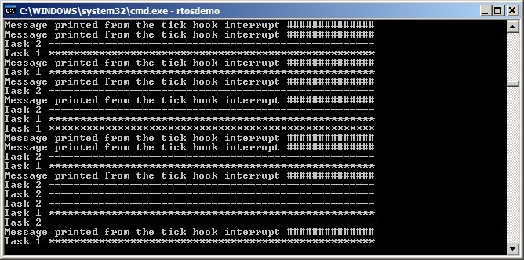

## 8.4 Gatekeeper Tasks

Gatekeeper tasks provide a clean method of implementing mutual exclusion
without the risk of priority inversion or deadlock.

A gatekeeper task is a task that has sole ownership of a resource. Only
the gatekeeper task is allowed to access the resource directly—any other
task needing to access the resource can do so only indirectly by using
the services of the gatekeeper.


### 8.4.1 Re-writing vPrintString() to use a gatekeeper task

Example 8.2 provides another alternative implementation for
`vPrintString()`. This time, a gatekeeper task is used to manage access to
standard out. When a task wants to write a message to standard out, it
does not call a print function directly but, instead, sends the message
to the gatekeeper.

The gatekeeper task uses a FreeRTOS queue to serialize access to
standard out. The internal implementation of the task does not have to
consider mutual exclusion because it is the only task permitted to
access standard out directly.

The gatekeeper task spends most of its time in the Blocked state,
waiting for messages to arrive on the queue. When a message arrives, the
gatekeeper simply writes the message to standard out, before returning
to the Blocked state to wait for the next message. The implementation of
the gatekeeper task is shown by Listing 8.18.

Interrupts can send to queues, so interrupt service routines can also
safely use the services of the gatekeeper to write messages to the
terminal. In this example, a tick hook function is used to write out a
message every 200 ticks.

A tick hook (or tick callback) is a function that is called by the
kernel during each tick interrupt. To use a tick hook function:

1.  Set `configUSE_TICK_HOOK` to 1 in FreeRTOSConfig.h.

2. Provide the implementation of the hook function, using the exact
   function name and prototype shown in Listing 8.17.


<a name="list8.17" title="Listing 8.17 The name and prototype for a tick hook function"></a>

```c
void vApplicationTickHook( void );
```
***Listing 8.17*** *The name and prototype for a tick hook function*


Tick hook functions execute within the context of the tick interrupt,
and so must be kept very short, must use only a moderate amount of stack
space, and must not call any FreeRTOS API functions that do not end with
'FromISR()'.

The scheduler will always execute immediately after the tick hook
function, so interrupt safe FreeRTOS API functions called from the tick
hook do not need to use their `pxHigherPriorityTaskWoken` parameter, and
that parameter can be set to NULL.


<a name="list8.18" title="Listing 8.18 The gatekeeper task"></a>

```c
static void prvStdioGatekeeperTask( void *pvParameters )
{
    char *pcMessageToPrint;

    /* This is the only task that is allowed to write to standard out. Any
       other task wanting to write a string to the output does not access 
       standard out directly, but instead sends the string to this task. As 
       only this task accesses standard out there are no mutual exclusion or 
       serialization issues to consider within the implementation of the task 
       itself. */
    for( ;; )
    {
        /* Wait for a message to arrive. An indefinite block time is specified
           so there is no need to check the return value – the function will 
           only return when a message has been successfully received. */
        xQueueReceive( xPrintQueue, &pcMessageToPrint, portMAX_DELAY );

        /* Output the received string. */
        printf( "%s", pcMessageToPrint );
        fflush( stdout );

        /* Loop back to wait for the next message. */
    }
}
```
***Listing 8.18*** *The gatekeeper task*


<a name="example8.2" title="Example 8.2 The alternative implementation for print task"></a>
---
***Example 8.2*** *The alternative implementation for print task*

---

The task that writes to the queue is shown in Listing 8.19. As before,
two separate instances of the task are created, and the string the task
writes to the queue is passed into the task using the task parameter.

<a name="list8.19" title="The print task implementation for Example 8.2"></a>


```c
static void prvPrintTask( void *pvParameters )
{
    int iIndexToString;
    const TickType_t xMaxBlockTimeTicks = 0x20;

    /* Two instances of this task are created. The task parameter is used to 
       pass an index into an array of strings into the task. Cast this to the
       required type. */
    iIndexToString = ( int ) pvParameters;

    for( ;; )
    {
        /* Print out the string, not directly, but instead by passing a pointer
           to the string to the gatekeeper task via a queue. The queue is 
           created before the scheduler is started so will already exist by the
           time this task executes for the first time. A block time is not 
           specified because there should always be space in the queue. */
        xQueueSendToBack( xPrintQueue, &( pcStringsToPrint[ iIndexToString ]), 0 );

        /* Wait a pseudo random time. Note that rand() is not necessarily
           reentrant, but in this case it does not really matter as the code 
           does not care what value is returned. In a more secure application 
           a version of rand() that is known to be reentrant should be used - 
           or calls to rand() should be protected using a critical section. */
        vTaskDelay( ( rand() % xMaxBlockTimeTicks ) );
    }
}
```

***Listing 8.19*** *The print task implementation for Example 8.2*


The tick hook function counts the number of times it is called, sending
its message to the gatekeeper task each time the count reaches 200. For
demonstration purposes only, the tick hook writes to the front of the
queue, and the tasks write to the back of the queue. The tick hook
implementation is shown in Listing 8.20.


<a name="list8.20" title="Listing 8.20 The tick hook implementation"></a>

```c
void vApplicationTickHook( void )
{
    static int iCount = 0;

    /* Print out a message every 200 ticks. The message is not written out
       directly, but sent to the gatekeeper task. */
    iCount++;

    if( iCount >= 200 )
    {
        /* As xQueueSendToFrontFromISR() is being called from the tick hook, it
           is not necessary to use the xHigherPriorityTaskWoken parameter (the 
           third parameter), and the parameter is set to NULL. */
        xQueueSendToFrontFromISR( xPrintQueue, 
                                  &( pcStringsToPrint[ 2 ] ), 
                                  NULL );

        /* Reset the count ready to print out the string again in 200 ticks
           time. */
        iCount = 0;
    }
}
```
***Listing 8.20*** *The tick hook implementation*


As normal, `main()` creates the queues and tasks necessary to run the
example, then starts the scheduler. The implementation of `main()` is
shown in Listing 8.21.

```c
/* Define the strings that the tasks and interrupt will print out via the
   gatekeeper. */
static char *pcStringsToPrint[] =
{
    "Task 1 ****************************************************\r\n",
    "Task 2 ----------------------------------------------------\r\n",
    "Message printed from the tick hook interrupt ##############\r\n"
};

/*-----------------------------------------------------------*/

/* Declare a variable of type QueueHandle_t. The queue is used to send messages
   from the print tasks and the tick interrupt to the gatekeeper task. */
QueueHandle_t xPrintQueue;

/*-----------------------------------------------------------*/

int main( void )
{
    /* Before a queue is used it must be explicitly created. The queue is 
       created to hold a maximum of 5 character pointers. */
    xPrintQueue = xQueueCreate( 5, sizeof( char * ) );

    /* Check the queue was created successfully. */
    if( xPrintQueue != NULL )
    {
        /* Create two instances of the tasks that send messages to the 
           gatekeeper. The index to the string the task uses is passed to the 
           task via the task parameter (the 4th parameter to xTaskCreate()). 
           The tasks are created at different priorities so the higher priority
           task will occasionally preempt the lower priority task. */
        xTaskCreate( prvPrintTask, "Print1", 1000, ( void * ) 0, 1, NULL );
        xTaskCreate( prvPrintTask, "Print2", 1000, ( void * ) 1, 2, NULL );

        /* Create the gatekeeper task. This is the only task that is permitted
           to directly access standard out. */
        xTaskCreate( prvStdioGatekeeperTask, "Gatekeeper", 1000, NULL, 0, NULL );

        /* Start the scheduler so the created tasks start executing. */
        vTaskStartScheduler();
    }

    /* If all is well then main() will never reach here as the scheduler will 
       now be running the tasks. If main() does reach here then it is likely 
       that there was insufficient heap memory available for the idle task to 
       be created. Chapter 3 provides more information on heap memory 
       management. */
    for( ;; );
}
```
<a name="list8.21" title="Listing 8.21 The implementation of main() for Example 8.2"></a>

***Listing 8.21*** *The implementation of main() for Example 8.2*


The output produced when Example 8.2 is executed is shown in Figure 8.8.
As can be seen, the strings originating from the tasks, and the strings
originating from the interrupt, all print out correctly with no
corruption.


<a name="fig8.8" title="Figure 8.8 The output produced when Example 8.2 is executed"></a>

<div align="center">


***Figure 8.8*** **The output produced when Example 8.2 is executed**
</div>

The gatekeeper task is assigned a lower priority than the print tasks—so
messages sent to the gatekeeper remain in the queue until both print
tasks are in the Blocked state. In some situations, it would be
appropriate to assign the gatekeeper a higher priority, so messages get
processed immediately—but doing so would be at the cost of the
gatekeeper delaying lower priority tasks until it has completed
accessing the protected resource.