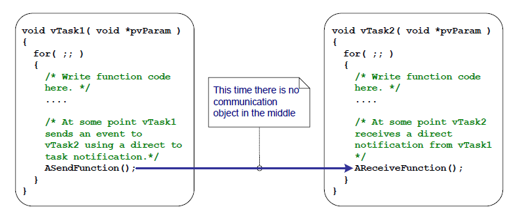

## 10.1 Introduction

FreeRTOS applications are typically structured as a series of independent tasks that communicate with each other to collectively provide the system functionality.  Task notifications are an efficient mechanism allowing one task to directly notify another task.

### 10.1.1 Communicating Through Intermediary Objects

This book has already described various ways in which tasks can
communicate with each other. The methods described so far have required
the creation of a communication object. Examples of communication
objects include queues, event groups, and various different types of
semaphore.

When a communication object is used, events and data are not sent
directly to a receiving task, or a receiving ISR, but are instead sent
to the communication object. Likewise, tasks and ISRs receive events and
data from the communication object, rather than directly from the task
or ISR that sent the event or data. This is depicted in Figure 10.1.

***Figure 10.1*** **A communication object being used to send an event from one task to another**

### 10.1.2 Task Notifications—Direct to Task Communication

'Task Notifications' allow tasks to interact with other tasks, and to
synchronize with ISRs, without the need for a separate communication
object. By using a task notification, a task or ISR can send an event
directly to the receiving task. This is depicted in Figure 10.2.

***Figure 10.2*** **A task notification used to send an event directly from one task to another**

Task notification functionality is optional. To include task
notification functionality set `configUSE_TASK_NOTIFICATIONS` to 1 in FreeRTOSConfig.h.

When `configUSE_TASK_NOTIFICATIONS` is set to 1, each task has at least one
'Notification State', which can be either 'Pending' or 'Not-Pending',
and a 'Notification Value', which is a 32-bit unsigned integer. When a
task receives a notification, its notification state is set to pending.
When a task reads its notification value, its notification state is set
to not-pending.  If the `configTASK_NOTIFICATION_ARRAY_ENTRIES` is set to a value
\> 1 then there are multiple Notification states and values identified by index.

A task can wait in the Blocked state, with an optional time out, for its
notification state to become pending.

### 10.1.3 Scope

This chapter discusses:

- A task's notification state and notification value.
- How and when a task notification can be used in place of a
  communication object, such as a semaphore.
- The advantages of using a task notification in place of a
  communication object.